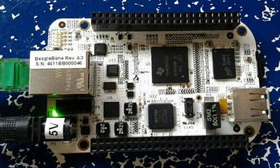

xml version="1.0" encoding="utf-8"?

Beagle

# TI BeagleBone

#### BeagleBone

### What is it?

This is a small (3" x 2") board with a TI AM225x processor, two USB ports, 
Ethernet port, SD/MMC slot and a pair of expansion connectors. I'm interested
in hardware interfacing, especially for audio and SDR applications.

## FPGA Expansion board

I'm working on an FPGA-based expansion board for the BeagleBone. Find out
more about it here: [BeagleBone FPGA](http://specialcomp.com/beaglebone/BeagleBone_FPGA.html)
[Return to Embedded page.](../index.html)
##### 
**Last Updated**

:2010-04-09
##### 
**Comments to:**

[Eric Brombaugh](mailto:ebrombaugh1@cox.net)

