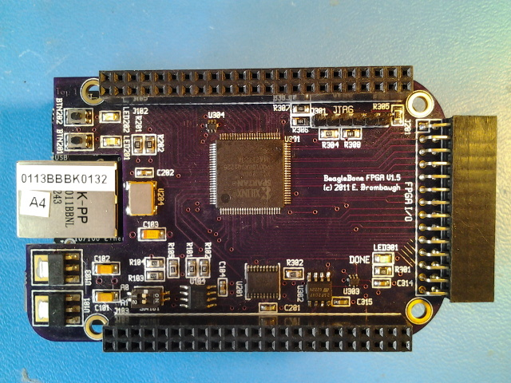

xml version="1.0" encoding="utf-8"?

Blank Canvas Cape (BCC)

# BeagleBone FPGA Expansion Board: Blank Canvas Cape (BCC)

#### Assembled Blank Canvas Cape

#### BCC Demo Video

## What is it?

The Blank Canvas Cape (BCC) is a small (3.4" x 2.15" - standard BeagleBone "Cape" dimensions) board with
a Xilinx Spartan 3A 200Kgate FPGA connected directly to the BeagleBone expansion
connectors. Designed to stack with the BeagleBone according to the method described
in the System Reference Manual, it provides the following features:

* Xilinx [XC3S200AVQ100](http://www.xilinx.com/products/spartan3a/) Spartan 3A FPGA with 200kgates, 16 Multipliers and 288kb RAM.
* Numonyx [M25P20](http://www.micron.com/products/ProductDetails.html?product=products/nor_flash/serial_nor_flash/M25P20-VMN3PB) 2Mb SPI Flash configuration memory
* 50 MHz crystal oscillator
* BeagleBone standard I2C ID EEPROM with jumper-selectable address.
* 28-pin I/O header with 24 pins directly connected to the FPGA, 2 3.3V power pins and 2 GND pins.
* JTAG port for FPGA development and debugging.
* 3x Diagnostic LEDs (2 User defined, 1 Configuration status).
* 2x User input buttons.

## Background

### Motivation

This board was conceived as a general-purpose I/O board with sufficient on-board
logic resources to support experiments in digital audio, Software Defined Radio,
robotics and general experimentation. 

## Design Details

### Expansion Connectors

Although the BeagleBone Expansion Connectors provide interfaces to the GPMC, LCD/Video,
McASP, SPI, I2C, UARTs, Timers, Interrupts, GPIO and ADC of the AM3xxx SOC, connecting
to all of these is not possible with the FPGA used on this board so the BCC
board only connects to the GPMC bus, SPI0 and I2C2. Access to the other available interfaces
is possible by stacking additional boards.

The GPMC expansion pins are available on connector P8 pins 3-26 and provide 24-bits of I/O
which can be multiplexed for a variety of purposes as shown in the table below:

| Pin | Function |
| --- | --- |
| 3 | **GPMC\_AD6**/MMC1\_DAT6//////GPIO1\_6 |
| 4 | **GPMC\_AD7**/MMC1\_DAT7//////GPIO1\_7 |
| 5 | **GPMC\_AD2**/MMC1\_DAT2//////GPIO1\_2 |
| 6 | **GPMC\_AD3**/MMC1\_DAT3//////GPIO1\_3 |
| 7 | **GPMC\_ADVN\_ALE**/TIMER4/GPIO2\_2 |
| 8 | **GPMC\_OEN\_REN**/TIMER7/EMU4/GPIO2\_3 |
| 9 | **GPMC\_BE0N\_CLE**/TIMER5/GPIO2\_5 |
| 10 | **GPMC\_WEN**/TIMER6/GPIO2\_4 |
| 11 | **GPMC\_AD13**/LCD\_DATA18/MMC1\_DAT5/MMC2\_DAT1/EQEP2B\_IN/PR1\_MII0\_TXD1/PR1\_PRU0\_PRU\_R30\_15/GPIO1\_13 |
| 12 | **GPMC\_AD12**/LCD\_DATA19/MMC1\_DAT4/MMC2\_DAT0/EQEP2A\_IN/PR1\_MII0\_TXD2/PR1\_PRU0\_PRU\_R30\_14/GPIO1\_12 |
| 13 | **GPMC\_AD9**/LCD\_DATA22/MMC1\_DAT1/MMC2\_DAT5/EHRPWM2B/PR1\_MII0\_CRS//GPIO0\_23 |
| 14 | **GPMC\_AD10**/LCD\_DATA21/MMC1\_DAT2/MMC2\_DAT6/EHRPWM2\_TRIPZONE\_INPUT/PR1\_MII0\_TXEN//GPIO0\_26 |
| 15 | **GPMC\_AD15**/LCD\_DATA16/MMC1\_DAT7/MMC2\_DAT3/EQEP2\_STROBE/PR1\_ECAP0\_ECAP\_CAPIN\_APWM\_O/PR1\_PRU0\_PRU\_R31\_15/GPIO1\_15 |
| 16 | **GPMC\_AD14**/LCD\_DATA17/MMC1\_DAT6/MMC2\_DAT2/EQEP2\_INDEX/PR1\_MII0\_TXD0/PR1\_PRU0\_PRU\_R31\_14/GPIO1\_14 |
| 17 | **GPMC\_AD11**/LCD\_DATA20/MMC1\_DAT3/MMC2\_DAT7/EHRPWM2\_SYNCI\_O/PR1\_MII0\_TXD3//GPIO0\_27 |
| 18 | **GPMC\_CLK**/LCD\_MEM\_CLK/GPMC\_WAIT1/MMC2\_CLK/PRT1\_MII1\_TXEN/MCASP0\_FSR/GPIO2\_1 |
| 19 | **GPMC\_AD8**/LCD\_DATA23/MMC1\_DAT0/MMC2\_DAT4/EHRPWM2A/PR1\_MII\_MT0\_CLK//GPIO0\_22 |
| 20 | **GPMC\_CSN2**/GPMC\_BE1N/MMC1\_CMD/PR1\_EDIO\_DATA\_IN7/PR1\_EDIO\_DATA\_OUT7/PR1\_PRU1\_PRU\_R30\_13/PR1\_PRU1\_PRU\_R31\_13/GPIO1\_31 |
| 21 | **GPMC\_CSN1**/GPMC\_CLK/MMC1\_CLK/PRT1EDIO\_DATA\_IN6/PRT1\_EDIO\_DATA\_OUT6/PR1\_PRU1\_PRU\_R30\_12/PR1\_PRU1\_PRU\_R31\_12/GPIO1\_30 |
| 22 | **GPMC\_AD5**/MMC1\_DAT5//////GPIO1\_5 |
| 23 | **GPMC\_AD4**/MMC1\_DAT4//////GPIO1\_4 |
| 24 | **GPMC\_AD1**/MMC1\_DAT1//////GPIO1\_1 |
| 25 | **GPMC\_AD0**/MMC1\_DAT0//////GPIO1\_0 |
| 26 | **GPMC\_CSN0**/GPIO1\_29 |

Additional connections on connector P9 are listed below:

| Pin | Function |
| --- | --- |
| 12 | **GPMC\_BE1N**/GMII2\_COL/GPMC\_CSN6/MMC2\_DAT3/GPMC\_DIR/PR1\_MII1\_RXLINK/MCASP0\_ACLKR/GPIO1\_28 |
| 17 | **SPI0\_CS0**/MMC2\_SDWP/I2C1\_SCL/EHRPWM0\_SYNCI\_O/PR1\_UART0\_TXD/PR1\_EDIO\_DATA\_IN1/PR1\_EDIO\_DATA\_OUT1/GPIO0\_5 |
| 18 | **SPI0\_D1**/MMC1\_SDWP/I2C1\_SDA/EHRPWM0\_TRIPZONE\_INPUT/PR1\_UART0\_RXD/PR1\_EDIO\_DATA\_IN0/PR1\_EDIO\_DATA\_OUT0/GPIO0\_4 |
| 19 | UART1\_RTSN/TIMER5/DCAN0\_RX/**I2C2\_SCL**/SPI1\_CS1/PR1\_UART0\_RTS\_N/PR1\_EDC\_LATCH1\_IN/GPIO0\_13 |
| 20 | UART1\_CTSN/TIMER6/DCAN0\_TX/**I2C2\_SDA**/SPI1\_CS0/PR1\_UART0\_CTS\_N/PR1\_EDC\_LATCH0\_IN/GPIO0\_12 |
| 21 | **SPI0\_D0**/UART2\_TXD/I2C2\_SCL/EHRPWM0B/PR1\_UART0\_RTS\_N/PR1\_EDIO\_LATCH\_IN/EMU3/GPIO0\_3 |
| 22 | **SPI0\_SCLK**/UART2\_RXD/I2C2\_SDA/EHRPWM0A/PR1\_UART0\_CTS\_N/PR1\_EDIO\_SOF/EMU2/GPIO0\_2 |
| 41 | EVENT\_INTR1/TCLKIN/**CLKOUT2**/TIMER7/PR1PRU0\_PRUR31\_16/EMU3/GPIO0\_20 |

As configured here, the BCC board supports
multiplexed 16-bit device access with three CS lines for a total address space of
384kB. Because GPMC wait requests are not provided the bus speed will have to be
reduced to accomodate the slowest device access in a single cycle.

### Configuration

At power up the FPGA is set to Configuration Mode [001] (Master SPI mode) and loads itself
from the on-board SPI Flash memory. By toggling several bits in the I2C2 port expander chip
at bus address 0x38 the FPGA may be set to Configuration Mode [111] (Slave Serial mode) which
allows the BeagleBone processor to load it via SPI0 at any time. Serial configuration is
quite fast (less than 1 second) in either case and LED301 on the board will
light to indicate a successful configuration.

Altering the content of the on-board SPI flash also uses SPI0. A special temporary
'pass-thru' FPGA design is required which provides a direct connection between SPI0 and
the SPI Flash memory to support programming and verifying the contents of the flash chip.

A bitstream download application which uses kernel I2C and SPIDEV drivers to manage the
process of configuration and programming will be provided for userland setup. Additionally,
a simple C language library of support functions will be available that allows custom applications
to take control of the FPGA board.

### JTAG

A 6-pin JTAG header is provided for external configuration and debug. It
conforms to the Digilent JTAG pinout, but can also be used with Xilinx
download cables if flywires are used. This is handy for testing the FPGA
without the Beagle attached, or for debugging designs using Xilinx's
Chipscope application.

### ID

A 32kbyte I2C EEPROM is available for conformance with the ID protocol described in the
BeagleBone System Reference Manual. Two address select bits are provided with jumper settings
to control the configuration order for stacked boards.

### Port Expander

An I2C Port Expander chip is used to control the FPGA configuration process. It resides at
I2C2 Bus Address 0x38. Be sure that there are no other I2C devices in the board stack that
will conflict with this addresss.

### I/O Header

The 28-pin I/O header on the right-hand side of the board connects directly to the pins of the
FPGA, providing a completely configurable interface. 24 pins of I/O are provided, alongh with 3.3V
power and ground.

### FPGA

The Xilinx XC3S200A Spartan 3A FPGA on this board is inexpensive and provides sufficient I/O
and logic resources to perform a wide range of interfacing and processing tasks. Simple signal
processing, sequencing and control are certainly possible, as well as some
buffering and reformatting using on-chip RAM.

### LEDs

There are three LEDs are on-board:

* LED201 is connected to an I/O pin on the FPGA and can
 be used as a visual indicator of internal activity.
* LED202 is connected to an I/O pin on the FPGA and can
 be used as a visual indicator of internal activity.
* LED301 lights when the FPGA has a valid configuration.

### Buttons

There are two user-defined buttons connected to the FPGA which allow real-time human control
of FPGA functions. The buttons are physically aligned with LED201 and LED202 at the top
right corner of the board.

### Clocks

The BeagleBone expansion headers provide one clock from the AM3xxx SOC which is
routed to the FPGA. This board also provides a crystal oscillator to generate a
stable 50MHz clock suitable for high-accuracy timing.

### Power

On-board 3.3V and 1.2V LDO regulators derive all the supplies required
from the BeagleBone SYS\_5V supply provided on the expansion connector. While the 3.3V
and 1.2V regulators which supply the FPGA I/O and Core voltages are rated for
close to 1A, it is recommended that FPGA designs which require high power are
not considered for this board. Although the Spartan 3A chip used here can
operate at fairly high internal frequencies approaching 200MHz, the practical
limitations of power supply and heat management will constrain the designs
that can safely be realized on this board.

## Software

### Kernel 3.2

Minimal kernel driver support required for the BCC board includes
I2C2 and SPI0 with SPIDEV, as well as pin muxing to make these interfaces available
on the expansion port. Since the board conforms to the BeagleBone IDPROM
standard it will be recognized by the bootloader and kernel.

 Until the IDPROM is set up correctly, the kernel will require some patching
to properly enable the SPI0 bus which is used to configure and communicate with
the FPGA. A short description of the required patches can be found here: 
[multiple-spi-bus-beaglebone](http://theredblacktree.wordpress.com/2012/10/01/multiple-spi-bus-beaglebone/).

### Kernel 3.8

The EEPROM supports automatic loading of the appropriate DT fragments via the
capemgr service. Details on setting up the EEPROM are here:

[github.com/ka6sox/bcc\_software/tree/master/eeprom](https://github.com/ka6sox/bcc_software/tree/master/eeprom)
A fragment to enable the SPI0 interface has been submitted for inclusion
and additional fragments to support the GPMC bus are in process here:

[github.com/ka6sox/bcc\_software](https://github.com/ka6sox/bcc_software)
### User

A user-space application and access library is available provided which supports
all the features on the board. The application can be used to download FPGA
configuration files, program the SPI Flash memory, control the
programmable clock oscillator and test the SPI control port. The access
library provides a low-level API for control of the I2C and SPI ports,
as well as higher level functions for bitstream download and may be used
to construct complex user-space applications for interaction with the FPGA
design. The source code is available here: 
[bcc\_lib git repository](https://github.com/emeb/bcc_lib).

Note that a special FPGA bitstream is required to program the on-board
configuration flash memory. The design source is available below in the
Design Documentation section.

### FPGA Design

Synthesizing an FPGA design requires the Xilinx ISE Webpack which is
a free download from the Xilinx website. This suite of tools includes a
GUI IDE as well as command-line applications that can be run under both
Linux and WinXX. Designs can be created with either Verilog or VHDL. Demo
designs will be provided to showcase the capabilities of the board
and will provide enough detail for starting on custom designs.

### PMOD Adapter

I've built an adapter board to allow use of the BCC with Digilent PMODs.
Find out more on the [adapter page](../pmod_adapter/index.html).

## Design Documentation

* [Hardware Design on GitHub](https://github.com/emeb/bcc_hardware)* [Schematic Diagram](bcc_schematic.pdf)
* [Bill of Materials](bcc_bom.xls)
* [PCB Assembly Diag](bcc_assy.pdf)
* [PCB Gerber files](bcc_gerbers.zip)
* [Blinky LED test design](bbone_fpga_blinky.zip)
* [Flash Programming design](flash_prog.zip)
* [GPIO / Test design](bcc_tst_source.zip)
* more to come...

## Status

* 11-15-11 - Design started.
* 09-05-12 - Design restarted.
* 09-17-12 - PCB submitted for fab.
* 10-05-12 - PCBs back from fab.
* 10-15-12 - PCBs assembled and FPGA verified.
* 11-24-12 - User Space code updated, SPI configuration verified.
* 12-31-12 - Put hardware design resources on GitHub.
* 05-02-13 - Put up Gerber zipfile.
* 05-28-13 - Added link to PMOD adapter.
* 06-10-13 - Added GPIO / Test design, updated formatting.
* 07-05-13 - Updated blinky and flash prog to avoid loading eMMC on BBB.

[Return to Embedded page.](../index.html)
##### 
**Last Updated**

:2013-06-27

 Thanks to Justin King for help with HTML formatting.

