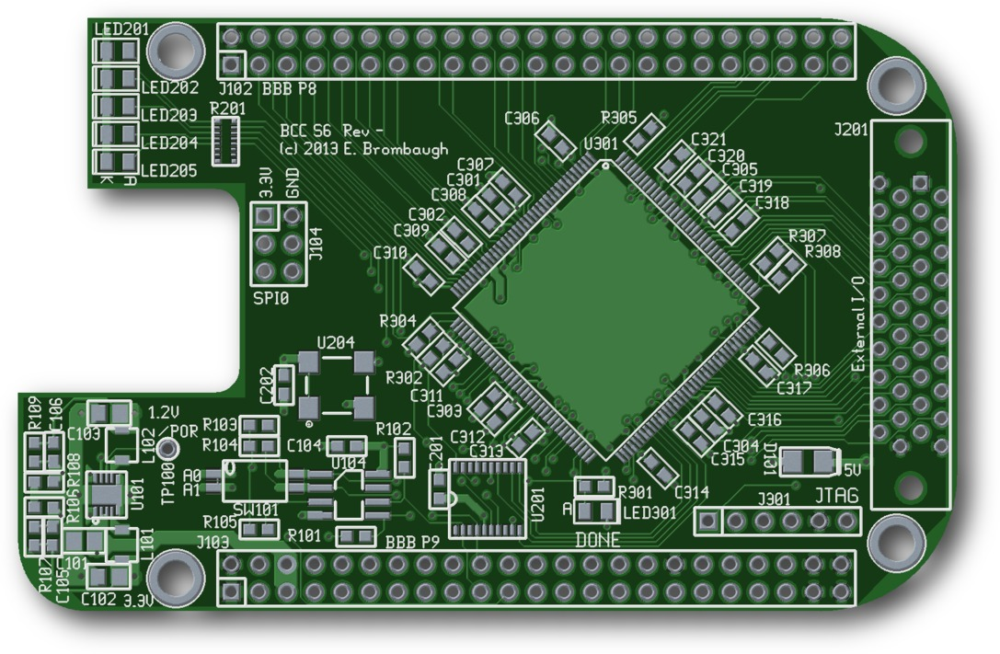

xml version="1.0" encoding="utf-8"?

Blank Canvas Cape - Spartan 6 version (BCC S6)

# Blank Canvas Cape Spartan 6 version (BCC S6)

#### BCC S6 rendering

## What is it?

The Blank Canvas Cape - Spartan 6 version (BCC S6) is a small
(3.4" x 2.15" - standard BeagleBone "Cape" dimensions) board with
a Xilinx Spartan 6 LX9 FPGA connected directly to the BeagleBone expansion
connectors. Designed to stack with the BeagleBone according to the method
described in the System Reference Manual, it provides the following features:

* Xilinx [XC6SLX9-2TQG144C](http://www.xilinx.com/products/silicon-devices/fpga/spartan-6/) Spartan 6 FPGA with 9152 Logic cells, 16 DSP481 slices and 576kb RAM.
* 50 MHz crystal oscillator
* BeagleBone standard I2C ID EEPROM with switch-selectable address.
* 40-pin Hirose FX2 I/O header with 32 pins directly connected to the FPGA,
 2x 5V power pins, 2x 3.3V power pins and 4x GND pins.
* JTAG port for FPGA development and debugging.
* 6x Diagnostic LEDs (5 User defined, 1 Configuration status).

## Design Details

### Expansion Connectors

Although the BeagleBone Expansion Connectors provide interfaces to the GPMC, LCD/Video,
McASP, SPI, I2C, UARTs, Timers, Interrupts, GPIO and ADC of the AM3xxx SOC, connecting
to all of these is not possible with the FPGA used on this board so some expansion
signals are unconnected. The interfaces that are used on the BCC S6 include

* Most of the GPMC, including the multiplexed address/data bus and control signals
* Sufficient PRU interfaces to implement handshaked 8-bit bi-directional I/O
* SPI0 for configuration of the FPGA and simple serial control
* McASP0 for audio I/O

### Detailed Breakdown of Available Connections

| Pin | Function |
| --- | --- |
| 3 | **GPMC\_AD6**/MMC1\_DAT6//////GPIO1\_6 |
| 4 | **GPMC\_AD7**/MMC1\_DAT7//////GPIO1\_7 |
| 5 | **GPMC\_AD2**/MMC1\_DAT2//////GPIO1\_2 |
| 6 | **GPMC\_AD3**/MMC1\_DAT3//////GPIO1\_3 |
| 7 | **GPMC\_ADVN\_ALE**/TIMER4/GPIO2\_2 |
| 8 | **GPMC\_OEN\_REN**/TIMER7/EMU4/GPIO2\_3 |
| 9 | **GPMC\_BE0N\_CLE**/TIMER5/GPIO2\_5 |
| 10 | **GPMC\_WEN**/TIMER6/GPIO2\_4 |
| 11 | **GPMC\_AD13**/LCD\_DATA18/MMC1\_DAT5/MMC2\_DAT1/EQEP2B\_IN/PR1\_MII0\_TXD1/PR1\_PRU0\_PRU\_R30\_15/GPIO1\_13 |
| 12 | **GPMC\_AD12**/LCD\_DATA19/MMC1\_DAT4/MMC2\_DAT0/EQEP2A\_IN/PR1\_MII0\_TXD2/PR1\_PRU0\_PRU\_R30\_14/GPIO1\_12 |
| 13 | **GPMC\_AD9**/LCD\_DATA22/MMC1\_DAT1/MMC2\_DAT5/EHRPWM2B/PR1\_MII0\_CRS//GPIO0\_23 |
| 14 | **GPMC\_AD10**/LCD\_DATA21/MMC1\_DAT2/MMC2\_DAT6/EHRPWM2\_TRIPZONE\_INPUT/PR1\_MII0\_TXEN//GPIO0\_26 |
| 15 | **GPMC\_AD15**/LCD\_DATA16/MMC1\_DAT7/MMC2\_DAT3/EQEP2\_STROBE/PR1\_ECAP0\_ECAP\_CAPIN\_APWM\_O/PR1\_PRU0\_PRU\_R31\_15/GPIO1\_15 |
| 16 | **GPMC\_AD14**/LCD\_DATA17/MMC1\_DAT6/MMC2\_DAT2/EQEP2\_INDEX/PR1\_MII0\_TXD0/PR1\_PRU0\_PRU\_R31\_14/GPIO1\_14 |
| 17 | **GPMC\_AD11**/LCD\_DATA20/MMC1\_DAT3/MMC2\_DAT7/EHRPWM2\_SYNCI\_O/PR1\_MII0\_TXD3//GPIO0\_27 |
| 18 | **GPMC\_CLK**/LCD\_MEM\_CLK/GPMC\_WAIT1/MMC2\_CLK/PRT1\_MII1\_TXEN/MCASP0\_FSR/GPIO2\_1 |
| 19 | **GPMC\_AD8**/LCD\_DATA23/MMC1\_DAT0/MMC2\_DAT4/EHRPWM2A/PR1\_MII\_MT0\_CLK//GPIO0\_22 |
| 20 | **GPMC\_CSN2**/GPMC\_BE1N/MMC1\_CMD/PR1\_EDIO\_DATA\_IN7/PR1\_EDIO\_DATA\_OUT7/PR1\_PRU1\_PRU\_R30\_13/PR1\_PRU1\_PRU\_R31\_13/GPIO1\_31 |
| 21 | **GPMC\_CSN1**/GPMC\_CLK/MMC1\_CLK/PRT1EDIO\_DATA\_IN6/PRT1\_EDIO\_DATA\_OUT6/PR1\_PRU1\_PRU\_R30\_12/PR1\_PRU1\_PRU\_R31\_12/GPIO1\_30 |
| 22 | **GPMC\_AD5**/MMC1\_DAT5//////GPIO1\_5 |
| 23 | **GPMC\_AD4**/MMC1\_DAT4//////GPIO1\_4 |
| 24 | **GPMC\_AD1**/MMC1\_DAT1//////GPIO1\_1 |
| 25 | **GPMC\_AD0**/MMC1\_DAT0//////GPIO1\_0 |
| 26 | **gpmc\_csn0**/gpmc\_csn0/gpio1[29] |
| 27 | **lcd\_vsync**/lcd\_vsync/gpmc\_a8/pru1\_r30\_8/pru1\_r31\_8/gpio2[22] |
| 28 | **lcd\_pclk**/lcd\_pclk/gpmc\_a10/pru1\_r30\_10/pru1\_r31\_10/gpio2[24] |
| 29 | **lcd\_hsync**/lcd\_hsync/gpmc\_a9/pru1\_r30\_9/pru1\_r31\_9/gpio2[23] |
| 30 | **lcd\_ac\_bias\_en**/lcd\_ac\_bias\_en/gpmc\_a11/pru1\_r30\_11/pru1\_r31\_11/gpio2[25 |
| 39 | **lcd\_data6**/lcd\_data6/gpmc\_a6/eQEP2\_index/pru1\_r30\_6/pru1\_r31\_6/gpio2[12] |
| 40 | **lcd\_data7**/lcd\_data7/gpmc\_a7/eQEP2\_strobe/pr1\_edio\_data\_out7/pru1\_r30\_7/pru1\_r31\_7/gpio2[13] |
| 41 | **lcd\_data4**/lcd\_data4/gpmc\_a4/eQEP2A\_in/pru1\_r30\_4/pru1\_r31\_4/gpio2[10] |
| 42 | **lcd\_data5**/lcd\_data5/gpmc\_a5/eQEP2B\_in/pru1\_r30\_5/pru1\_r31\_5/gpio2[11] |
| 43 | **lcd\_data2**/lcd\_data2/gpmc\_a2/ehrpwm2\_tripzone\_in/pru1\_r30\_2/pru1\_r31\_2/gpio2[8] |
| 44 | **lcd\_data3**/lcd\_data3/gpmc\_a3/ehrpwm0\_synco/pru1\_r30\_3/pru1\_r31\_3/gpio2[9] |
| 45 | **lcd\_data0**/lcd\_data0/gpmc\_a0/ehrpwm2A/pru1\_r30\_0/pru1\_r31\_0/gpio2[6] |
| 46 | **lcd\_data1**/lcd\_data1/gpmc\_a1/ehrpwm2B/pru1\_r30\_1/pru1\_r31\_1/gpio2[7] |

Additional connections on connector P9 are listed below:

| Pin | Function |
| --- | --- |
| 10 | **RESET\_OUT** |
| 11 | **gpmc\_wait0**/gpmc\_wait0/mii2\_crs/gpmc\_csn4/rmii2\_crs\_dv/mmc1\_sdcd/uart4\_rxd/gpio0[30] |
| 12 | **GPMC\_BE1N**/GMII2\_COL/GPMC\_CSN6/MMC2\_DAT3/GPMC\_DIR/PR1\_MII1\_RXLINK/MCASP0\_ACLKR/GPIO1\_28 |
| 17 | **SPI0\_CS0**/MMC2\_SDWP/I2C1\_SCL/EHRPWM0\_SYNCI\_O/PR1\_UART0\_TXD/PR1\_EDIO\_DATA\_IN1/PR1\_EDIO\_DATA\_OUT1/GPIO0\_5 |
| 18 | **SPI0\_D1**/MMC1\_SDWP/I2C1\_SDA/EHRPWM0\_TRIPZONE\_INPUT/PR1\_UART0\_RXD/PR1\_EDIO\_DATA\_IN0/PR1\_EDIO\_DATA\_OUT0/GPIO0\_4 |
| 19 | UART1\_RTSN/TIMER5/DCAN0\_RX/**I2C2\_SCL**/SPI1\_CS1/PR1\_UART0\_RTS\_N/PR1\_EDC\_LATCH1\_IN/GPIO0\_13 |
| 20 | UART1\_CTSN/TIMER6/DCAN0\_TX/**I2C2\_SDA**/SPI1\_CS0/PR1\_UART0\_CTS\_N/PR1\_EDC\_LATCH0\_IN/GPIO0\_12 |
| 21 | **SPI0\_D0**/UART2\_TXD/I2C2\_SCL/EHRPWM0B/PR1\_UART0\_RTS\_N/PR1\_EDIO\_LATCH\_IN/EMU3/GPIO0\_3 |
| 22 | **SPI0\_SCLK**/UART2\_RXD/I2C2\_SDA/EHRPWM0A/PR1\_UART0\_CTS\_N/PR1\_EDIO\_SOF/EMU2/GPIO0\_2 |
| 24 | **uart1\_txd**/uart1\_txd/mmc2\_sdwp/dcan1\_rx/i2c1\_scl/pru0\_r31\_16/gpio0[15] |
| 25 | **mcasp0\_ahclkx**/mcasp0\_ahclkx/eQEP0\_strobe/mcasp0\_axr3/mcasp1\_axr1/EMU4/pru0\_r30\_7/pru0\_r31\_7/gpio3[21] |
| 26 | **uart1\_rxd**/uart1\_rxd/mmc1\_sdwp/dcan1\_tx/i2c1\_sda/pru1\_r30\_16/gpio0[14] |
| 27 | **mcasp0\_fsr**/mcasp0\_fsr/eQEP0B\_in/mcasp0\_axr3/mcasp1\_fsx/EMU2/pru0\_r30\_5/pru0\_r31\_5/gpio3[19] |
| 28 | **mcasp0\_ahclkr**/mcasp0\_ahclkr/ehrpwm0\_synci/mcasp0\_axr2/spi1\_cs0/ecap2\_in\_pwm2\_out/pru0\_r30\_3/pru0\_r31\_3/gpio3[17] |
| 29 | **mcasp0\_fsx**/mcasp0\_fsx/ehrpwm0B/spi1\_d0/mmc1\_sdcd/pru0\_r30\_1/pru0\_r31\_1/gpio3[15] |
| 30 | **mcasp0\_axr0**/mcasp0\_axr0/ehrpwm0\_tripzone/spi1\_d1/mmc2\_sdcd/pru0\_r30\_2/pru0\_r31\_2/gpio3[16] |
| 31 | **mcasp0\_aclkx**/mcasp0\_aclkx/ehrpwm0A/spi1\_sclk/mmc0\_sdcd/pru0\_r30\_0/pru0\_r31\_0/gpio3[14] |
| 41 | EVENT\_INTR1/TCLKIN/**CLKOUT2**/TIMER7/PR1PRU0\_PRUR31\_16/EMU3/GPIO0\_20 |
| 42 | **uart3\_txd**/spi1\_cs1/pr1\_ecap0\_ecap\_cap\_in\_apwm\_o/spi1\_sclk/mmc0\_sdwp/xdma\_event\_intr2/gpio0[7] |

As configured here, the BCC board supports
multiplexed 16-bit device access with three CS lines for a total address space of
384kB.

### Configuration

The FPGA is set to Configuration Mode [11] (Slave Serial mode) which
allows the BeagleBone processor to load it via SPI0 at any time. Serial configuration is
quite fast (just a few seconds) and LED301 on the board will light to indicate a successful
configuration.

### JTAG

A 6-pin JTAG header is provided for external configuration and debug. It
conforms to the Digilent JTAG pinout, but can also be used with Xilinx
download cables if flywires are used. This is handy for testing the FPGA
without the Beagle attached, or for debugging designs using Xilinx's
Chipscope application.

### ID

A 32kbyte I2C EEPROM is available for conformance with the ID protocol described in the
BeagleBone System Reference Manual. Two address select bits are provided with jumper settings
to control the configuration order for stacked boards.

### Port Expander

An I2C Port Expander chip is used to control the FPGA configuration process. Four additional bits
from the port expander are routed to the FPGA for low-speed signaling from the Beaglebone. The
port expander resides at I2C2 Bus Address (0x38+board address). Be sure that there are no other
I2C devices in the board stack that will conflict with this addresss.

### I/O Header

The 40-pin I/O header on the right-hand side of the board connects directly to the pins of the
FPGA, providing a completely configurable interface. 32 pins of I/O are provided, alongh with 3.3V
and 5V power and ground.

### LEDs

There are six LEDs are on-board:

* LED201-LED205 are connected to an I/O pin on the FPGA and can
 be used as a visual indicator of internal activity.
* LED301 lights when the FPGA has a valid configuration.

### Clocks

The BeagleBone expansion headers provide one clock from the AM3xxx SOC which is
routed to the FPGA. This board also provides a crystal oscillator to generate a
stable 50MHz clock suitable for high-accuracy timing.

### Power

An on-board 3.3V and 1.2V switching regulator derives all the supplies required
from the BeagleBone VCC\_5V supply provided on the expansion connector. While the 3.3V
and 1.2V regulators which supply the FPGA I/O and Core voltages are rated for
close to 1A, it is recommended that FPGA designs which require high power are
not considered for this board. Although the Spartan 6 chip used here can
operate at fairly high internal frequencies approaching 200MHz, the practical
limitations of power supply and heat management will constrain the designs
that can safely be realized on this board.

## Software

### Kernel 3.2

Minimal kernel driver support required for the BCC board includes
I2C2 and SPI0 with SPIDEV, as well as pin muxing to make these interfaces available
on the expansion port. Since the board conforms to the BeagleBone IDPROM
standard it will be recognized by the bootloader and kernel.

 Until the IDPROM is set up correctly, the kernel will require some patching
to properly enable the SPI0 bus which is used to configure and communicate with
the FPGA. A short description of the required patches can be found here: 
[multiple-spi-bus-beaglebone](http://theredblacktree.wordpress.com/2012/10/01/multiple-spi-bus-beaglebone/).

### Kernel 3.8

The EEPROM supports automatic loading of the appropriate DT fragments via the
capemgr service. Details on setting up the EEPROM are here:

[github.com/ka6sox/bcc\_software/tree/master/eeprom](https://github.com/ka6sox/bcc_software/tree/master/eeprom)
A fragment to enable the SPI0 interface has been submitted for inclusion
and additional fragments to support the GPMC bus are in process here:

[github.com/ka6sox/bcc\_software](https://github.com/ka6sox/bcc_software)
### User

A user-space application and access library is available which supports
all the features on the board. The application can be used to download FPGA
configuration files and test the SPI control port. The access
library provides a low-level API for control of the I2C and SPI ports,
as well as higher level functions for bitstream download and may be used
to construct complex user-space applications for interaction with the FPGA
design. The source code is available here: 
[bcc\_lib git repository](https://github.com/emeb/bcc_lib).

### FPGA Design

Synthesizing an FPGA design requires the Xilinx ISE Webpack which is
a free download from the Xilinx website. This suite of tools includes a
GUI IDE as well as command-line applications that can be run under both
Linux and WinXX. Designs can be created with either Verilog or VHDL. Demo
designs will be provided to showcase the capabilities of the board
and will provide enough detail for starting on custom designs.

## Design Documentation

* [Hardware Design on GitHub](https://github.com/emeb/bcc_s6_hardware)* [Schematic Diagram](bcc_s6_schematic.pdf)
* [Bill of Materials](https://github.com/emeb/bcc_s6_hardware/blob/master/bom.ods)
* [Bill of Materials (.CSV)](bom.csv)
* [Gerbers in OSHpark format](bcc_s6.oshpark.zip)
* more to come...

## Status

* 10-03-13 - Design started.
* 10-15-13 - PCB ordered.
* 10-28-13 - PCB and stencil received.
* 11-01-13 - Assembled.
* 11-03-13 - EEPROM, DT fragment and bitstream download working.
* 11-04-13 - SPI port verified, gerbers posted.
* 01-08-14 - I/O connector work, update BOM with correct cap P/N.

[Return to Embedded page.](../index.html)
##### 
**Last Updated**

:2014-01-08

