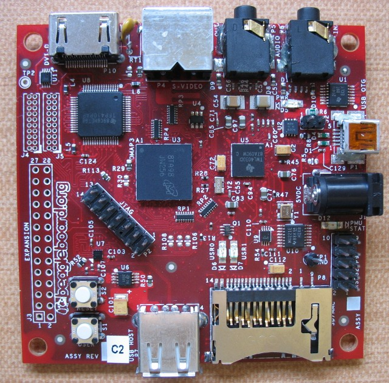

xml version="1.0" encoding="utf-8"?

Beagle

# TI Beagleboard

#### Beagleboard

### What is it?

This is a small (3" x 3") board with a TI OMAP3530 processor, two USB ports, 
UART port, DVI video (1280x800 max), SD/MMC slot, audio I/O and an expansion
port. I'm interested in hardware interfacing, especially for audio and SDR
applications.

### Getting Started

When you get one it comes without any firmware. You'll need to prepare an
SD card with the bootloader, kernel amd root filesystem before you can do
anything with it. Here are some links that I've found useful:

* The main website: [beagleboard.org](http://beagleboard.org/)
* Angstrom distribution: [www.angstrom-distribution.org](http://www.angstrom-distribution.org/)
* Sakoman Gnome Images: [www.sakoman.com](http://www.sakoman.com/)

### Expansion header

For my purposes, the expansion header is key. This provides access to a number
of direct connections to the ARM SoC, including GPIO, SPI, I2C, SD/MMC. The
trick is that you need to tweak the bootloader and/or kernel to get access
to these functions.

The newer bootloaders and kernels provided at the sources above have all
been patched to provide the I/O functions required for some of the more general
expansion cards, like the Tin Can Tools Zippy board which provides a 2nd SD/MMC
slot and a SPI-based 10baseT Ethernet port. That's great if you need these
functions, but gets in the way if you're trying to do something else. So, you'll
need to build a kernel with custom I/O assignments. Here's how I did it:

#### Test system

I used OpenEmbedded to build a simple test kernel and root system. That gets
me started with a known-working kernel, albeit one which doesn't have the
hardware setup I wanted. Instructions for setting that up are here:
[BeagleBoardAndOpenEmbeddedGit](http://elinux.org/BeagleBoardAndOpenEmbeddedGit)
#### Building a Kernel

Once you've got OE installed and a working test system running, you'll need to
build your own kernel. It's possible to do that within OE/Angstrom, but it adds
and extra layer of cruft that I didn't want to deal with right now. Instead,
I built my kernel stand-alone using the directions found here:
[BeagleBoardLinuxKernel](http://elinux.org/BeagleBoardLinuxKernel)
I tweaked the process a bit - in the list of patches I included those that
are specifically for the Beagleboard, but left off the ones that set up the
Zippy board. Before applying the patches with quilt, I started a new git
branch as a reference point for a clean kernel. After applying the patches
I did a 'git checkin -a' to add all the changes that the patches made.

Using the new kernel is as simple as copying it to the boot partion of the
test system SD card. You may want to rename the original kernel so you've got
it around - just in case your new kernel doesn't work.

When you follow those directions you'll end up with source for the kernel in
the OE branch you've chosen to follow. In my case that's the Angstrom stable
branch, which at the time of writing was using linux-omap 2.6.29. There are
newer kernels available (up to 2.6.33 rc?? at this time) which have more
bugfixes and features that I'll have to investigate at some point in the
future.

#### Adding SPI to the Kernel

There are a lot of suggestions out there for how to get SPI added to the
kernel. I studied some of them and came up with an amalgam that seems to work
for me. Helpful links are here:

* [HY Research Pinmux](http://www.hy-research.com/omap3_pinmux.html)
* [elinux.org SPI](http://elinux.org/BeagleBoard/SPI)
* [elinux.org Pinmux](http://elinux.org/BeagleBoardPinMux)
* [Google Beagle group thread](http://groups.google.com/group/beagleboard/browse_thread/thread/42988f0e14db0f01/816397901ec999c4|MCSPI3)

There are 3 key components to making this work:
1. #### Enable CONFIG\_OMAP\_MUX in the kernel configuration.

 This provides the code necessary to set the mux selects and
 pin functions of the expansion port pins that your SPI port will use.
 This is generally handled by the bootloader, but the kernel can do it
 as well and this option enables that.
 You'll find the option in menuconfig under:
 System Type -> TI OMAP Implementations
2. #### Add SPI data structures and code to the board init file.

 This is the code that invokes the pin setup and creates the data
 structures which define how you want the SPI port to connect to the
 kernel drivers.
3. #### Add Pin configuration data to the mux.c and mux.h files.

 You'll need to give the mux setup code some data which tells
 it how to configure the pins you're using. That isn't passed in at
 runtime, but rather is just indexed from a pre-built table.

I've got a patch that includes all the changes I made to the kernel
source in order to get SPI port 4 working:
<emeb_spi.patch>.

#### Testing

First order of business after building the new kernel is to see if the
SPIDEV devices are available. Look in the /dev directory for entries of
the form "spidevx.y". You should see 'spidev3.0', 'spidev3.1' and 'spidev4.0'.

In order to see if SPI is working, you'll need user space
code that can send data to the device. There is source for a simple test
program provided in the kernel documentation and I've got an ARM executable
here: [spidev\_test.zip](../mini2440/spidev_test.zip). Uncompress
this and copy it to the root filesystem of your SD card. Run the test with
this command line:

./spidev\_test -D /dev/spidev4.0

That should spit out a bunch of FF data. If you short pins 12 to 18 of
the expansion connector together you'll loopback from SOMI to SIMO and some
of that FF data should change.

## FPGA Expansion board

I'm working on an FPGA-based expansion board for the Beagle. Find out
more about it here: [Beagle FPGA](beagle_fpga.html)
[Return to Embedded page.](../index.html)
##### 
**Last Updated**

:2010-04-09
##### 
**Comments to:**

[Eric Brombaugh](mailto:ebrombaugh1@cox.net)

