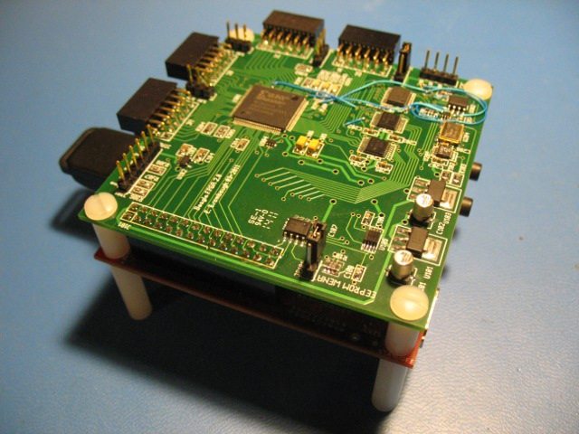

xml version="1.0" encoding="utf-8"?

Beagle FPGA Rev 2

# Beagle FPGA Expansion Board Rev 2 (Prototype)

#### Assembled prototype board w/ Beagle

## What is it?

This is a small (3.1" x 3" - same size as Beagle) board with a Xilinx Spartan
3A FPGA connected directly to the Beagle expansion connector. Designed to mount
back-to-back with the Beagle using 3/8" stand-offs, it provides the following
features:

* Xilinx [XC3S200AVQ100](http://www.xilinx.com/products/spartan3a/) Spartan 3A FPGA with 200kgates, 16 Multipliers and 288kb RAM.
* Numonyx [M25P20](http://www.micron.com/products/ProductDetails.html?product=products/nor_flash/serial_nor_flash/M25P20-VMN3PB) 2Mb SPI Flash configuration memory
* 50 MHz crystal oscillator
* Linear Tech [LTC6904](http://www.linear.com/pc/productDetail.jsp?navId=H0,C1,C1010,C1096,P2416) I2C 10kHz-68MHz programmable CMOS clock oscillator
* Beagle community standard [I2C ID EEPROM](http://elinux.org/BeagleBoardPinMux#Expansion_boards)
* 4 x Digilent-compatible I/O ports with 8 FPGA I/O, VDD (selectable 5V or 3.3V) and GND.
* 3.3V I2C port for off-board serial expansion.
* JTAG port for FPGA development and debugging.
* 3x Diagnostic LEDs (2 User defined, 1 Configuration status).

## Background

### Motivation

This board was conceived as a general-purpose I/O board with sufficient on-board
logic resources to support experiments in digital audio, Software Defined Radio,
robotics and general experimentation. 

### Versions

The original version was a one-off personal project intended as a proof-of-concept
and is described in more detail on [its own web page](../beagle/beagle_fpga.html).
A small number of this board were produced for use in dedicated applications, but were
never generally released for sale.

Rev 2 described here is targeted for commercial production and has a few minor modifications
to allow more I/O flexibility. Changes include:

* Re-arranged connections between the FPGA and Beagle Expansion connector to
 support a wider range of interfaces. In particular, the MMC2 port and its
 control signals are fully connected, allowing the FPGA to function as an
 SDIO peripheral, or MMC level shifter.
* Addition of a 2Mb SPI Flash memory from which the FPGA will configure itself
 at power-on. This allows dedicated interfaces to be in place prior to booting the
 Beagleboard so that peripherals can be available to the Linux kernel at boot time.
* Addition of a second User LED for enhanced diagnostic capability

## Design Details

### Expansion Connector

All GPIO/Muxed signals on the Beagle Expansion connector are routed to the
FPGA, with the exception of the I2C signals which are used for ID and control
on-board. Some pins do have restricted functions as described below

* Pins 12, 16, 18 and 20 of the expansion connector carrying signals for McSPI 4 
 are dedicated for configuration of the FPGA after power-up and writing to the SPI
 configuration flash memory and are not bi-directional. If you want to alter the
 FPGA functions or reprogram the configuration flash memory your kernel will have to
 support this interface. If you prefer to use these pins for other functions you will
 have to restrict the data direction to that similar to the McSPI 4 connections.
* Pin 6 of the expansion connector carries the UART2\_TX signal (or McBSP3 Clock)
 and is restricted as an output only.
* Pins 4, 8 and 10 of the expansion connector pass through a level shifter with
 programmable data direction. In order to use these for bi-directional data you need
 to configure their direction via the I2C2 port expander chip as described below.

The nRESET signal on pin 26 of the expansion header is optionally available
at pin 21 of the FPGA by installing a 0-ohm resistor at location R104. This is
not installed by default since incorrect application of the FPGA input pulldown
resistor could cause the Beagleboard to be held in reset state. It is recommended
that this is only be installed by experienced users who understand the possible
failure modes involved.

The 1.8Vand REGEN pins are not used.

### Configuration

At power up the FPGA is set to Configuration Mode [001] (Master SPI mode) and loads itself
from the on-board SPI Flash memory. By toggling several bits in the I2C2 port expander chip
at bus address 0x38 the FPGA may be set to Configuration Mode [111] (Slave Serial mode) which
allows the Beagleboard processor to load it via McSPI 4 at any time. Serial configuration is
quite fast (less than 1 second) in either case and LED301 on the board (labelled "DONE") will
light to indicate a successful configuration.

Altering the content of the on-board SPI flash also uses McSPI 4. A special temporary
'pass-thru' FPGA design is required which provides a direct connection between McSPI 4 and
the SPI Flash memory to support programming and verifying the contents of the flash chip.

A bitstream download application which uses kernel I2C and SPIDEV drivers to manage the
process of configuration and programming will be provided for userland setup. Additionally,
a simple C language library of support functions is available that allows custom applications
to take control of the FPGA board.

### JTAG

A 6-pin JTAG header is provided for external configuration and debug. It
conforms to the Digilent JTAG pinout, but can also be used with Xilinx
download cables if flywires are used. This is handy for testing the FPGA
without the Beagle attached, or for debugging designs using Xilinx's
Chipscope application.

### ID

A 128-byte I2C EEPROM is available for conformance with the
[Beagle Expansion
board ID standard](http://elinux.org/BeagleBoardPinMux#Expansion_boards). The ID is 0x0006 0x0001.

Rev 2 of the Beagle FPGA board shares the same ID as the
earlier version because the GPIO mux settings are identical, and in order to
minimize the impact on kernel and u-boot code bases. An extra version byte in
the I2C EEPROM is used to differentiate the board revisions to ensure that
the proper support tools are used to program the board.

While normally write-protected, a Write-Enable jumper is provided to set the
ID and any other data stored in the EEPROM. This device uses address 0x50h.

### I2C

A 3.3V level shifted version of the Beagle I2C2 bus is available, along with
3.3V supply and GND on a 4-pin header. This can be used to add I2C peripherals
off-board. Bear in mind that there already 3 devices on the bus as listed here,
so check that any additional devices don't collide with these:

* ID EEPROM: 24C01W at I2C address 0x50
* Port Expander: PCF8574 at I2C address 0x38
* Clock Oscillator: LTC6904 at I2C address 0x17

### Digilent Ports

These are 12-pin right-angle 0.1" receptacles which conform to the Digilent
PMOD standard. Each connector provides 8 bits of direct connection to the FPGA,
along with two power and two ground connections. Power is jumper selectable as
either 3.3V or 5V on a per-connector basis, but bear in mind that the logic levels
to and from the FPGA must not exceed 3.3V.

Digilent (and others) sell a variety of I/O boards for this standard that are
inexpensive, small and provide a wide range of interfacing opportunities, including
Ethernet, RF/Wireless, motor control, audio, etc. Find out more at
[Digilent's site](http://www.digilentinc.com/Products/Catalog.cfm?NavPath=2,401&Cat=9).

There are two of these connectors on two sides of the board, spaced at the
same interval as is found on Digilent FPGA boards, so standard two-connector
boards with up to 16 I/O signals are possible.

### FPGA

The Xilinx XC3S200A Spartan 3A FPGA on this board is inexpensive (about
$12 in single quantity) and provides sufficient I/O and logic resources to 
perform a wide range of interfacing and processing tasks. Simple signal
processing, sequencing and control are certainly possible, as well as some
buffering and reformatting using on-chip RAM.

### LEDs

There are three LEDs are on-board:

* LED301 (green) labled "DONE" lights when the FPGA has a valid configuration.
* LED302 (blue) labled "USER0" is connected to I/O pin P50 on the FPGA and can
 be used as a visual indicator of internal activity.
* LED303 (green) labled "USER1" is connected to I/O pin P49 on the FPGA and can
 be used as a visual indicator of internal activity.

### Clocks

No dedicated clocks are provided on the Beagle expansion header, so this board
provides two clock sources. A crystal oscillator generates a stable 50MHz
clock suitable for high-accuracy timing, while an I2C-programmable oscillator
supplies a variable clock in the 1kHz to 68MHz range with less accuracy and
more jitter. This device is at I2C address 0x17.

### Power

On-board 3.3V, 1.8V and 1.2V LDO regulators derive all the supplies required
from the Beagle 5V supply provided on the expansion connector. While the 3.3V
and 1.2V regulators which supply the FPGA I/O and Core voltages are rated for
close to 1A, it is recommended that FPGA designs which require high power are
not considered for this board. Although the Spartan 3A chip used here can
operate at fairly high internal frequencies approaching 200MHz, the practical
limitations of power supply and heat management will constrain the designs
that can safely be realized on this board.

## Software

### Kernel

Minimal kernel driver support required for the Rev 2 FPGA board includes I2C2 and SPI
port 4 with SPIDEV, as well as pin muxing to make these interfaces available
on the Beagle expansion port. Since the board conforms to the Beagle IDPROM
standard it is already automatically recognized by recent versions of u-boot
and pin-muxes are correctly set. Recent versions of the kernel (2.6.32 ->) recognize
the 'expansionboard=beaglefpga' parameter and enable McSPI4 in SPIDEV mode.

### User

A Beagle user-space application and access library is provided which supports
all the features on the board. The application can be used to download FPGA
configuration files, program the SPI Flash memory, control the
programmable clock oscillator and test the SPI control port. The access
library provides a low-level API for control of the I2C and SPI ports,
as well as higher level functions for bitstream download and may be used
to construct complex user-space applications for interaction with the FPGA
design. Full source for this is available at:

git://gitorious.org/bfpga\_lib/bfpga2\_lib.git

A "Manufacturing Test" program is also available which exercises all the
expansion port pins between the Beagle and the FPGA, as well as the Digilent
output ports and the on-board clock oscillators. The program can be used
as an example of accessing GPIO, controlling the level shifter directions
and talking to the FPGA's designed-in SPI control port. Note that this
requires some kernel and/or u-boot hacking to make Beagle GPIO pins 144-146
available via SYSFS. More details on that later. 

### FPGA Design

Synthesizing an FPGA design requires the Xilinx ISE Webpack which is
a free download from the Xilinx website. This suite of tools includes a
GUI IDE as well as command-line applications that can be run under both
Linux and WinXX. Designs can be created with either Verilog or VHDL. Demo
designs will be provided to showcase the capabilities of the Tracker board
and will provide enough detail for starting on custom designs.

## Design Documentation

* [Schematic Diagram](beagle_fpga2_pg1-3.pdf)
* [BOM](bom_sort.xls)
* more to come...

## Status

* 02-16-11 - Initial Feasibility discussions.
* 03-21-11 - Artwork and BOM sent for prototype manufacturing
* 05-17-11 - Prototype boards received. Fix minor errors and confirm I2C works.
* 05-19-11 - JTAG download works
* 05-21-11 - Update configuration utility. Slave Serial configuration works.
* 06-15-11 - Revise configuration muxing for Master SPI configuration. Slave Serial still works.
* 06-17-11 - Add SPI Flash programming capability. Power-up SPI configuration works.
* 06-21-11 - Manufacturing Test Program works. Create web page.

[Return to Embedded page.](../index.html)
##### 
**Last Updated**

:2011-06-22
##### 
**Comments to:**

[Eric Brombaugh](mailto:ebrombaugh1@cox.net)

