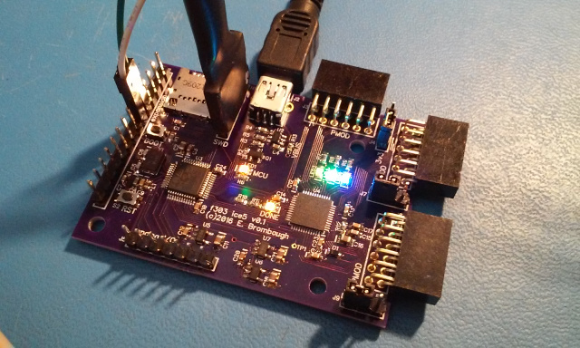

xml version="1.0" encoding="utf-8"?

STM32F303 + ice5 Development Board

# STM32F303 + ice5 Development Board

## What is it?

The STM32F303 + ice5 is a small (2.5" x 1.8") board with an STM32F303CCT6 MCU
and a Lattice ice40 Ultra or Ultra PlusFPGA. USB, Micro SD, PMOD and GPIO interfaces
allow development of complex projects in control and signal processing.

* [STM32F303CCT6](http://www.st.com/internet/mcu/product/252051.jsp)
 CPU with:
	+ 32-bit ARM Cortex-M4F CPU rated for 72MHz clock
	+ 48kB SRAM
	+ 256kB Flash
	+ 10 Timers
	+ 3 SPI (2 I2S)
	+ 2 I2C
	+ 3 USART
	+ 1 CAN
	+ 1 USB Device
	+ 37 GPIO pins (20 5V tolerant)
	+ 4 12-bit SAR ADC
	+ 2 12-bit DACs
	+ 7 Analog Comparators
	+ 4 Op-Amps
* Lattice [Ultra or Ultra Plus](http://www.latticesemi.com/en/Products/FPGAandCPLD/iCE40Ultra.aspx)
 FPGA:
	+ Ultra - iCE5LP4K-SG48
		- 3520 LUTs
		- 4 Multiplier/Accumulate blocks
		- 20x 4kb EBRAMs
		- OTP Non-volatile configuration memory
		- 1 PLL
		- 2 I2C cores
		- 2 SPI cores
		- 10kHz oscillator
		- 48MHz oscillator
		- 3 24ma OC LED drivers
	+ Ultra Plus - iCE5UP5K-SG48
		- 5280 LUTs
		- 8 Multiplier/Accumulate blocks
		- 30x 4kb EBRAMs
		- 2x 32kx16b SPRAMs
		- OTP Non-volatile configuration memory
		- 1 PLL
		- 2 I2C cores
		- 2 SPI cores
		- 10kHz oscillator
		- 48MHz oscillator
		- 3 24ma OC LED drivers
* single 5V supply (USB bus power or external on header)
* 3.3V 300ma regulator for MCU
* 3.3V 300ma regulator for FPGA I/O
* 1.2V 300ma regulator for FPGA core
* 5x Diagnostic LEDs (1 MCU user defined, 1 Configuration status, 3 FPGA user defined).
* 3x 12-pin Digilent-style PMOD connectors with 8 FPGA I/O each and selectable supply voltage.
* USB Full-speed device (mini-B connector) with interface reset circuit.
* Micro SD card slot with SPI interface to MCU.
* Dedicated SPI port between MCU and FPGA
* Misc GPIO between MCU and FPGA (Full-duplex I2S / USART / etc)
* Analog and Digital GPIO for the MCU.
	+ SPI port (shared with on-board micro SD)
	+ USART TX/RX
	+ I2C port
	+ 5 Analog I/O (1 on-chip DAC and/or 5 muxed ADC inputs)
	+ Misc GPIO
* Boot and Reset buttons.
* 6-pin ST-Link standard SWD programming/debugging port.

### Configuration

Lattice ice40 Ultra and Ultra Plus parts can be configured either from internal
OTP flash or externally. This board allows the STM32 processor to configure the
FPGA either from on-chip flash (the Ultra configuration bitstream is ~70kB and
Ultra Plus is ~105kB, either of which fits easily into the 256kB on-chip flash)
or from the micro SD interface.

### Software Development

The STM32 family of parts are supported by a variety of commercial IDEs, all
of which are available in low-cost or limited free versions from the
[ST website](http://www.st.com/internet/mcu/class/1734.jsp).

I prefer to use open-source tools so I've set up a development environment
based on the GNU C compiler for ARM, available for free from the Launchpad
project. For downloading to the target I use OpenOCD and the ST-Link V2 SWD
interface that's available on most all of the inexpensive STM32 Discovery boards.
To accelerate development I also use the STM32 Standard Peripheral Library as
a starting point for my code and then optimize out the heavyweight functions
as required. Links to all of these are here:

* [Launchpad GCC](https://launchpad.net/gcc-arm-embedded): 
 ARM-supported GCC (somewhat newer than the CS version above).
* [OpenOCD](http://openocd.org/): JTAG/SWD interface for
 programming a debugging.
* [STM32 Standard Peripheral Library for STM32F30x](http://www.st.com/content/st_com/en/products/embedded-software/mcus-embedded-software/stm32-embedded-software/stm32-standard-peripheral-libraries/stsw-stm32108.html): Manufacturer's low-level C driver code.
* [dfu-util](http://dfu-util.sourceforge.net/): Simple Linux application to program STM32Fiend via USB DFU.

### Hardware Development

The Lattice ice40 Ultra family is supported by a freely available iCEcube2
toolchain from the manufacturer. 
[Lattice iCEcube2 Download Page](http://www.latticesemi.com/iCEcube2)
Ultra Plus FPGAs are now supported by the
[Icestorm](http://www.clifford.at/icestorm/) toolchain.
Ultra FPGAs are not yet supported but are similar enough to Ultra Plus that
they may well be supported in the future. Keep checking at the project
website as more device support is added frequently.

### What can it do?

This board provides plenty of horsepower for DSP. The [iceRadio](../../radio/iceRadio/index.html)
project demonstrates some of the things I've been able to do with it.

## Design Documentation

* [Schematic Diagram](f303_ice5_sch.pdf)
* [Bill of Materials](f303_ice5_bom.xls)
* [Top Paste Mask for stenciling](f303_ice5_TopPaste.gbr)
* [Board at OSHpark](https://oshpark.com/shared_projects/UdMUb3Xu)
* [Firmware and Hardware design code at GitHub](https://github.com/emeb/f303_ice5)

## Status

* 2016-05-17 - Design started.
* 2016-06-30 - PCBs back from fab.
* 2016-07-02 - PCB assembled and verified.
* 2016-07-02 - Web page created.
* 2016-07-04 - Web page updated with GitHub project link.
* 2016-07-20 - Added paste mask for stenciling.
* 2018-01-21 - Confirmed to work with Ultra Plus.

[Return to Embedded page.](../index.html)
##### 
**Last Updated**

:2018-01-21

