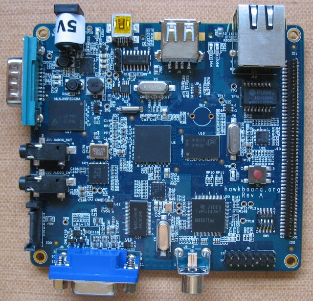

xml version="1.0" encoding="utf-8"?

Hawk

# InnovateSolutions Hawkboard

#### InnovateSolutions Hawkboard

### What is it?

This is a small board with a TI OMAP-L138 processor, two USB ports, Ethernet,
RS-232, VGA out, Composite in, SD/MMC slot, SATA, audio I/O and an expansion
port. I haven't done much with it besides confirm that it powers up and I can
talk to it via UART and Ethernet. Find out more about it at the following sites:

* [Main Hawkboard site](http://hawkboard.org)
* [Special Computing (US distributors)](https://specialcomp.com/hawkboard/index.htm)
* [elinux.org Beginners page](http://elinux.org/Hawkboard/BeginnersGuide)
* [elinux.org main page](http://elinux.org/Hawkboard)
* More to come

[Return to Embedded page.](../index.html)
##### 
**Last Updated**

:2010-04-25
##### 
**Comments to:**

[Eric Brombaugh](mailto:ebrombaugh1@cox.net)

