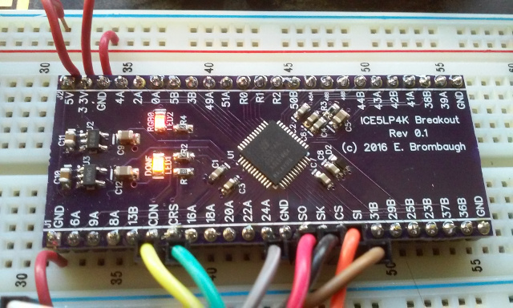

xml version="1.0" encoding="utf-8"?

ice5 Breakout Board

# ice5 Breakout Board

## What is it?

The ice5 Breakout is a small (1.0" x 2.4") board with a Lattice ice40 Ultra 
FPGA pinned out to 0.1" headers suitable for use with a solderless breadboard.
In addition to the FPGA it also provides 3.3V and 1.2V regulators to source the
power supplies required by the FPGA. Two LEDs are provided as well, one to
indicate when the FPGA is configured and another for general use which is
hooked to one of the three dedicated LED driver outputs on the FPGA.

* Lattice [iCE5LP4K-SG48](http://www.latticesemi.com/en/Products/FPGAandCPLD/iCE40Ultra.aspx) FPGA with
	+ 3520 LUTs
	+ 4 Multiplier/Accumulate blocks
	+ 20x 4kb RAMs
	+ OTP Non-volatile configuration memory
	+ 1 PLL
	+ 2 I2C cores
	+ 2 SPI cores
	+ 10kHz oscillator
	+ 48MHz oscillator
	+ 3 24ma OC LED drivers
* single 5V supply
* 3.3V 300ma regulator for I/O
* 1.2V 300ma regulator for core
* 2x Diagnostic LEDs (1 User defined, 1 Configuration status).
* All FPGA I/O on 0.1" headers.

### Configuration

Lattice ice40 Ultra parts can be configured either from internal OTP flash or
externally. This board does not contain any external configuration memory so
the FPGA must be provided with a SPI configuration memory, or configured via
a separate programming source such as an MCU with a SPI port or a programming
pod.

## Design Documentation

* [Schematic Diagram](ice5lp4ksg48_breakout_sch.pdf)
* [Bill of Materials](ice5lp4ksg48_breakout_BOM.xls)
* [Board at OSHpark](https://oshpark.com/shared_projects/usbPsR74)

## Status

* 2016-04-05 - Design started.
* 2016-04-13 - PCBs back from fab.
* 2016-05-01 - PCB assembled and FPGA verified.
* 2016-07-02 - Web page created.

[Return to Embedded page.](../index.html)
##### 
**Last Updated**

:2016-07-02

