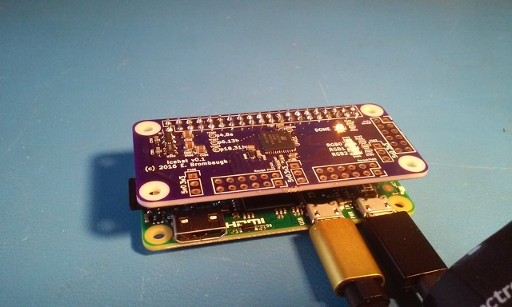

xml version="1.0" encoding="utf-8"?

icehat - Raspberry Pi ice40 Ultra/Ultra Plus FPGA hat

# icehat - Raspberry Pi ice40 Ultra/Ultra Plus FPGA hat

## What is it?

The icehat is a small (Raspberry Pi Zero-sized) board with a Lattice ice40 Ultra or Ultra Plus
FPGA and three Digilent-compatible 8-bit PMOD receptacles.
* Lattice [Ultra or Ultra Plus](http://www.latticesemi.com/en/Products/FPGAandCPLD/iCE40Ultra.aspx)
 FPGA:
	+ Ultra - iCE5LP4K-SG48
		- 3520 LUTs
		- 4 Multiplier/Accumulate blocks
		- 20x 4kb EBRAMs
		- OTP Non-volatile configuration memory
		- 1 PLL
		- 2 I2C cores
		- 2 SPI cores
		- 10kHz oscillator
		- 48MHz oscillator
		- 3 24ma OC LED drivers
	+ Ultra Plus - iCE5UP5K-SG48
		- 5280 LUTs
		- 8 Multiplier/Accumulate blocks
		- 30x 4kb EBRAMs
		- 2x 32kx16b SPRAMs
		- OTP Non-volatile configuration memory
		- 1 PLL
		- 2 I2C cores
		- 2 SPI cores
		- 10kHz oscillator
		- 48MHz oscillator
		- 3 24ma OC LED drivers
* single 5V supply from RPi Header
* 3.3V 300ma regulator for FPGA I/O
* 1.2V 300ma regulator for FPGA core
* 4x Diagnostic LEDs (1 Configuration status, 3 FPGA user defined).
* 3x 12-pin Digilent-style PMOD connectors with 8 FPGA I/O each and selectable supply voltage.
* Dedicated SPI port between RPi and FPGA
* I2S between RPi and FPGA

### Configuration

Lattice ice40 Ultra and Ultra Plus parts can be configured either from internal
OTP flash or externally. This board allows the RPi to configure the FPGA using
GPIO and SPI available on the Raspberry Pi expansion port. A simple userspace
library and command-line application is provided to download the bitstream. Once
downloaded, the RPi SPI port can also be used to communicate with the design
in the FPGA.

### Hardware Development

The Lattice ice40 Ultra family is supported by a freely available iCEcube2
toolchain from the manufacturer. 
[Lattice iCEcube2 Download Page](http://www.latticesemi.com/iCEcube2)
Ultra Plus FPGAs are now supported by the
[Icestorm](http://www.clifford.at/icestorm/) toolchain.
Ultra FPGAs are not yet supported but are similar enough to Ultra Plus that
they may well be supported in the future. Keep checking at the project
website as more device support is added frequently.

### Design Notes

**Assembly:** This was one of my first KiCad designs in a long time and there are a few
aspects of the PCB layout that are... shall we say "non-optimum". In particular
I neglected to use the "hand-soldering" footprint variants so assembly is somewhat
more difficult than it really needs to be. If there is sufficient interest in
this board I may update the layout to make it easier for hand assembly.

**Configuration GPIO:** The FPGA configuration is done via the RPi SPI port with
a few GPIO to provide the CRESET and DONE handshaking. I picked some random GPIO
pins for this purpose but if there is a more standard way of doing this then I'd
be happy to revise these connections.

**Configuration Flash:** In general this board cannot stand alone - it relies on the
RPi to provide the FPGA configuration because there is no on-board external flash
storage. Yes, the OTP NVCM in the FPGA can be used but because it's OTP it's not
a good option for development. It might be possible to add an external SPI flash
memory but this would require some additional circuit work to allow programming
from the RPi.

**Additional GPIO:** I often do digital audio work, so I've connected the
RPi I2S expansion pins to the FPGA in order to allow the FPGA to be inserted into
the audio processing path.

## Design Documentation

* [Schematic](./icehat_sch.pdf)
* [Board at OSHpark](https://oshpark.com/shared_projects/arGUJG2i)
* [Firmware and Hardware design code at GitHub](https://github.com/emeb/icehat)

## Status

* 2016-10-06 - Design started.
* 2016-10-27 - PCBs back from fab.
* 2016-10-30 - PCB assembled and verified.
* 2016-10-31 - Web page created.
* 2018-01-21 - Successfully tested with Ultra Plus FPGA.

[Return to Embedded page.](../index.html)
##### 
**Last Updated**

:2018-01-21

