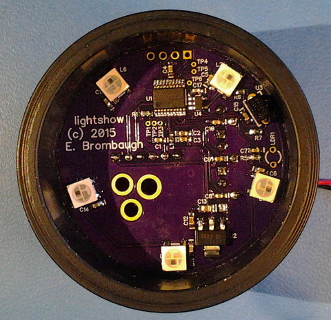

xml version="1.0" encoding="utf-8"?

Lightshow

# Lightshow

#### Lightshow board V0.1

### What is it?

This is a small (1.9" dia) board with 5 WS2812 RGB LEDs, an STM32F030F4 MCU,
3.3V regulator, IR receiver, CdS cell, three trimmer pots, SWD header and some
I/O pins brought out to testpoints and a SIP header. It's designed to mount
inside a piece of 1.5" PVC plumbing coupling to act as a light-up base for a
small rock crystal sphere. A 2.1mm ID barrel power connector allows it to be
powered from commonly available 5VDC wall warts. The trimmer pots allow selection
of light show algorithms, speed and brightness. The IR receiver can interface
with commonly available remote controls and the CdS cell allows it to adapt to
ambient light conditions.

### Why?

I've had this rock sphere rolling around on my desk for years and decided to do
something dramatic for it. Coming up with some interesting light algorithms and
learning how IR messaging works seemed like a side benefit.

### Software Development

The STM32 family of parts are supported by a variety of commercial IDEs, all
of which are available in low-cost or limited free versions from the
[ST website](http://www.st.com/internet/mcu/class/1734.jsp).

I prefer to use open-source tools so I've set up a development environment
based on the GNU C compiler for ARM, available for free from the Launchpad
project. For downloading to the target I use OpenOCD and the ST-Link V2 SWD
interface that's available on most all of the inexpensive STM32 Discovery boards.
To accelerate development I also use the STM32 Standard Peripheral Library as
a starting point for my code and then optimize out the heavyweight functions
as required. Links to all of these are here:

* [Launchpad GCC](https://launchpad.net/gcc-arm-embedded): 
 ARM-supported GCC (somewhat newer than the CS version above).
* [OpenOCD](http://openocd.org/): JTAG/SWD interface for
 programming a debugging.
* [STM32F0 Discovery](http://www.st.com/web/catalog/tools/FM116/SC959/SS1532/PF253215?sc=internet/evalboard/product/253215.jsp): Development board with USB flash programming
 and debugging.
* [STM32 Standard Peripheral Library for STM32F0xx](http://www.st.com/web/catalog/tools/FM147/CL1794/SC961/SS1743/LN1939/PF257884): Manufacturer's low-level C driver code.

### Design Resources

* Schematic: <lightshow_sch.pdf>
* OSHpark board: [Lightshow](https://oshpark.com/shared_projects/DcfLx8YA)
* BOM: <lightshow_bom.xls>
* Source on GitHub: [github.com/emeb/lightshow](https://github.com/emeb/lightshow)
* More to come...

### Revisions

* V0.1 was first board fabbed.

## Status

* 05-14-15 - Schematic and layout.
* 05-15-15 - PCB design sent to fab.
* 05-26-15 - Created Web Page.
* 05-28-15 - Boards back from fab, assembled, works.

[Return to Embedded page.](../index.html)
##### 
**Last Updated**

:2015-05-28
##### 
**Comments to:**

[Eric Brombaugh](mailto:ebrombaugh1@cox.net)

