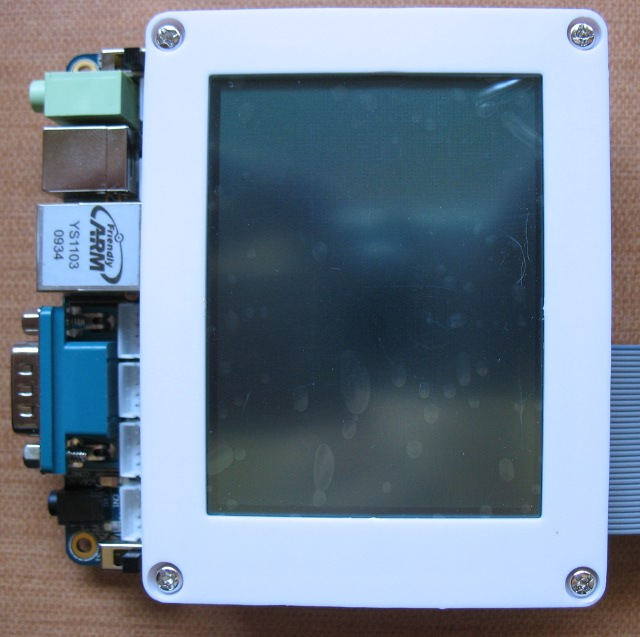

xml version="1.0" encoding="utf-8"?

mini2440

# FriendlyARM mini2440

#### mini2440

## What is it?

The [FriendlyARM
mini2440](http://www.friendlyarm.net/products/mini2440) is a small single-board computer with plenty of I/O and several
options for touch-screen LCD interfaces. I've got the version with a 3.5"
touchscreen which is available from several resellers in the USA for about
$110:

* [Mini-Box](http://www.mini-box.com/mini2440v2)
* [Andahammer](http://andahammer.com/mini3/?PHPSESSID=7cea4a579fb470cd8fa48091c5df19c2)

## Hardware

The principle attraction of the mini2440 is all the I/O. In particular, there are
a number of 3- and 4-pin shells with serial, audio and power connections, and a
34-pin shrouded IDC header which carries processor GPIO, clocks and I2C signals.
These are somewhat unusual connectors, especially the expansion header which is
a 2mm pitch. Fortunately they're all available at the normal components retailers:

* [Digi-Key](http://www.digikey.com)
	+ [4-pin housing](http://search.digikey.com/scripts/DkSearch/dksus.dll?keywords=455-1164-ND)
	+ [3-pin housing](http://search.digikey.com/scripts/DkSearch/dksus.dll?keywords=455-1126-ND)
	+ [Crimp pins](http://search.digikey.com/scripts/DkSearch/dksus.dll?keywords=455-2148-1-ND)
	+ [34-pin 2mm IDC connector](http://search.digikey.com/scripts/DkSearch/dksus.dll?keywords=S9061-ND)
	+ [34-pin 2mm shrouded header](http://search.digikey.com/scripts/DkSearch/dksus.dll?keywords=S9023-ND)
* [Mouser](http://mouser.com)
	+ [1mm flat cable by the foot](http://www.mouser.com/Search/ProductDetail.aspx?R=191-2815-050virtualkey52320000virtualkey523-191-2815-050)

### Expansion header

The expansion header is where most of the interesting things are happening. This
provides access to a number of direct connections to the ARM SoC as shown below:

| Function | Pin | Pin | Function |
| --- | --- | --- | --- |
| +5V | 1 | 2 | +3.3V |
| GND | 3 | 4 | nRESET |
| AIN0 | 5 | 6 | AIN1 |
| AIN2 | 7 | 8 | AIN3 |
| GPF0/EINT0 | 9 | 10 | GPF1/EINT1 |
| GPF2/EINT2 | 11 | 12 | GPF3/EINT3 |
| GPF4/EINT4 | 13 | 14 | GPF5/EINT5 |
| GPF6/EINT6 | 15 | 16 | GPG0/EINT8/Button1 |
| GPG1/EINT9 | 17 | 18 | GPG3/EINT11/SPInCS1 |
| GPG5/EINT13/SPIMISO1 | 19 | 20 | GPG6/EINT14/SPIMOSI1 |
| GPG7/EINT15/SPICLK1 | 21 | 22 | GPG9/EINT17/nRTS1 |
| GPG10/EINT18/nCTS1 | 23 | 24 | GPG11/EINT19/TCLK1/Button6 |
| GPE11/SPIMISO0 | 25 | 26 | GPE12/SPIMOSI0 |
| GPE13/SPICLK0 | 27 | 28 | GPG2/SPInCS0 |
| GPE14/I2CSCK | 29 | 30 | GPE15/I2CSDA |
| GPB0/TOUT0 | 31 | 32 | GPB1/TOUT1 |
| GPH9/CLKOUT0 | 33 | 34 | GPH10/CLKOUT1 |

#### Legend

* AINx - analog inputs to 10-bit ADC
* GPxn - GPIO port x bit n
* EINTn - External Interrupt n
* SPIfn - SPI port n Function f
* I2Cf - I2C Function f
* nCTSx - UART x Clear to send
* nRTSx - UART x Request to send
* TCLKx - Timer x clock
* TOUTx - Timer x output
* CLKOUTx - Clock output x

Note that many of the pins have several functions which are selected by
setting the pinmux in the SoC - I'll discuss that in greater detail in the
software section. Also be aware that pins 16 and 24 are also tied to buttons
on the board, and many of the pins are also routed to some of the other
connectors so don't try to use them for more than one function at a time.
Refer to the schematic for further details about potential conflicts.

## Software

The mini2440 is shipped with a fairly usable QTopia installation running on
a Linux 2.6.x kernel. By default this kernel supports a few custom I/O drivers
to access the on-board LEDs and Buttons, as well as the I2C port and one of the
ADC channels. All of these are accessible via user-space devices for which demo
applications and source code is available. Unfortunately, if you want to use
other I/O ports and services you'll need to customize the kernel. Details of
that process are presented here.

Note that many of the folks using the mini2440 have chosen to completely
change their Linux installation. This means choosing a different kernel, a
new root filesystem, and in some cases even replacing the Supervivi bootloader
with an alternative like u-boot. I'm not interested in making such extensive
changes - the QTopia linux works fine and seems to be fairly well integrated,
so I'm happy to continue using it.

### Kernel Tweaking

Tweaking the Linux kernel isn't particularly difficult, but gathering the
information and tools required to do so and setting them up can be tedious.
[FriendlyARM's download page](http://www.friendlyarm.net/downloads)
has archives of the source and tools you'll need, as well as an extensive and
detailed user manual with instructions on how to do this in Chinese. For those
of us who don't read Chinese, Google Language tools are able to make some
sense of this manual - cutting and pasting into the translator worked for me
and I've extracted the relevent directions down into a text file which you
may find helpful: [mini2440 Manual ch5-7 English
Translation](ch5-7_eng.zip).

The most important part of setting up a development environment is to
be familiar with working with the linux command line. That's well outside
the scope of this document, so I'm assuming you've already got a Linux system
up and running which you can use to base the rest of the process on. I use
both Fedora 11 and Ubuntu 9.04, but all my mini2440 work has been done on the
Ubuntu system.
Given that you've got Linux running, the rest of the process
consists of:

1. #### Download and Install the ARM cross-compiler

 The ARM cross-compiler is available on the FriendlyARM download site
 here: [arm-linux-gcc-4.3.2.tgz](http://www.friendlyarm.net/dl.php?file=arm-linux-gcc-4.3.2.tgz).
 
 I found this blog entry extremely helpful for the process:
 [Equally Bad: Project: How to setup the mini2440 dev tools](http://equallybad.blogspot.com/2010/02/project-how-to-setup-default-dev-tools.html)
Take note of the software dependencies that are called out in the
 above blog. I've also been cautioned that on a vanilla Ubuntu 9.10
 install you may also need to install the ncurses5 package if you
 haven't already.
2. #### Download and Extract the Linux kernel source

 There are several versions of the Linux kernel shipped with the mini2440
 depending on when you bought your board. My board was delivered with the
 2.6.32-2 kernel, so that's what I'm basing this on. If you have an older
 kernel (use the 'uname -a' command to check) you'll want to use different
 files, or else upgrade your entire NAND installation to use more up-to-date
 firmware.
 
 The Linux kernel source I used is available on the FriendlyARM download site
 here: [linux-2.6.32.2-mini2440\_20100113.tgz](http://www.friendlyarm.net/dl.php?file=linux-2.6.32.2-mini2440_20100113.tgz).
 You'll want to use this rather than a generic Linux kernel since it contains
 customized code specific to the mini2440, including the LED, Button and ADC
 drivers.
 
 Once you have the kernel source tarball, choose a place to extract it
 - the location isn't critical. Use the command 'tar -zxvf linux-2.6.32.2-mini2440\_20100113.tgz'
 to do this and a new directory called 'linux-2.6.32.2' will be created. At this
 point you're ready to customize and/or compile your kernel. If you'd like to
 try building the kernel without changes just to test that everything is working,
 follow these steps:
 
	1. cd linux-2.6.32.2
	2. cp config\_mini2440\_t35 .config # choose the pre-built config that matches your LCD
	3. make menuconfig # and just exit
	4. make zImage # and wait for the process to finish - about 1/2 hour on my Atom CPU
Now you've got a compressed kernel image in ./arch/arm/boot that you can
 download into the NAND flash as described below.
3. #### Edit the board initialization routines for your hardware

 The specific hardware hookups that Linux has to know about are all set
 forth in the board init file and consist of data structures and C code
 which describe the hardware to the kernel drivers. This is aslo where the
 GPIO pinmux (mentioned above) is set up - it's responsible for routing
 the signals from on-chip peripherals like SPI and I2C to the port pins
 and must be configured before they can be used. The board init file
 for the mini2440 is located at:
 
 linux-2.6.32.2/arch/arm/mach-s3c2440/mach-mini2440.c
 
 As delivered, this board init file contains info about the UARTs,
 LCD, Ethernet, NAND, MMC and I2C buses. To use SPI bus 0 on the
 expansion connector we have to add information about it. I've done that
 already and the updated file can be found here:
 <mach-mini2440.c.zip>
Extract this file and copy it to the location above.
4. #### Configure and compile the kernel for your hardware

 Although we've told the kernel about the specific hardware our board
 uses in the init file, we need to give the kernel a set of drivers that 
 can talk to that hardware. More specifically, we want to add the GPIO and
 SPI device drivers to the config file. The easiest way to do this is
 to grab my config file here:
 <config_mini2440_t35_gpio_spi.zip>
Extract this file and copy it into the linux-2.6.32.2 directory, then
 follow these steps:
 
	1. cd linux-2.6.32.2
	2. make clean # to start over if you built a test case above
	3. cp config\_mini2440\_t35\_gpio\_spi .config
	4. make menuconfig # and just exit
	5. make zImage
 This will only work if you happen to have the same T35 LCD that I
 do. If you have different LCD you'll need to configure your kernel by
 hand using the menuconfig tool. This requires you to find the pre-built
 config file for your hardware - primarily which LCD you've got - and
 copy it to '.config' in the kernel root directory. When you've done
 this, run 'make menuconfig' to build and run the ncurses-based
 configuration utility. Use the arrow and enter keys to navigate around
 the various kernel options and enable the following:
 
	* GPIO sysfs
	* SPI
	* SPI Master
	* SPIDEV
	* SPI S3C24XX
Once you've found and enabled these (they should all be under the
 devices menu), exit menuconfig and proceed with 'make zImage'.
5. #### Install the kernel on the board

 This step requires the use of a host computer to talk to the Supervivi
 bootloader which is accessible when the mini2440 is powered up with the
 NAND/NOR switch in the NOR position. Two links are required - an RS-232
 serial connection for text-based command/response between you and the
 bootloader, and a USB connection for bulk data transfers. It's possible
 to do this in either Windows or Linux, but the Windows process seems a
 bit better integrated so that's the approach I took.
 
 NOTE: during the process of getting my kernel to work I had to
 download several times and I ran into some annoying USB driver behavior.
 It seems that the Windows USB driver for the mini2440 is buggy because
 it frequently fails to recognize the mini2440. The only solution I
 found was to disconnect the mini2440, uninstall the driver and
 reconnect/reinstall. Perhaps I should have tried downloading using
 the Linux approach - it might have been more reliable.
 
 You'll need a Windows machine to run the download application
 provided by FriendlyARM on the DVD which ships with the board. The
 application is called DNW and is found at:
 
 FriendlyARM/Chinease/windows####/dnw
 
 You'll also need the USB drivers for Supervivi which are found at:
 
 FriendlyARM/Chinease/windows####/usb##
 
 These can also be found on the FriendlyARM download page here:
 
	* [dnw.zip](http://www.friendlyarm.net/dl.php?file=dnw.zip)
	* [usb-downloaddr\_20090421.zip](http://www.friendlyarm.net/dl.php?file=usb-downloaddr_20090421.zip)
First connect the mini2440 RS-232 port to your Windows PC serial port
 (or use a USB/Serial adapter) with the serial cable that came with it.
 Bootloader commands are sent via this link. Connect the mini2440 USB
 to your PC as well - bulk data transfers take place over this
 connection. Flip the NAND/NOR switch on the mini2440 to the NOR position
 and power it up. Windows should recognize a new USB device and prompt you
 for the driver location. Point it at the USB driver mentioned above.
 
 Run DNW. It should spot the USB connection and put the text [USB:OK]
 in the window's title bar. Select "Serial Port->Connect" from the menus
 and hit enter a few times. This should put the text [COM:115300] in the
 window's title bar as well and you should see the Supervivi help text
 scroll across the screen.
 
  At this point you're ready to download your new kernel. Hit 'k' on
 the keyboard to download a kernel image. Now select 'USB Port->Transmit/Restore'
 from the menu. This brings up a file select dialog. Browse to the location
 of your new kernel file and proceed. A progress bar should appear as the
 file is sent - the process should only take a few seconds. Download is
 complete and you may now exit from DNW.
 
 Power down the board and flip the NAND/NOR switch back to the NAND
 position. Power up - you should see the penguin screen and short progress
 messages, after which a QTopia desktop appears. Pull up a terminal window
 and type 'uname -a' - the kernel date should be only a few minutes old.
 You're done.

### User Applications

After the process described above you should have a kernel with GPIO and SPI
capability. You should find a device named '/dev/spidev0.0' as well as new
GPIO entries in the /sys/class/gpio directory. You'll need some applications to test these
new I/O devices and I've got a few here:
* #### GPIO

 The GPIO device driver that we added to the kernel above is known as
 the 'sysfs' driver. This is because it works through a simple interface
 based on pseudo-files in the /sys hierarchy. This seems kind of odd
 at first, but makes GPIO easy to control from a variety of languages.
 
 A simple shell-script approach is described for the Beagle board over at
 [Make Magazine](http://blog.makezine.com/archive/2009/02/blinking_leds_with_the_beagle_board.html)
 and this works on the mini2440 with our new kernel as well. Just
 cut/paste the script there and load it into the mini2440. The I/O number
 that the script requires can be computed for any of our GPIO pins by
 
 GPIO\_num = GPIO\_port \* 32 + GPIO\_bit
 
 Where GPIO\_port is GPA = 0, GPB = 1, GPC = 2 ... GPH = 7, etc. So for
 example if you wanted to toggle pin 9 (GPF0) of the expansion header you
 would use the value 5\*32+0 = 160.
 
 You can find out more about the GPIO sysfs device driver by reading
 through the kernel documentation found at
 
 linux-2.6.32.2/Documentation/gpio.txt
 
 in the kernel source
* #### SPI

 The SPI device driver is fairly well described in the kernel source
 documentation found at
 
 linux-2.6.32.2/Documentation/spi/spidev
 
 In the same directory you'll also find source code for some
 user-space applications. I've compiled one of them for my system and
 you can grab it here: <spidev_test.zip>.
 
 To use it, just enter the command "./spidev\_test -D /dev/spidev0.0"
 If you short pins 25 to 26 you'll loopback MOSI to MISO and the test
 data sent out should come back. Disconnect the two pins and the data
 will change.

### Going Further

You'll notice that there are two SPI ports, numerous external interrupts,
timers and UART flow control options for some of the expansion connector pins.
Connecting these is possible and requires further modifications to the board
init file and kernel configuration. Additionally, there are four ADC inputs,
only one of which is presently supported by the kernel driver. All these should
be fairly easy to enable with a bit of extra work.

[Return to Embedded page.](../index.html)
##### 
**Last Updated**

:2010-03-28
##### 
**Comments to:**

[Eric Brombaugh](mailto:ebrombaugh1@cox.net)

