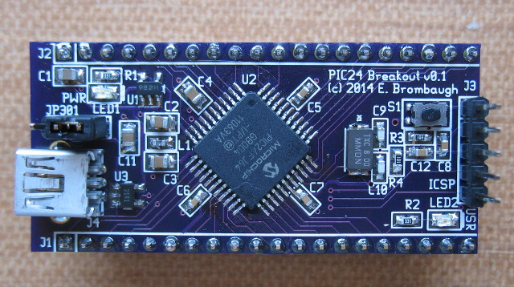

xml version="1.0" encoding="utf-8"?

PIC24 Breakout

# PIC24 Breakout

#### PIC24 Breakout Board

### What is it?

This is a small (1" x 2") board with a PIC24FJ64GB004-I/PT MCU, 3.3V regulator,
reset button, power LED, user GPIO LED, JTAG header, USB OTG socket and
most I/O pins brought out to SIP headers suitable for use in a solderless
breadboard. With this board one can easily prototype small PIC24 applications
with minimum effort and expense.

### What it isn't

This is not a full development system - you'll have to gather your own
programming tools, power supply, I/O devices, etc. This is not an Arduino
clone with all the low-level stuff already done for you.

### Features:

* [PIC24FJ64GB004-I/PT](http://www.microchip.com/wwwproducts/Devices.aspx?dDocName=en536118)
 CPU with:
	+ 16-bit PIC24 CPU rated for 16 MIPS
	+ 8kB SRAM
	+ 64kB Flash
	+ 15 Timers
	+ 2 SPI
	+ 2 I2C
	+ 2 UART
	+ 1 USB OTG
	+ 35 GPIO pins
	+ 13 chl 10-bit SAR ADC
* Onboard 3.3V Regulator (4.1V - 6V input range)
* Filtered Analog 3.3V Supply
* Power and User LEDs
* Reset button
* 5-pin ISP header
* Jumper selectable bus or host power
* Fits standard solderless breadboard with 1 row exposed on each side

### Design Resources

* Schematic: <PIC24_breakout_schematic.pdf>
* More to come...

## Status

* 2011-07-31 - Schematic started.
* 2014-05-06 - Major revisions for OTG.
* 2014-05-07 - Layout started.
* 2014-05-08 - PCB design sent to fab.
* 2014-05-23 - PCB back from fab.
* 2014-05-25 - Assembled, blinky light works.

[Return to Embedded page.](../index.html)
##### 
**Last Updated**

:2014-05-26
##### 
**Comments to:**

[Eric Brombaugh](mailto:ebrombaugh1@cox.net)

