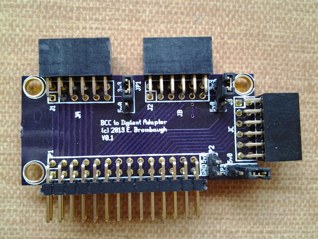

xml version="1.0" encoding="utf-8"?

PMOD Adapter

# BCC PMOD Adapter

#### PMOD Adapter Board

## What is it?

This is a simple adapter board that converts the
[BCC](../bcc/index.html) 28-pin connector to 3 12-pin PMOD connectors.
Using this board it is possible to connect several PMODs to the BCC for I/O
expansion. Since the BCC provides only 3.3V power on its connector, the adapter
also has a terminal pin for an alternate power supply and jumpers to select
either 3.3V or the alternate supply for each PMOD connector.

## Design Documentation

* [Schematic Diagram](bf2dig_pg1.pdf)
* [PCB Gerber files](pmod_adapter_gerber.zip)
* more to come...

## Status

* 02-05-13 - Design started.
* 02-07-13 - PCB submitted for fab.
* 02-20-13 - PCBs back from fab.
* 02-25-13 - PCBs assembled and verified.
* 05-28-13 - Web page created.

[Return to Embedded page.](../index.html)
##### 
**Last Updated**

:2013-05-28

