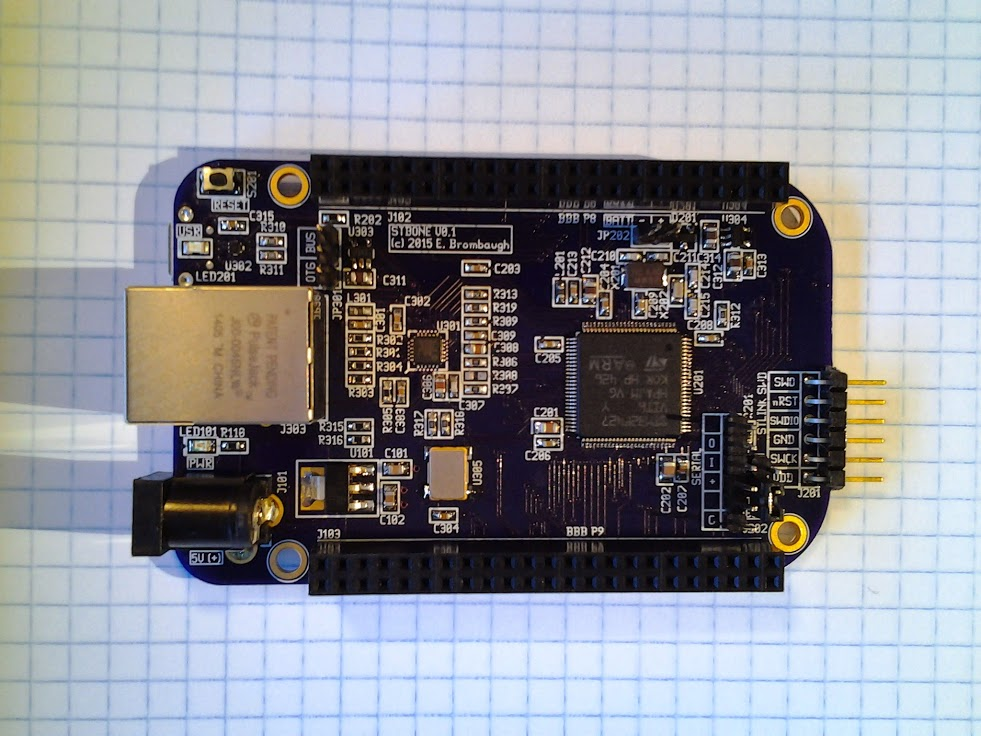

xml version="1.0" encoding="utf-8"?

STBone

# STBone - BeagleBone form-factor STM32F427 board

#### STBone Prototype

## What is it?

STBone is a small (3.4" x 2.15" - standard BeagleBone dimensions) board with
an STM32F427 MCU. Designed to support many BeagleBone capes via the standard P8/P9
connectors, it provides the following features:

* [STM32F427VIT6](http://www.st.com/web/en/catalog/mmc/FM141/SC1169/SS1577/LN1789/PF253575) processor with:
	+ 180MHz ARM Cortex M4F CPU with DSP and hardware floating point.
	+ 2MB Flash
	+ 256kB SRAM
	+ 3×12-bit, 2.4 MSPS ADC
	+ 2×12-bit D/A converters
	+ 17 timers
	+ 3×I2C interfaces
	+ 4 USARTs/4 UARTs
	+ 6 SPIs
	+ SAI (serial audio interface)
	+ SDIO
	+ 2×CAN
	+ USB 2.0 full-speed device/host/OTG
	+ 10/100 Ethernet MAC
	+ etc
* [LAN8720A-CP-TR](http://www.microchip.com/wwwproducts/Devices.aspx?product=LAN8720A) 10/100 Ethernet PHY
* Beaglebone standard 23x2 pin connectors with many BBB-compatible peripheral interfaces
	+ SPI
	+ I2C
	+ Audio
	+ Analog I/O
	+ UART
	+ 16-bit parallel FSMC
	+ Misc GPIO
* Micro SD card socket - 4-bit SDIO mode.
* USB Micro-AB port with device/host/OTG support.
	+ Power jumper for Host power (source) or Bus power (sink)
* 8MHz main crystal
* 32kHz RTC crystal
* Battery Backup option
* FTDI-compatible serial connector
* STLINK compatible SWD port for debugging and flash programming.
* Boot mode jumper to enable bootloader
* 5V center-positive power via 2.1mm barrel jack.
* Diagnostic LED.
* Power LED.
* Reset button.

### Motivation

This board was conceived as a simplified, low-cost stand-in for the Beaglebone
which would support many of the same I/O interfaces in a non-linux embedded
context. It has sufficient I/O resources to interoperate with many existing
Beaglebone Capes.

## Design Documentation

* [github repo of design materials](https://github.com/emeb/stbone)
* [Schematic Diagram](stbone_schematic.pdf)
* [Bill of Materials](bom_sorted.xls)
* more to come...

## Status

* 2014-02-01 - Schematic started.
* 2014-04-07 - Layout started.
* 2014-05-22 - Initial routing complete.
* 2015-01-20 - Major revisions - sent to fab.
* 2015-02-28 - PCB back from fab and assembled.
	+ USB device and host modes work
	+ Ethernet works
		- Minor bug - polarity of MagJack Speed LED reversed
	+ SDIO works
	+ FTDI serial connector works
	+ RTC works
	+ Backup Battery works
* 2015-03-05 - BCC and BCC S6 capes work.
	+ BBB P9 SPI and I2C ports work
	+ BBB P9 VDD\_5V works.
	+ BBB P9 SYS\_5V is NC - must jumper to VDD\_5V.

[Return to Embedded page.](../index.html)
##### 
**Last Updated**

:2015-03-05

