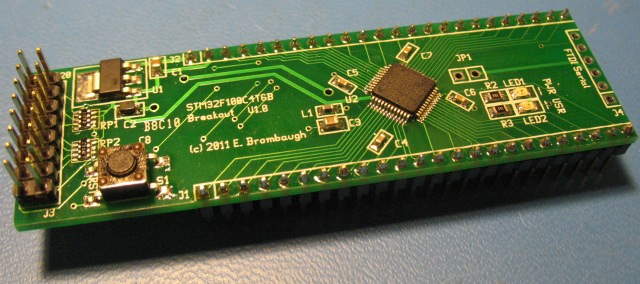

xml version="1.0" encoding="utf-8"?

STM32F100 Breakout

# STM32F100 Breakout

#### STM32F100 Breakout Board

### What is it?

This is a small (1" x 3.25") board with an STM32F100C4T6B MCU, 3.3V regulator,
reset button, power LED, user GPIO LED, JTAG header and all pins brought out
to SIP headers suitable for use in a solderless breadboard. With this board
one can easily prototype small ARM Cortex M3 applications with minimum effort
and expense.

### What it isn't

This is not a full development system - you'll have to gather your own
programming tools, power supply, I/O devices, etc. This is not an Arduino
clone with all the low-level stuff already done for you. If you want to get by
on the cheap you'll have to be familiar with setting up an ARM GCC toolchain
as well as how to build your own copy of the latest OpenOCD JTAG downloader.

### Features:

* [STM32F100C4T6B](http://www.st.com/internet/com/TECHNICAL_RESOURCES/TECHNICAL_LITERATURE/DATASHEET/CD00251732.pdf)
 CPU with:
	+ 32-bit ARM Cortex-M3 CPU rated for 24MHz clock
	+ 4kB SRAM
	+ 16kB Flash
	+ 6 Timers
	+ 1 SPI
	+ 1 I2C
	+ 2 USART
	+ 1 CEC (Consumer Electronics I2C)
	+ 37 GPIO pins
	+ 10 Chl 12-bit ADC
	+ 2 12-bit DAC
	+ Note: Footprint is compatible with other 48-pin QFP parts in the STM32F100 family for additional resources.
* Onboard 3.3V Regulator (4.75V - 15V input range)
* Filtered Analog 3.3V Supply
* Power and User LEDs
* Reset button
* 20-pin JTAG compatible programming interface
* 6-pin FTDI serial compatible interface
* Fits standard solderless breadboard with 1 row exposed on each side

### Interfaces

* J1, J2: 48 pins of direct access to the QFP pins of the MCU. Note
 that J2-1 is a 5V input to the on-board regulator but all other pins
 are directly connected.
* J3: 20-pin compatible JTAG connector This connector only provides
 16 pins of the 20 standard, but pins 17-20 were not used so just let your
 20-pin connector dangle. Be sure to align pin 1 on the cable and connector
 though!
* J4: 6-pin serial connector compatible with the FTDI USB/Serial pinout.
 Use this to create devices that can talk directly to a USB host with
 minimal cabling. Could also be used for bootloaders.
* JP1: Power jumper to allow the board to be powered by the FTDI
 USB/Serial cable. Use caution to avoid connecting an FTDI device to local
 supplies though.
* S1: Reset button - tied directly to the MCU reset input. Handy way to
 quickly reboot your MCU after flashing new code into it.
* LED1: Power indicator - lights up when 3.3V is present.
* LED2: User GPIO - connected to GPIOB-11. Useful for diagnostics.

### Software Development

The STM32 family of parts are supported by a variety of commercial IDEs, all
of which are available in low-cost or limited free versions from the
[ST website](http://www.st.com/internet/mcu/class/1734.jsp).

I prefer to use open-source tools, so I've set up a development environment
based on the GNU C compiler for ARM, available for free from Mentor/Codesourcery.
For downloading to the target I use OpenOCD, coupled with an Olimex USB-TINY JTAG
pod. To ease development I also use the STM32 Standard Peripheral Library to
as a starting point for my code and then optimize out the heavyweight functions
as required. Links to all of these are here:

* [CS Lite ARM GCC](http://www.mentor.com/embedded-software/sourcery-tools/sourcery-codebench/lite-edition): be sure to get v4.5 or greater for best code.
* [Open OCD JTAG downloader](http://openocd.berlios.de/web/): be sure to get version 0.5.0 or greater for STM32 'value line' support.
* [Olimex USB/JTAG pod](http://www.sparkfun.com/products/8278): works great with Open OCD
* [STM32 Standard Peripheral Library](http://www.st.com/internet/com/SOFTWARE_RESOURCES/SW_COMPONENT/FIRMWARE/stm32f10x_stdperiph_lib.zip): Manufacturer's low-level C driver code.

### Design Resources

* Schematic: <stm32_breakout_pg1.pdf>
* Example Source: <blinky_f100.zip>
* Bill of Materials: <bom.txt>
* Gerber archive (Suitable for OSHPark): <stm32_breakout_gerber.zip>

### Getting One

Interested? Gerbers are available in the Design Resources list above which can be used with most mail-order PCB fabs. Parts will run about $10 or so depending on
where you get them and which version of the processor you want.

[Return to Embedded page.](../index.html)
##### 
**Last Updated**

:2013-07-25
##### 
**Comments to:**

[Eric Brombaugh](mailto:ebrombaugh1@cox.net)

