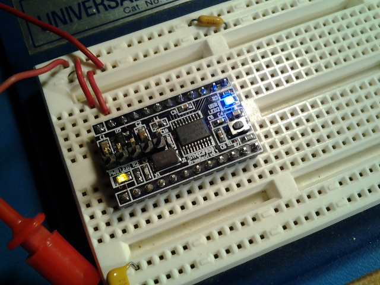

xml version="1.0" encoding="utf-8"?

STM32F030 Breakout

# STM32F030 Breakout

#### Assembled STM32F030 Breakout Board V0.1

### What is it?

This is a small (1.2" x 0.7") board with an STM32F030F4 MCU, 3.3V regulator,
reset button, power LED, user GPIO LED, SWD header and all I/O pins brought
out to SIP headers suitable for use in a solderless breadboard. With this
board one can easily prototype small ARM Cortex M0 applications with minimum
effort and expense.

Note that this board can also be used for other STM32F0xx parts in the
20-pin TSSOP package, such as the STM32F031F6P6.

### What it isn't

This is not a full development system - you'll have to gather your own
programming tools, power supply, I/O devices, etc. This is not an Arduino
clone with all the low-level stuff already done for you. If you want to get by
on the cheap you'll have to be familiar with setting up an ARM GCC toolchain
as well as using a JTAG/SWD debugger.

### Why?

Because CHEAP! These 20-pin TSSOP MCUs are some of the least expensive ARM
parts I've seen (less than $1 in small qty) but they still have plenty of
useful features. The package is small and easy to tuck into a corner of a
board but it's a 0.65mm pin pitch so it's not too tough to solder by hand.
And did I mention CHEAP?

### Features:

* [STM32F030F4](http://www.st.com/web/en/catalog/mmc/SC1169/SS1574/LN1826/PF258968)
 CPU with:
	+ 32-bit ARM Cortex-M0 CPU rated for 48MHz clock
	+ 4kB SRAM
	+ 16kB Flash
	+ 5 Timers
	+ 1 SPI
	+ 1 I2C
	+ 1 USART
	+ RTC
	+ 15 GPIO pins (4 are 5V tolerant)
	+ 1 12-bit SAR ADC with 11 input channels
* Onboard 3.3V Regulator (4.1V - 10V input range)
* Filtered Analog 3.3V Supply
* 8MHz crystal (not required)
* Power and User LEDs
* Reset button
* 5-pin ST-Link V2 SWD compatible programming interface
* Standard 24-pin 600-mil DIP form factor (Fits solderless breadboard
 with 2/3 rows exposed on each side

### Interfaces

* J1, J2: 24 pins of direct access to all of the pins of the MCU.
 In addition a 5V input and 3.3V output as well as 2 more GND pins
 are available.
* J4: 5-pin ST-Link V2 This connector provides the ST standard
 SWD debug/download connection. Note only pins 1-5 are used
 since this MCU doesn't provide the SWO normally present on pin 6.
* S1: Reset button - tied directly to the MCU reset input. Handy way to
 quickly reboot your MCU after flashing new code into it.
* LED1: Power indicator - lights up when 3.3V is present.
* LED2: User GPIO - connected to PB8. Useful for diagnostics.

### Software Development

The STM32 family of parts are supported by a variety of commercial IDEs, all
of which are available in low-cost or limited free versions from the
[ST website](http://www.st.com/internet/mcu/class/1734.jsp).

I prefer to use open-source tools so I've set up a development environment
based on the GNU C compiler for ARM, available for free from the Launchpad
project. For downloading to the target I use OpenOCD and the ST-Link V2 SWD
interface that's available on most all of the inexpensive STM32 Discovery boards.
To accelerate development I also use the STM32 Standard Peripheral Library as
a starting point for my code and then optimize out the heavyweight functions
as required. Links to all of these are here:

* [Launchpad GCC](https://launchpad.net/gcc-arm-embedded): 
 ARM-supported GCC (somewhat newer than the CS version above).
* [OpenOCD](http://openocd.org/): JTAG/SWD interface for
 programming a debugging.
* [STM32F0 Discovery](http://www.st.com/web/catalog/tools/FM116/SC959/SS1532/PF253215?sc=internet/evalboard/product/253215.jsp): Development board with USB flash programming
 and debugging.
* [STM32 Standard Peripheral Library for STM32F0xx](http://www.st.com/web/catalog/tools/FM147/CL1794/SC961/SS1743/LN1939/PF257884): Manufacturer's low-level C driver code.

### Design Resources

* Schematic: <stm32f03_breakout_schematic.pdf>
* PCB Gerbers: <stm32f03_breakout.oshpark.zip>
* OSHPark board: [STM32F03x Board](https://oshpark.com/shared_projects/ICEtPDRF)
* BOM: <bom.xls>
* Blinky LED test source: <f030_blinky.zip>
* I2C OLED driver source: <f030_oled.zip>
* More to come...

### Revisions

* V0.1 was first board fabbed.

## Status

* 03-24-15 - Schematic and layout.
* 03-25-15 - PCB design sent to fab.
* 04-04-15 - PCB back from fab, assembled, tested, works.
* 04-04-15 - Web page created.
* 04-09-15 - Added BOM.
* 11-29-16 - Added OLED project.

[Return to Embedded page.](../index.html)
##### 
**Last Updated**

:2016-12-18
##### 
**Comments to:**

[Eric Brombaugh](mailto:ebrombaugh1@cox.net)

