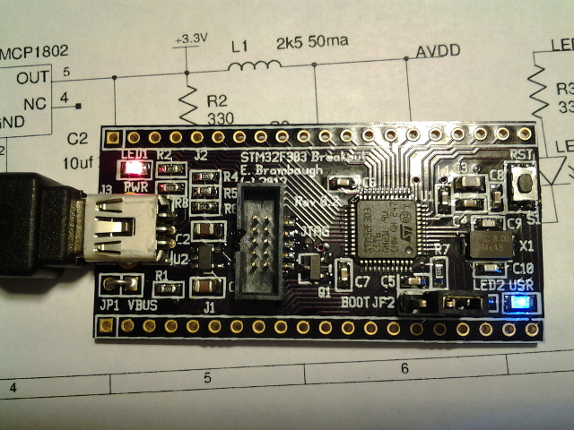

xml version="1.0" encoding="utf-8"?

STM32F303 Breakout

# STM32F303 Breakout

#### Assembled STM32F303 Breakout Board V0.2

### What is it?

This is a small (1" x 2") board with an STM32F303CCT6 MCU, 3.3V regulator,
reset button, power LED, user GPIO LED, JTAG header, USB Device socket and
most I/O pins brought out to SIP headers suitable for use in a solderless
breadboard. With this board one can easily prototype small ARM Cortex M4F
applications with minimum effort
and expense.

### What it isn't

This is not a full development system - you'll have to gather your own
programming tools, power supply, I/O devices, etc. This is not an Arduino
clone with all the low-level stuff already done for you. If you want to get by
on the cheap you'll have to be familiar with setting up an ARM GCC toolchain
as well as using a JTAG/SWD debugger or the on-chip USB DFU bootloader.

### Features:

* [STM32F303CCT6](http://www.st.com/internet/mcu/product/252051.jsp)
 CPU with:
	+ 32-bit ARM Cortex-M4F CPU rated for 72MHz clock
	+ 48kB SRAM
	+ 256kB Flash
	+ 10 Timers
	+ 3 SPI (2 I2S)
	+ 2 I2C
	+ 3 USART
	+ 1 CAN
	+ 1 USB Device
	+ 37 GPIO pins (20 5V tolerant)
	+ 4 12-bit SAR ADC
	+ 2 12-bit DACs
	+ 7 Analog Comparators
	+ 4 Op-Amps
* Onboard 3.3V Regulator (4.1V - 10V input range)
* Filtered Analog 3.3V Supply
* Power and User LEDs
* Reset button
* 10-pin Mini-JTAG or SWD compatible programming interface
* Fits standard solderless breadboard with 1 row exposed on each side

### Interfaces

* J1, J2: 40 pins of direct access to most of the pins of the MCU.
 Note that some power supply pins are combined and the USB pins are only
 brought to J3
* J3: USB Mini-B device connector. Use this to create devices that can
 talk directly to a USB host with minimal cabling.
* J4: 10-pin Mini JTAG connector This connector provides the ARM standard
 10-pin JTAG/SWD debug/download connections.
* JP1: Power jumper to allow the board to be powered by the USB interface.
 Use caution to avoid connecting both USB and local supplies
 simultaneously.
* JP2: Boot mode jumper. Enables the ROM bootstrap loader after reset.
 Serial and USB DFU modes are supported.
* S1: Reset button - tied directly to the MCU reset input. Handy way to
 quickly reboot your MCU after flashing new code into it.
* LED1: Power indicator - lights up when 3.3V is present.
* LED2: User GPIO - connected to PB8. Useful for diagnostics.

### Software Development

The STM32 family of parts are supported by a variety of commercial IDEs, all
of which are available in low-cost or limited free versions from the
[ST website](http://www.st.com/internet/mcu/class/1734.jsp).

The STM32F303 chip used on this board does support USB DFU in its native
bootloader. Short the JP2 BOOT jumper, plug into your PCs USB port and it will
enumerate, at which point you can send it code using either the bootloader
driver provided by ST
([um0412.zip](http://www.st.com/internet/com/SOFTWARE_RESOURCES/SW_COMPONENT/SW_DEMO/um0412.zip))
, or with open-source tools similar to those supplied with the Black Magic
Probe source code (below).

I prefer to use open-source tools, so I've set up a development environment
based on the GNU C compiler for ARM, available for free from the Launchpad
project. For downloading to the target I use the excellent Black Magic Probe.
To accelerate development I also use the STM32 Standard Peripheral Library as
a starting point for my code and then optimize out the heavyweight functions
as required. Links to all of these are here:

* [Launchpad GCC](https://launchpad.net/gcc-arm-embedded)
 ARM-supported GCC (somewhat newer than the CS version above).
* [STM32 Standard Peripheral Library for STM32F30x](http://www.st.com/internet/com/SOFTWARE_RESOURCES/SW_COMPONENT/FIRMWARE/stm32f30x_dsp_stdperiph_lib.zip): Manufacturer's low-level C driver code.
* [Black Magic Probe (BMP)](http://www.blacksphere.co.nz/main/blackmagic)
 A very handy JTAG/SWD download and debug probe I've been using.
* [blackmagic git](https://github.com/gsmcmullin/blackmagic)
 Updated firmware for the BMP that makes it work even better.

### Design Resources

* Schematic (v0.2): <stm32fx03_breakout.pdf>
* PCB Gerbers (v0.2): <stm32fx03_breakout_v02.zip>
* Bill of Materials (v0.2): <bom.xls>
* Blinky LED test source: <f303_blinky.zip>
* More to come...

### Revisions

* V0.2 was first board fabbed.

## Status

* 12-29-12 - Schematic started.
* 12-29-12 - Layout started.
* 12-30-12 - V0.2 PCB design sent to fab.
* 01-22-13 - V0.2 PCB back from fab, assembled, tested, works.
* 08-30-13 - Posted V0.2 PCB gerbers.

[Return to Embedded page.](../index.html)
##### 
**Last Updated**

:2013-08-30
##### 
**Comments to:**

[Eric Brombaugh](mailto:ebrombaugh1@cox.net)

