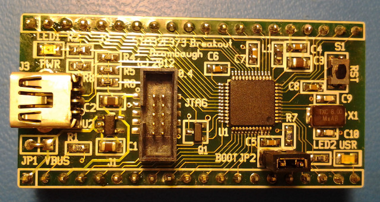

xml version="1.0" encoding="utf-8"?

STM32F373 Breakout

# STM32F373 Breakout

#### STM32F373 Breakout Board V0.4

### What is it?

This is a small (1" x 2") board with an STM32F373CCT6 MCU, 3.3V regulator,
reset button, power LED, user GPIO LED, JTAG header, USB Device socket and
most I/O pins brought out to SIP headers suitable for use in a solderless
breadboard. With this board one can easily prototype small ARM Cortex M4F
applications with minimum effort
and expense.

### What it isn't

This is not a full development system - you'll have to gather your own
programming tools, power supply, I/O devices, etc. This is not an Arduino
clone with all the low-level stuff already done for you. If you want to get by
on the cheap you'll have to be familiar with setting up an ARM GCC toolchain
as well as how to build your own copy of the latest OpenOCD JTAG downloader.

### Features:

* [STM32F373CCT6](http://www.st.com/internet/com/TECHNICAL_RESOURCES/TECHNICAL_LITERATURE/DATASHEET/DM00046749.pdf)
 CPU with:
	+ 32-bit ARM Cortex-M4F CPU rated for 72MHz clock
	+ 32kB SRAM
	+ 256kB Flash
	+ 14 Timers
	+ 3 SPI
	+ 2 I2C
	+ 3 USART
	+ 1 CAN
	+ 1 USB Device
	+ 36 GPIO pins (20 5V tolerant)
	+ 1 12-bit SAR ADC
	+ 3 16-bit Sigma/Delta ADCs
	+ 3 12-bit DACs
	+ 2 Analog Comparators
* Onboard 3.3V Regulator (4.1V - 10V input range)
* Filtered Analog 3.3V Supply
* Power and User LEDs
* Reset button
* 10-pin Mini-JTAG or SWD compatible programming interface
* Fits standard solderless breadboard with 1 row exposed on each side

### Interfaces

* J1, J2: 40 pins of direct access to most of the pins of the MCU.
 Note that some power supply pins are combined and the USB pins are only
 brought to J3
* J3: USB Mini-B device connector. Use this to create devices that can
 talk directly to a USB host with minimal cabling.
* J4: 10-pin Mini JTAG connector This connector provides the ARM standard
 10-pin JTAG/SWD debug/download connections.
* JP1: Power jumper to allow the board to be powered by the USB interface.
 Use caution to avoid connecting both USB and local supplies
 simultaneously.
* JP2: Boot mode jumper. Enables the ROM bootstrap loader after reset.
 Serial mode is supported, others TBD.
* S1: Reset button - tied directly to the MCU reset input. Handy way to
 quickly reboot your MCU after flashing new code into it.
* LED1: Power indicator - lights up when 3.3V is present.
* LED2: User GPIO - connected to GPIOB-11. Useful for diagnostics.

### Software Development

The STM32 family of parts are supported by a variety of commercial IDEs, all
of which are available in low-cost or limited free versions from the
[ST website](http://www.st.com/internet/mcu/class/1734.jsp).

I prefer to use open-source tools, so I've set up a development environment
based on the GNU C compiler for ARM, available for free from Codesourcery or
the Launchpad project. For downloading to the target I use either an STM32
Discovery board with stlink V2, or the excellent Black Magic Probe. To accelerate
development I also use the STM32 Standard Peripheral Library as a starting point
for my code and then optimize out the heavyweight functions as required. Links
to all of these are here:

* [Launchpad GCC](https://launchpad.net/gcc-arm-embedded)
 ARM-supported GCC.
* [STM32F4 Discovery](http://www.st.com/internet/evalboard/product/252419.jsp): for downloading and debug via SWD port.
* [STLINK tools for Linux](https://github.com/texane/stlink)
 Open-source interfaces for downloading and debugging.
* [STM32F37x/38x DSP and Standard Peripheral Libraries](http://www.st.com/web/en/catalog/tools/PF258151#): Manufacturer's low-level C driver code.
* [Black Magic Probe (BMP)](http://www.blacksphere.co.nz/main/blackmagic)
 A very handy JTAG/SWD download and debug probe I've been using.

### Design Resources

* Schematic (v0.4): [stm32f373\_breakout\_v0.4\_pg1.pdf](stm32f3_breakout_v0.4_pg1.pdf)
* Bill of Materials (v0.4): <bom.xls>
* PCB Gerbers for V0.4: [stm32f373\_breakout\_gerber.zip](stm32f3_breakout_gerber.zip)
* Blinky LED source: <stm32f373_breakout_blinky.zip>
* Board for sale at OSHpark: [stm32f37x breakout v0.4](https://oshpark.com/shared_projects/hl4o3mOk)
* More to come...

### Revisions

* V0.3 was first board fabbed. There is a bug in the USB pullup that
 causes improper enumeration.
* V0.4 was the second board fabbed. This version corrects the USB
 pullup issue and adds USB reset capability. A revised footprint for an
 8MHz crystal is provided and the JTAG connector is reoriented to allow
 use of a shrouded connector.

### Bootloader

Testing of the boot mode flash loader on the STM32F3 Discovery boards
suggested that the F3 bootloader was similar to the BID 4.1 type functionality
found in many of the earlier STM32 parts, including USART1, USART2, CAN and
USB DFU modes. After assembling the F373 breakout board it was seen that only
USART1 appears to work (RX on PA10, TX on PA11). USART2 and USB DFU modes do
not seem to be present (the 8MHz HSE crystal is never even started up).
Checking the IDs in the USART1 mode shows BID 5.0 which is not detailed in
the AN2606 Bootloader appnote at the time of this writing (12-12-12).

(01-04-13) We've conducted a disassembly of the STM32F373 system memory and
confirmed that the bootloader in that device does not support USB DFU mode.
Comparison vs the system memory in the STM32F303 (which does support USB DFU)
shows that the code is about 1/2 the size and never accesses any of the
registers associated with the USB peripheral. This represents a fairly
significant deviation from the capabilities that are specified in the data
sheet and reference manual for the STM32F373. So far, ST.com has not responded
to questions about this so we have to wait for an updated AN2606 document for
further details.

(05-01-13) ST did finally acknowledge that an early batch of STM32F373 parts
was programmed with the wrong bootloader during the manufacturing test process
back in Q3 2012. Those parts have apparently been cleared from the
distribution chain and any new parts bought during 2013 should have the correct
USB DFU-capable bootloader programmed into the system memory area. I have not
confirmed this personally, but I have been told that it works by others who
have bought parts more recently.

(09-19-13) I bought recent batch of STM32F373 parts and built up another
breakout board. This one works just fine with USB in bootloader mode. Here's
a table of what the markings and functionality are:

| Purchase Date | Marking | USB | Serial |
| --- | --- | --- | --- |
| Late 2012 | STM32F373CCT6 GH22T 9U CHN230 B | No | Yes |
| Mid 2013 | STM32F373CCT6 GH21P 9U CHN244 B | Yes | ??? |

## Status

* 10-13-12 - Schematic started.
* 10-24-12 - Layout started.
* 10-25-12 - V0.3 PCB design sent to fab.
* 11-12-12 - V0.3 PCB back from fab, assembled, tested, working.
* 11-16-12 - V0.4 PCB update to fab.
* 12-12-12 - V0.4 PCB back from fab, assembled, tested, working.
* 01-04-13 - Updated Bootloader info.
* 05-01-13 - V0.4 PCB gerbers posted. Updated bootloader info
* 09-19-13 - Built 2nd board with later lot/date code. USB Bootloader works.
* 05-09-14 - Updated links.
* 08-20-18 - Added OSHpark project link.

[Return to Embedded page.](../index.html)
##### 
**Last Updated**

:2018-08-20
##### 
**Comments to:**

[Eric Brombaugh](mailto:ebrombaugh1@cox.net)

