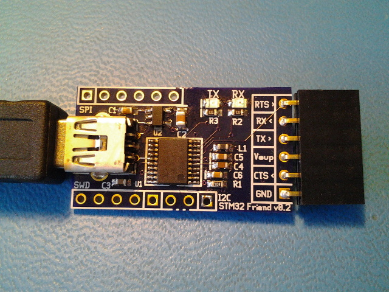
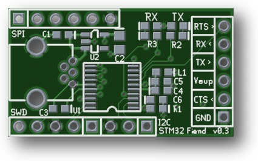

xml version="1.0" encoding="utf-8"?

STM32 Fiend

# STM32 Fiend

#### STM32 Fiend V0.2 and V0.3 render

### What is it?

This is a small (1.2" x 0.7") board with an STM32F042F6 MCU, 3.3V regulator,
USB mini-B, reset and boot buttons, TX and RX LEDs, SWD header and all I/O pins
brought out to SIP headers. This board is pin and form-factor similar to the
commonly used FTDI Friend board and provides a pin-compatible serial connector.
It also provides additional connectors for other interfaces, such as SPI, I2C
and SWD programming. Additionally, the main serial connector pins support
digital GPIO, 12-bit analog input, touch sensing and various timer functions
such as PWM. With this board and some custom programming you can build
simple and inexpensive USB-based communications and control applications. 

### What it isn't

This is not a full development system - you'll have to gather your own
programming tools, power supply, I/O devices, etc. This is not an Arduino
clone with all the low-level stuff already done for you. If you want to get by
on the cheap you'll have to be familiar with setting up an ARM GCC toolchain
as well as using a JTAG/SWD debugger.

### Features:

* [STM32F042F6](http://www.st.com/web/catalog/mmc/FM141/SC1169/SS1574/LN1823/PF259617)
 CPU with:
	+ 32-bit ARM Cortex-M0 CPU rated for 48MHz clock
	+ 6kB SRAM
	+ 32kB Flash
	+ 6 Timers
	+ 1 SPI
	+ 1 I2C
	+ 2 USART
	+ 1 USB
	+ 1 CAN
	+ 1 CEC
	+ RTC
	+ Crystal-less USB operation
	+ 15 GPIO pins (4 are 5V tolerant)
	+ 1 12-bit SAR ADC with 11 input channels
* Onboard 3.3V Regulator (4.1V - 10V input range)
* Filtered Analog 3.3V Supply
* TX and RX LEDs
* Reset button
* BOOT button
* 5-pin ST-Link V2 SWD compatible programming interface
* Serial, SPI and I2C connectors

### Interfaces

* 6-pin Serial:
	+ 1) GND
	+ 2) CTS (input) [PA0/TIM2\_CH1\_ETR/Touch\_G1\_IO1/ADC\_IN0]/
	+ 3) Vsupply
	+ 4) TX (output) [PA2/TIM2\_CH3/Touch\_G1\_IO3/ADC\_IN2]
	+ 5) RX (input) [PA3/TIM2\_CH4/Touch\_G1\_IO4/ADC\_IN3]
	+ 6) RTS (output) [PA1/TIM2\_CH2/Touch\_G1\_IO2/ADC\_IN1]
* 6-pin SPI:
	+ 1) GPIO [PB1/TIM3\_CH4/TIM14\_CH1/TIM1\_CH3N/TSC\_G3\_IO3/ADC\_IN9]
	+ 2) MOSI [PA7/I2S1\_SD/TIM3\_CH2/TIM14\_CH1/TIM1\_CH1N/TIM17\_CH1/TSC\_G2\_IO4/ADC\_IN7]
	+ 3) MISO [PA6/I2S1\_MCK/TIM3\_CH1/TIM1\_BKIN/TIM16\_CH1/TSC\_G2\_IO3/ADC\_IN6]
	+ 4) CLOCK [PA5/I2S1\_CK/CEC/TIM2\_CH1\_ETR/TSC\_G2\_IO2/ADC\_IN5]
	+ 5) /CS [PA4/I2S1\_WS/TIM14\_CH1/TSC\_G2\_IO1/USART2\_CK/ADC\_IN4]
	+ 6) GND
* 3-pin I2C:
	+ 1) SDA [PF0/CRS\_SYNC/OSC\_IN]
	+ 2) SCL [PF1/OSC\_OUT]
	+ 3) GND
* 5-pin SWD:
	+ 1) VDD
	+ 2) SWCLK [PA14/USART2\_TX]
	+ 3) GND
	+ 4) SWDIO [PA13/IR\_OUT]
	+ 5) /NRST
* S1: Reset button - tied directly to the MCU reset input. Handy way to
 quickly reboot your MCU after flashing new code into it.
* S1: BOOT button - tied directly to the MCU BOOT0 input. Held during
 reset or power-up this puts the part into bootloader mode for new firmware.
* TX LED: Lights when TX is active.
* RX LED: Lights when RX is active.
* VDD Select pads: Apply solder blobs to select 3.3V or 5V out on serial connector

### Software Development

The STM32 family of parts are supported by a variety of commercial IDEs, all
of which are available in low-cost or limited free versions from the
[ST website](http://www.st.com/internet/mcu/class/1734.jsp).

I prefer to use open-source tools so I've set up a development environment
based on the GNU C compiler for ARM, available for free from the Launchpad
project. For downloading to the target I use OpenOCD and the ST-Link V2 SWD
interface that's available on most all of the inexpensive STM32 Discovery boards.
To accelerate development I also use the STM32 Standard Peripheral Library as
a starting point for my code and then optimize out the heavyweight functions
as required. Links to all of these are here:

* [Launchpad GCC](https://launchpad.net/gcc-arm-embedded): 
 ARM-supported GCC (somewhat newer than the CS version above).
* [OpenOCD](http://openocd.org/): JTAG/SWD interface for
 programming a debugging.
* [STM32F0 Discovery](http://www.st.com/web/catalog/tools/FM116/SC959/SS1532/PF253215?sc=internet/evalboard/product/253215.jsp): Development board with USB flash programming
 and debugging.
* [STM32 Standard Peripheral Library for STM32F0xx](http://www.st.com/web/catalog/tools/FM147/CL1794/SC961/SS1743/LN1939/PF257884): Manufacturer's low-level C driver code.
* [dfu-util](http://dfu-util.sourceforge.net/): Simple Linux application to program STM32Fiend via USB DFU.

### Design Resources

* Schematic: <stm32fiend_schematic.pdf>
* OSHpark board: [STM32Fiend v0.3 PCB](https://oshpark.com/shared_projects/omTftGgG)
* BOM: <bom.xls>
* USB CDC ACM serial firmware: <fiend_serial_v0.1.zip>
* USB CDC ACM analog firmware: <fiend_analog_v0.1.zip>
* More to come...

### Revisions

* V0.1 was first board fabbed.
* V0.2 corrects some issues with silkscreen and LED operation.
	+ RX / TX LED silkscreen labels reversed.* V0.3 changes name and fixes RX / TX labels.

## Status

* 05-21-15 - Schematic and layout.
* 05-22-15 - PCB designs sent to fab.
* 05-22-15 - Web page created.
* 05-26-15 - Added BOM and OSHpark link.
* 06-06-15 - Boards back from fab.
* 06-13-15 - Assembled v0.2. Tested and works but silkscreen bugs found.
* 06-18-15 - Fix silk bugs, name changed, added analog and temperature project.

[Return to Embedded page.](../index.html)
##### 
**Last Updated**

:2015-06-18
##### 
**Comments to:**

[Eric Brombaugh](mailto:ebrombaugh1@cox.net)

