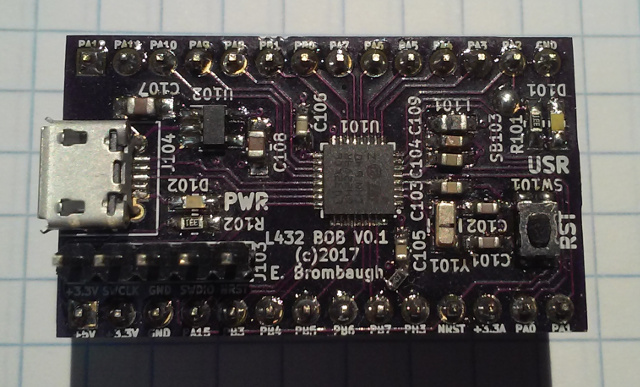
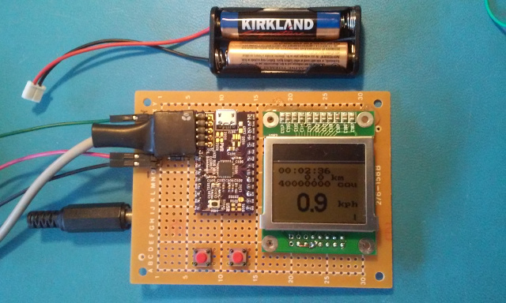

xml version="1.0" encoding="utf-8"?

STM32L432 Breakout

# STM32L432 Breakout

#### Assembled STM32L432 Breakout Board V0.1

### What is it?

This is a small (37x22mm) board with an STM32L432KC6 MCU, 3.3V regulator,
reset button, power LED, user GPIO LED, SWD header USB connector and all I/O
pins brought out to SIP headers suitable for use in a solderless breadboard.
With this board one can easily prototype small ARM Cortex Lxx applications with
minimum effort and expense.

### What it isn't

This is not a full development system - you'll have to gather your own
programming tools, power supply, I/O devices, etc. This is not an Arduino
clone with all the low-level stuff already done for you. If you want to get by
on the cheap you'll have to be familiar with setting up an ARM GCC toolchain
as well as using a JTAG/SWD debugger.

### Features:

* [STM32L432KC6](http://www.st.com/en/microcontrollers/stm32l432kc.html)
 CPU with:
	+ 32-bit ARM Cortex-M4 CPU rated for 80MHz clock
	+ 64kB SRAM
	+ 256kB Flash
	+ 8 Timers
	+ 1 QSPI
	+ 2 SPI
	+ 2 I2C
	+ 2 USART
	+ 1 LPUART
	+ 1 SAI
	+ 1 USB
	+ 1 CAN
	+ 1 CEC
	+ RTC
	+ 26 GPIO pins (4 are 5V tolerant)
	+ 1 12-bit SAR ADC with 10 input channels
	+ 2 12-bit DACs
	+ Op-amps, comparators, capsense
* Onboard 3.3V Regulator (4.1V - 10V input range)
* Filtered Analog 3.3V Supply
* 32kHz crystal (not required)
* Power and User LEDs
* Reset button
* USB micro-B connector
* 5-pin ST-Link V2 SWD compatible programming interface
* 28-pin 700-mil DIP form factor (Fits solderless breadboard
 with 2 rows exposed on each side

### Interfaces

* J101, J102: 28 pins of direct access to all of the pins of the MCU.
 In addition a 5V input and 3.3V output as well as 2 more GND pins
 are available.
* J103: 5-pin ST-Link V2 This connector provides the ST standard
 SWD debug/download connection. Note only pins 1-5 are used
 since this MCU doesn't provide the SWO normally present on pin 6.
* J104: USB micro-B connector.
* SB101/SB102: Optionally connect USB pins to SIP headers.
* SW101: Reset button - tied directly to the MCU reset input. Handy way to
 quickly reboot your MCU after flashing new code into it.
* D101: User GPIO - connected to PA2. Useful for diagnostics.
* D102: Power indicator - lights up when 3.3V is present.

### Software Development

The STM32 family of parts are supported by a variety of commercial IDEs, all
of which are available in low-cost or limited free versions from the
[ST website](http://www.st.com/internet/mcu/class/1734.jsp).

I prefer to use open-source tools so I've set up a development environment
based on the GNU C compiler for ARM, available for free from the Launchpad
project. For downloading to the target I use OpenOCD and the ST-Link V2 SWD
interface that's available on most all of the inexpensive STM32 Discovery boards.
To accelerate development I also use the STM32 Standard Peripheral Library as
a starting point for my code and then optimize out the heavyweight functions
as required. Links to all of these are here:

* [Launchpad GCC](https://launchpad.net/gcc-arm-embedded): 
 ARM-supported GCC (somewhat newer than the CS version above).
* [OpenOCD](http://openocd.org/): JTAG/SWD interface for
 programming a debugging.
* [STM32F0 Discovery](http://www.st.com/web/catalog/tools/FM116/SC959/SS1532/PF253215?sc=internet/evalboard/product/253215.jsp): Development board with USB flash programming
 and debugging.
* [STM32 Standard Peripheral Library for STM32F0xx](http://www.st.com/web/catalog/tools/FM147/CL1794/SC961/SS1743/LN1939/PF257884): Manufacturer's low-level C driver code.

### What can it do?

The STM32L432KC MCU is has excellent low power operating characteristics. I've
got a home-grown bicycle computer project that couples this board with a low-res
monochrome bitmapped LCD for realtime display of time, speed and distance. During
operation it draws less than 1ma and when powered down it pulls only a few nano-amps.

#### Low-power Bicycle Computer based on STM32L432KC

### Design Resources

* Schematic: <l432_bob.pdf>
* OSHpark board: [l432\_bobv0.1](https://oshpark.com/shared_projects/4wLpi5md)
* Github Repo: [emeb/l432\_bob](https://github.com/emeb/l432_bob)
* More to come...

### Revisions

* V0.1 was first board fabbed. Note - this version is missing the 10k pulldown on the BOOT0 pin
 - you must bodge this on the board (see photo), or to external pin PH3.

## Status

* 10-05-17 - Schematic and layout started.
* 10-16-17 - PCB design sent to fab.
* 11-02-17 - Assembled. Basic blinky light and USB DFU work.
* 05-24-18 - Web page created.

[Return to Embedded page.](../index.html)
##### 
**Last Updated**

:2018-05-24
##### 
**Comments to:**

[Eric Brombaugh](mailto:ebrombaugh1@cox.net)

