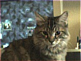

Mattel Camera

# 
Mattel Camera

Mattel made several digital cameras, among them the BarbieCam and the Nick Click. Both are identical from a hardware/software standpoint and both are relatively inexpensive. With a resolution of only 160x120, they are by no means high-res, but they do present some fun experimenting opportunities.

The cameras use a 56K 8/N/1 serial protocol, and thus can be adapted for use with most any computer. The command protocols are [detailed here](http://webcam.sourceforge.net/barbie/scicomms.doc) and are easy to use. Note that the camera has little native intelligence, running from a variant of the Intel 8051. As a consequence, the image data from the camera is almost completely raw, requiring the host PC to demosaic the Bayer RGB data. While fundamentally simple, this process can be done in many ways. Here are just a few links to more information on this:

 [Ting Chen's excellent summary](http://www-ise.stanford.edu/~tingchen/main.htm)
 [Fill Factory's generalized algorithm](http://www.fillfactory.com/htm/technology/htm/rgbfaq.htm)
 [Ron Kimmel's new algorithm](http://www.cs.technion.ac.il/~ron/PAPERS/ieee_ip99.ps.gz)
 You might also find  [Charles Poynton's Color FAQ](http://www.poynton.com/notes/colour_and_gamma/ColorFAQ.html) useful if you \_really\_ want to learn about video and color.

I've written several simple applications for downloading and processing the data from the Mattel cameras. Although a work in progress, these are functional and can serve as a starting point for any further development. Currently, they support several different demosaic algorithms, JPEG, BMP and PPM file formats and other useful options.

<mattel_cam.tar.gz> The original version.

<mattel_cam-0.3.1.tar.gz> New, improved
with additional options and bugfixes. Minor tweaks for latest GCC syntax.

Here's a self portrait of the camera, saved with JPEG quality of 90.

Here's one of my helpers...

Please let me know if you find this code useful, or if you have any suggestions or revisions to the code.

I've used this code to set up a simple webcam with realtime updates, history and automated time-lapse movie generation. If you're interested in this, [here](webcam_scripts.tar.gz) is a tarball of the scripts I use to run it. Sorry, the webcam is behind a firewall and thus inaccessible, but here's an example of the time lapse movies: [15 min](fast_09211345.mpg) [full day](daily_0918.mpg). 

Some other folks have also gotten some code for the Mattel Cameras going. Pete Zaitcev has a small app available at his [site](http://people.redhat.com/zaitcev/linux/), and the [gphoto](http://www.gphoto.org) development team has a driver in their development version.

### Note to Windows users

I get a fair number of inquiries from Windows users asking for help with their Mattel cameras under various flavors of Windows. It seems that Windows XP doesn't support the old drivers for the Mattel camera and Mattel doesn't plan to update the driver for XP. This is an unfortunate yet frequent occurance in the world of proprietary software and one of the reasons I like Open Source and Free software.

Although I don't program in Windows and cannot help you with your Windows system, the source code for my Mattel camera driver could be used by someone with experience in programming Windows applications to create an adequate driver for the Mattel camera in almost any OS, including Windows XP. Perhaps you know someone who could do this? If so, I'd be happy to help.

[Return to Linux page.](index.html)
##### 
**Last Updated**

:2007/10/16
##### 
**Comments to:**

[Eric Brombaugh](mailto:ebrombaugh1@cox.net)

