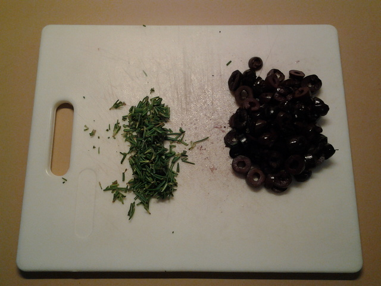
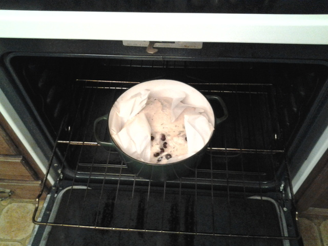

# No Knead Bread

Ingredients:
* 3 cups bread flour
* 2 tsp salt (or to taste)
* 1/4 tsp dry yeast
* 2 cups water (bottled seems to give a better rise, Mesa's Finest has a lot of chlorine)

#### Mise en place

#### Dry ingredients

Mix the dry ingredients first, then add water.

#### Mixed

Stir it up. It will be a sticky, shaggy wad. Don't bother stirring it too much - the moisture
will evenly distribute during the rise.

#### Ready to rise

Cover it - we use a clean plastic shower cap. Place in a warm-ish safe place. We use our cat-proof oven.

#### 6 hours into first rise

After 6 hours of rising the dough is very wet with tiny bubbles in it. It's
probably expanded to twice the original volume.

#### 12 hours into first rise. Impressive flatulence for a quarter-teaspoon of yeast, eh?

#### Optional mix-ins (olives and rosemary)

#### 18 hours into first rise - ready to be punched down.

#### Adding the mix-ins

#### Fold in. If making plain bread, just give the dough a good stir.

#### Dump out onto baking parchment (blorp!)

#### Into basket for second rise (because the bowl is dirty)

#### Ready for second rise

#### About two hours later, start heating the pot and lid to 450F (move the dough somewhere else)

#### What's going on here? (this is BEFORE the oven was turned on! Safety first!)

#### When the oven reaches temperature, remove the lid of the blazingly hot pot, grab the corners of the parchment, lower the dough in (paper and all), and replace the lid. This is most efficiently done with two people.

#### We bake covered for 25 minutes, remove the lid, then bake another 10-15 minutes. This is much shorter than the recipe calls for, and depends on how well-done you like your bread.

#### Out of the oven, still in the pot. Use the now-crispy parchment to remove the bread, peel off the paper, and cool on a rack. Be aware that the pot is VERY hot and will stay that way for quite a while.

#### Finished

#### Cutaway view (off-camera sounds of happy munching)

##### 
**Last Updated**

:2014-04-26

