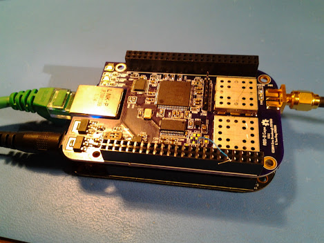

xml version="1.0" encoding="utf-8"?

ADS-B Cape

# ADS-B Cape

## Introduction

The ADS-B Cape is a receiver which captures ADS-B messages broadcast by many
commercial and general aviation aircraft for air traffic control purposes. It
consists of a tuned RF (TRF) front-end with narrowband filtering at 1090MHz,
a logarithmic response detector/amplifier (logamp) and a 20MSPS 10-bit ADC
coupled to an FPGA which demodulates the log-video data into standard-format
message frames compatible with many software applications. Because it's a
fully-compatible Beaglebone Cape it can be used with any type of Beaglebone
embedded computer - White, Black, Bluesteel, etc.

### Features:

* 50-ohm SMA RF input
* Highly sensitive low-noise front-end amplifier.
* Two filter stages for exceptional out-of-band rejection.
* 80dB dynamic range logamp.
* 20MSPS 10-bit ADC.
* Xilinx [XC3S200AVQ100](http://www.xilinx.com/products/spartan3a/) Spartan 3A FPGA with 200kgates, 16 Multipliers and 288kb RAM for
 DSP data demodulator.
* Four status LEDs (1 FPGA configuration and 3 general-purpose.
* SPI and I2C control/data interface from Beaglebone to FPGA
* 14-bit PRU interface option for higher speed data.
* Standard Beaglebone headers and ID EEPROM.
* Selectable board address supporting up to four separate devices.

## Architecture

The ADS-B Cape follows a common architecture which uses no heterodyne processing.
Instead, the 1090MHz signals are amplified, filtered and detected at the carrier
frequency. The detected signal with a slope of 20mV/dB is DC-coupled into a 10-bit
ADC with a 2V reference, yeilding approximately 10 lsb counts/dB of signal power
with a usable power range of about -100dBm to -20dBm.

The ADC runs at 20MSPS which provides 20 samples per data bit in the ADS-B frame,
sufficient to provide accurate sampling phase within the bit window which improves
overall sensitivity beyond that possible with systems that sample at only 2x the
bit rate. The 20MSPS 10-bit data is processed within the FPGA to trigger when the
detected signal crosses an adaptive minimum trigger level (MTL), at which point
a correlator searches for the Mode S reply preamble and then a PPM demod recovers
the data. Retriggering is supported, which provides usable data when a stronger
signal collides in time with a weaker signal.

Recovered data and confidence bits are queued in a FIFO within the FPGA which can
hold up to 32 full frames of data until the host processor fetches them via
the SPI bus. Host-side software is responsible for error detection and
correction (EDAC) via the 24-bit CRC that all ADS-B messages carry. Frames
which do not meet the 56 or 112-bit length requirement are also dropped by
the host before processing. Currently the host software sends the raw data
packets over the Ethernet connection using a TCP socket and the standard
ASCII format used by a wide range of ADS-B tracking applications.

## Prototype Testing

The version 0.1 prototype PCBs have been received and one has been assembled. A
few schematic and layout issues were found but none that prevent basic operation,
although performance isn't quite as good as was seen with the proof-of-concept
lashup that was tested prior to the board design. A detailed report of findings
is available in the documents section of the github repository.

## Design Resources

* Design on Github: [adsb\_cape](https://github.com/emeb/adsb_cape)
* Schematic: <adsb_cape_schematic.pdf>
* Bill of Materials: <bom.ods>
* Gerbers in OSHpark format: <adsb_cape.oshpark.zip>
* More to come...

## Status

* 07-14-14 - Schematic started.
* 07-15-14 - Layout started.
* 08-08-14 - Prototype lashup working.
* 08-08-14 - Website started.
* 08-11-14 - BOM added, all parts ordered.
* 08-16-14 - Parts checked, PCBs ordered.
* 10-21-14 - v0.1 board working with minor modifications.

[Return to Radio page.](../index.html)
##### 
**Last Updated**

:2014-10-21
##### 
**Comments to:**

[Eric Brombaugh](mailto:ebrombaugh1@cox.net)

