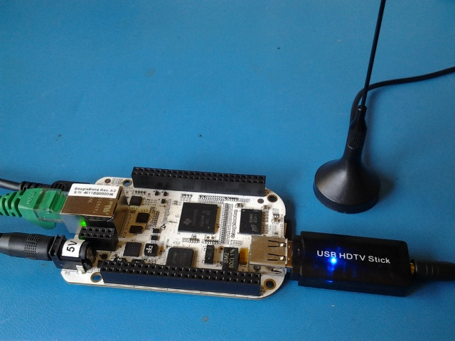

xml version="1.0" encoding="utf-8"?


Beaglebone RTL-SDR


# Beaglebone RTL-SDR





## Introduction


This is an experiment to see how well the RTL-SDR driver runs on a mid-range
ARM SBC. The Beaglebone is an ARM-based single-board computer that's available
for less than $100 yet provides a surprising number of powerful features. Since
it has a USB host port and an ethernet port, it seems like a natural fit for a
remote RF digitizer using the [RTL-SDR](../rtl-sdr/index.html)
driver and an inexpensive DVB-T dongle.

## Getting it Going


You'll need the following materials and software
* A Beaglebone - find them at various hardware vendors:
	+ [Special Computing](https://specialcomp.com/beagleboard/bone.htm)
	+ [Adafruit](http://www.adafruit.com/products/513)
	+ [Digi-Key](http://www.digikey.com/product-search/en/programmers-development-systems/general-embedded-dev-boards-and-kits-mcu-dsp-fpga-cpld/2621773?k=beaglebone)
* An RTL2832 DVB-T dongle (check ebay)
* A spare micro SD to install the Beaglebone OS
* [The Latest Beaglebone Angstrom Image](http://downloads.angstrom-distribution.org/demo/beaglebone/)
* [RTL-SDR source](http://sdr.osmocom.org/trac/wiki/rtl-sdr)


### Preparing the Beaglebone


First thing is to create a fresh installation of the latest Angstrom distribution
for your Beaglebone. Earlier versions may have been missing some of the tools and
libraries needed to ensure that the build/install process works without trouble.

Download the image from the site above and follow the instructions for extracting
it to the SD card. Once this is complete, you'll need to install the development
package for the libusb 1.0 library which is the only dependency for the RTL-SDR
software build. Power up the Beaglebone with the new OS, log in and run these commands:


```

opkg update
opkg install libusb-1.0-dev

```

### Compiling the RTL-SDR source


Next grab the source code for the RTL-SDR package and build it:


```

mkdir build
cd build
git clone git://git.osmocom.org/rtl-sdr.git
cd rtl-sdr
autoreconf -i
./configure
make
make install

```

### Testing the system


At this point you should have the drivers ready. Connect the RTL2832
dongle to the Beaglebone host port as shown in the photo above. Test it
with the "rtl\_test" command as follows:


```

root@beaglebone:~/rtl-sdr/rtl-sdr# rtl_test -t
Found 1 device(s):
  0:  ezcap USB 2.0 DVB-T/DAB/FM dongle

Using device 0: ezcap USB 2.0 DVB-T/DAB/FM dongle
Found Elonics E4000 tuner
Supported gain values (18): -1.0 1.5 4.0 6.5 9.0 11.5 14.0 16.5 19.0 21.5 24.0 29.0 34.0 42.0 43.0 45.0 47.0 49.0 
Benchmarking E4000 PLL...
[E4K] PLL not locked for 51000000 Hz!
[E4K] PLL not locked for 2215000000 Hz!
[E4K] PLL not locked for 1108000000 Hz!
[E4K] PLL not locked for 1271000000 Hz!
E4K range: 52 to 2214 MHz
E4K L-band gap: 1108 to 1271 MHz

```


You'll probably also want to test the fastest sample rate possible without
dropping data. Again, use the "rtl\_test" command as follows:


```

root@beaglebone:~/rtl-sdr/rtl-sdr# rtl_test -s 2.048e6
Found 1 device(s):
  0:  ezcap USB 2.0 DVB-T/DAB/FM dongle

Using device 0: ezcap USB 2.0 DVB-T/DAB/FM dongle
Found Elonics E4000 tuner
Supported gain values (18): -1.0 1.5 4.0 6.5 9.0 11.5 14.0 16.5 19.0 21.5 24.0 29.0 34.0 42.0 43.0 45.0 47.0 49.0 
Reading samples in async mode...
lost at least 20 bytes
^C

```


On my setup I found that 2.048MHz was possible with only a slight glitch at
starup, but 3.2MHz dropped a lot of data.

## Going Further


This shows that the Beaglebone is a perfectly adequate host for the RTL-SDR
hardware and software and opens up a broad range of possible applications in
software defined radio. Using the RTL-SDR tools you just installed, you can
digitize RF over a wide frequency range and pipe the results to another
application on the Beaglebone or send it over the ethernet port to a remote
peer for further processing. I found however that it's not practical to save
the raw data files on the Beaglebone's SD filesystem - at least for the SD card
I'm using the sample rate completely swamps the capabilities of the card to
write data and causes the system to hang.

[Return to Radio page.](../index.html)
##### 
**Last Updated**


:2012-06-03
##### 
**Comments to:**


[Eric Brombaugh](mailto:ebrombaugh1@cox.net)

[](http://validator.w3.org/check?uri=referer)


