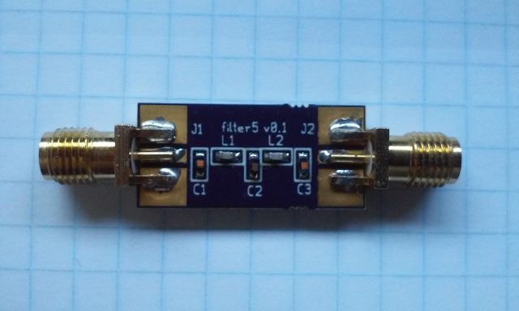

xml version="1.0" encoding="utf-8"?

5th-Order LC Filter board

# 5th-Order LC Filter board

## Introduction

This is a board for building 5th-order LC filters. Both Low-pass and High-pass
filters are possible by simply swapping L and C components.

### Features:

* Small Size
* SMA connections using commonly available end-launch jacks
* Low-pass or High-pass depending on components.
* Uses readily available 0603 SMT packages

### Designing Filters

The schematic is set up to use a shunt topology - the first reactive element
is from signal to ground. This works for either low-pass or high-pass. I've
had good results using this online design page:

[LC Filter Design](https://www-users.cs.york.ac.uk/~fisher/lcfilter/)
As an example, for a 20MHz low-pass I've used the following values

| Refdes | Value | MFG PN |
| --- | --- | --- |
| C1,C3 | 330pF | Murata GRM1885C1H331JA01D |
| L1,L2 | 390nH | Abracon AISC-0603F-R39J-T |
| C2 | 390pf | Murata GRM1885C1H391JA01D |

For a 3MHz high-pass I've used the following values

| Refdes | Value | MFG PN |
| --- | --- | --- |
| C1,C3 | 3.3uH | Abracon AISC-0603F-3R3J-T |
| L1,L2 | 560pF | Murata GRM1885C1H561JA01D |
| C2 | 1.5uH | Abracon AISC-0603F-1R5J-T |

### Design Resources

* Schematic: <filter5_schematic.pdf>
* LTSpice starter project: <band4_cheby.asc>
* Gerbers (OSHpark naming conventions): <filter5.oshpark.zip>
* Board at OSHpark: [OSHpark order page](https://oshpark.com/shared_projects/a1oCtIfm)

[Return to Radio page.](../index.html)
##### 
**Last Updated**

:2016-11-23
##### 
**Comments to:**

[Eric Brombaugh](mailto:ebrombaugh1@cox.net)

