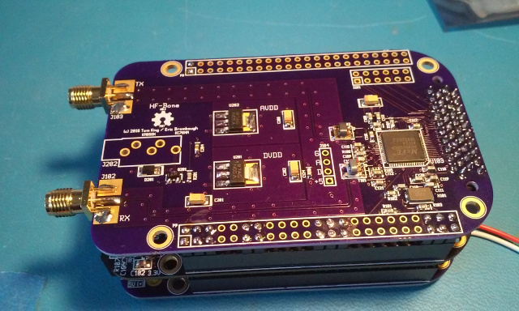
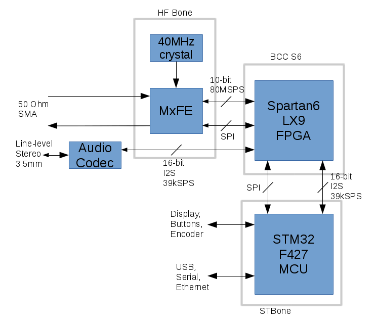

xml version="1.0" encoding="utf-8"?

HF Bone

# HF Bone

## Introduction

This is a Software Defined Radio (SDR) system for use in the HF band
(50kHz - 35MHx) that Tom King / KA6SOX and I have been working on together.
It is composed of several boards, some of which are described in detail
elsewhere on this site:

* HF Bone - the RF codec consisting of an
 [Analog Devices AD9865 MxFE chip](http://www.analog.com/en/products/rf-microwave/communications-analog-front-ends/mixed-signal-frontends/ad9865.html)
 with an 80MSPS 10-bit ADC and 200MSPS 10-bit DAC for receiving and transmitting
 HF-band RF signals.
* [BCC S6 FPGA Board](../../embedded/bcc_s6/index.html) - 
 Contains high-speed digital logic for the Decimating Downconverter (DDC),
 Digital Upconverter (DUC) as well as I2S master logic for an audio codec.
* [STBONE MCU Board](../../embedded/stbone/index.html) - 
 Provides software defined demodulation and overall control.
* [I2S Codec PMOD](../../synth/codec_pmod/index.html) - Used for
 stereo audio I/O.

Combined with suitable firmware and FPGA design, these boards comprise a
transceiver with an instantaneous bandwidth of up to 35MHz. The DDC and DUC
designs in this prototype operate with ~38kHz complex baseband for both
transmission and reception.

## System Architecture

The HF Bone system diagram is shown in Figure 1 below.

**Figure 1: HF Bone System Diagram**

### RF Front-End

The 50-ohm RF input is matched to the AD9865 MxFE converter pins with a balun.
Inside the MxFE the recieved signal first passes thru a Programmagle Gain
Amplifier (PGA) and variable low-pass filter (LPF) to prevent aliasing and
ensure best signal amplitude into the ADC. The ADC output data is sent
off-board via a high-density connector.

Transmit data arrives on-board via the same connector and is interpolated
to the DAC sample rate. The DAC gain is programmable and the output is matched
to 50 ohms with a balun.

Support circuits for the MxFE chip include voltage regulators, crystal
oscillator and a low-speed SPI interface for configuration.

### FPGA

The FPGA on the BCC S6 board provides interfaces between all the boards as
well as the DSP needed to tune, filter and resample the MxFE data.

#### DSP

The receiver DDC and transmitter DUC handle down- and up-conversion of
the low-rate baseband digital data to the RF sample rates. For more detail on
how this works, please see the
[HF SDR prototype](../hfsdr_proto/index.html)
page.

#### MxFE Interface

The MxFE interface allows both full- and half-duplex modes of operation at
various sample rates. Synchronous clocking and direction control signals are
included along with 12 bits of bi-directional data.

#### I2S

The FPGA provides a bi-directional I2S audio interface that's used to
carry baseband data between the DDC/DUC and MCU and also audio data between
the MCU and I2S Codec. Muxing inside the FPGA determines source / destination
between all three nodes as required by duplexing.

#### SPI Control Interface

The SPI Control interface provides up to 128 32-bit wide read/write registers
which the MCU uses to control the FPGA design and check status, as well as
demuxing to support control of the MxFE and I2S codec.

#### External PA control

A 3.5mm jack is provided with a TX/RX control line and a serial connection
to the MCU which allows duplexing and configuration of external synthesizers.

### MCU

The STM32F427 processor interfaces to the FPGA via SPI and I2S serial ports to
control the front end processing and exchange baseband and audio data. Firmware
running on the MCU configures the FPGA from a micro-SD card at power up,
confirms the presence of the proper design by reading an ID register via the
SPI interface and then configures the MxFE and I2S codec. Once all the
converters are running, the MCU handles modulation and demodulation between
the baseband I/Q in the DDC/DUC and audio.

#### Firmware Design

MCU firmware is divided into two sections. Background processes perform real-time
DSP calculations to process baseband data from the FPGA into audio or digital
data and back. The foreground process on the MCU is a simple serial command-line interface
with commands for manipulating the FPGA configuration, tuning setup and
background demodulation parameters.

## Future Work

At present the HF Bone system is still under development. Hardware test is
underway and when basic functions are confirmed we'll move on to adding support
for transmit and receive for common HF signal formats like AM, CW, SSB and
various digital modes.

## Design Resources

* [Schematic](./HF-Bone_schematic.pdf)
* [gEDA/PCB Design on Github](https://github.com/emeb/hf_bone)
* More to come...

## Status

* 07-03-16 - Schematic started.
* 12-12-16 - Boards back, assembled, webpage posted.
* 12-14-16 - Initial testing - SPI works, I2S works, RX @ 40MSPS works.
* 12-15-16 - RX @ 80MSPS works. TX DAC + DUC working.
* 12-20-16 - Added codec. TX/RX (CW/AM/SSB) working.
* 02-22-17 - Added support for [VHF front-end](../r820t2_breakout/index.html).

[Return to Radio page.](../index.html)
##### 
**Last Updated**

:2017-03-04
##### 
**Comments to:**

[Eric Brombaugh](mailto:ebrombaugh1@cox.net)

