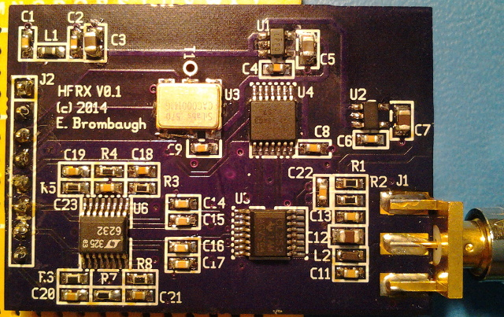
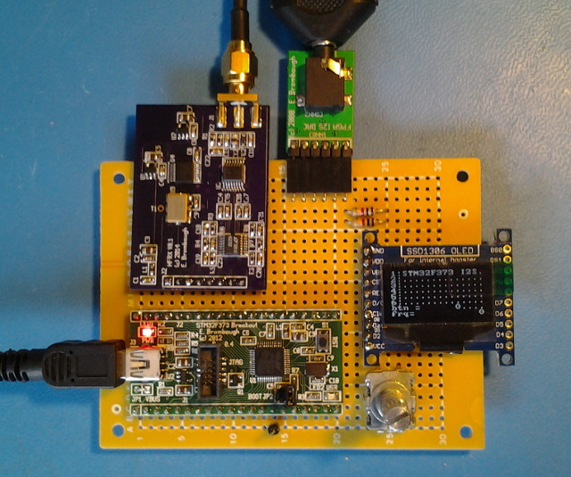
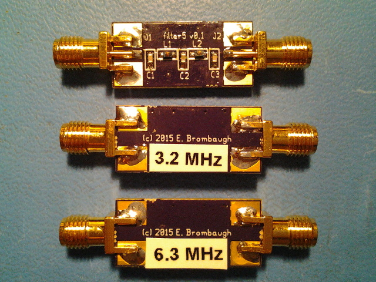
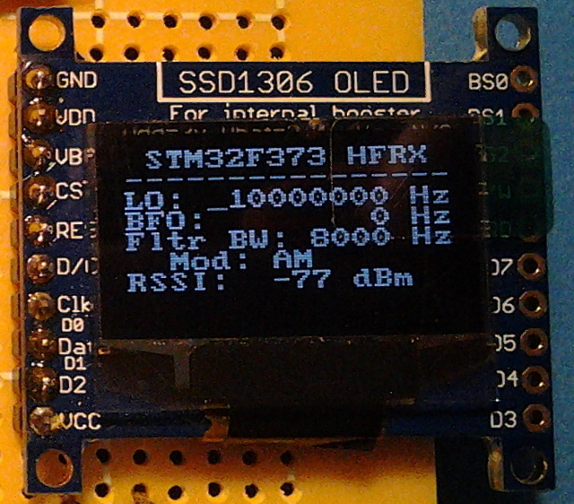

xml version="1.0" encoding="utf-8"?

HFRX

# HFRX Prototype

## Introduction

This is a test prototype for experimenting with a Quadrature Sampling Detector. It
includes an Si570 I2C-tunable oscillator (0-160MHz), a divide-by-4 sequencer, 
a 1:4 analog mux and a low noise amplifier. A 50-ohm SMA connector is provided
for RF input and an 8-pin 0.1" header provides power, I2C and differential analog
I and Q output.

### Features:

* [Si570](http://www.silabs.com/Support%20Documents/TechnicalDocs/si570.pdf)
 160MHz I2C-tunable oscillator.
* [SN74LVC74A](http://www.ti.com/lit/ds/symlink/sn74lvc74a.pdf)
 dual-D flip-flop for divide-by-4 sequencer
* [SN74CBTLV3253](http://www.ti.com/lit/ds/symlink/sn74cbtlv3253.pdf)
 dual 1:4 analog mux for commutation
* [LT6232](http://cds.linear.com/docs/en/datasheet/623012fc.pdf)
 quad op-amp for differential I and Q signal gain.
* Separate analog and digital onboard 3.3V Regulators (5V input)
* 50-ohm SMA RF input
* 8-pin 0.1" header for I2C, baseband and power

## Background

The Quadrature Sampling Detector (QSD) is a unique approach to signal downconversion
which uses switched-capacitor techniques to simultaneously mix and filter a high-frequency
signal down to baseband. I was first introduced to this concept by Dan Tayloe during a talk
he gave at the Ft. Tuthill Hamfest several years ago. Since then, variations on the design
have appeared in many projects popular throughout the amateur radio community, most notably
the SoftRock series of HF receivers.

This circuit borrows heavily from many prior designs, in particular in its use
of the Si570 I2C-tunable oscillator, the LV3253 analog mux and the LT6232 op-amp. One
notable difference is that the baseband gain stage preserves the differential nature of the
I and Q signals instead of combining them into unipolar signals. The reason for this
choice will become clear below.

## Overall System Application

Because the QSD generates as output a complex I and Q analog signal, further processing
at baseband is required to recover usable audio or data. In the case of Amplitude
Modulation (AM) a simple magnitude detector may be applied to demodulate the audio.
Single Sideband (SSB) usually uses some variation on the Weaver demodulator and
Frequency Modulation (FM) can be processed in the phase domain. While Tayloe's
original design used analog circuits to implement the audio demodulation, more
recent systems including the SoftRock radios feed the raw I and Q signals to a
PC stereo audio input for processing in the digital domain. This provides a great
deal of flexibility in the demodulation processing, including the ability to
handle various digital modes.

While most current applications of the QSD rely on "big iron" PCs to do the
DSP required for demodulation, the latest generation of embedded processors
showing up on the market such as the ARM Cortex M4 have DSP capabilities that
are sufficient to the task with a much smaller footprint in size, weight and power.
On-board peripherals for many of these tiny MCUs include decent A/D converters
that can digitize the analog I and Q signals for subsequent digital processing,
and many provide either on-board DACs or peripheral interfaces sufficient for
outputting high-quality audio.

The approach envisioned here is to use an
[STM32F373CCT6](http://www.st.com/web/catalog/mmc/FM141/SC1169/SS1576/LN10)
MCU to do all baseband processing in the digital domain, outputting the
demodulated audio via the on-chip I2S interface to a good quality stereo audio DAC.
This MCU includes a set of 16-bit ADCs which can operate at sufficiently high
rates to sample the baseband I and Q for the required processing. To maximize
noise immunity in the ADC, the differential input mode will be used which requires
that the gain stage on this prototype board not sum the opposing phases into a
unipolar signal.

## Prototype System

The prototype system consists of the HFRX board, an
[STM32F373 Breakout](../../embedded/stm32f373breakout/index.html)
board, an [I2S DAC PMOD](../../synth/audiodac/index.html), an Adafruit
OLED board and a rotary encoder all mounted on perfboard and interconnected with
wire-wrap. Two of the 'F373 SDADCs are configured to sample the differential I and
Q signals at 18.75kHz (the highest common sample rate with the on-chip I2S port)
and all the DSP takes place at this sample rate. After demodulation the processed
audio is buffered into the I2S port for transmission to the audio DAC. The OLED
display and rotary encoder provide a simple UI for controlling operating parameters.
Presently, this system is currently capable of receiving AM over the range of 870kHz
- 40MHz with realtime tuning of the LO and BFO frequencies. Further development
will allow selection of baseband filter bandwidth, modulation, audio gain, etc.
Additional refinements are envisioned, such as improved fine tuning and audio
muting to eliminate pops during coarse tuning.

## Lessons Learned

Starting with the prototype system built in 2014 I had a fair amount of initial
success. Using only an AM demodulator I was able to confirm operation and the
limits (both high and low) of sensitivity. As noted above, a smoothly ramped
audio mute was added to prevent loud pops when tuning the LO.

Once these issues were addressed the major downside of the QSD quickly
revealed itself - reception of images at odd harmonics of the Local Oscillator.
When tuned to 10MHz, the system will also pick up weak images of signals at
30MHz, 50MHz, 70MHz, etc. Since this is a weakness of the QSD itself the only way
to eliminate the images is to add preselect filters. I put the system away for a
year and moved on to other things.

### RF Filters

In June 2015 I became curious enough to build some filters. Knowing that only odd
harmonics would cause problems, I designed six low-pass filters to cover the full
range of the receiver, with corners at 1.6, 3.2, 6.3, 11.5, 22 and 40 MHz. A
5th-order Chebyshev shunt design was used and L/C values chosen from the 5% range.
I found that the 0603 SMD inductors available today perform nicely and I was
seeing excellent matches to the design characteristics.

### Demodulation

Putting these filters inline between the antenna and HFRX prototype system
allowed me to further test performance without seeing spurious response from
higher up the spectrum (originally I was getting significant interference from
broadcast FM stations) and work on addition refinements. First up was to add
Single Sideband (SSB) demodulation. Using and all-pass IIR implementation of
a Hilbert Transform that'd I'd first developed for an electronic music frequency
shifter, I was abled to get rudimentary upper and lower sideband demodulation
working.

### Received Signal Strength Indicator

The original AM demodulator works by computing the square root of the sum of
squares of the I and Q channel, then applying a DC block to remove the carrier
component. By low-pass filtering the raw sum of squares, then converting to dB
it's possible to create an estimate of input signal strength. Calibrating vs a
known source (my own RF signal generator with accurate padding) it was possible
to determine that the receiver saturates at about -27dBm (roughly 10mVpp) which
corresponds nicely to the 1Vpp input range of the STM32F373 SDADCs along with
the 100x gain of the differential amplifiers in the QSD. A discernable signal
was heard when the power was reduced to -106dBm for an overall dynamic range of
about 80dB.

### Audio Filters

For improved audio quality it's helpful to filter out high frequencies beyond
those necessary to understand a transmission. For CW this can mean a filter
cutoff as low as a few hundered Hertz while SSB phone might be more like 4kHz
and broadcast AM might go as high as 8kHz. Between the BFO and demodulator I
added a pair of 6th-order IIR filters implemented as a chain of second-order
sections. I build coefficient sets to support six bandwidths of 8kHz, 6kHz,
4kHz, 2kHz, 1kHz and 500Hz.

### AGC

With 80dB of dynamic range I found myself constantly tweaking the headphone
amplifier gain as I switched from a super-powerful nearby AM broadcast station
vs the evening SSB nets on 20M. Adding an AGC corrected this. The design used
here is a log-domain AGC with a settling time of about 0.5s. The AGC sits
between the Audio Filters and the Demodulator. RSSI was revised to report the
AGC gain setting instead of just the measured signal power.

### Aliasing Troubles

After adding the AGC it became clear that there were some issues with SSB
demodulation. I'd frequently hear the tell-tale quack-quack of an inverted
sideband and shifting to the opposite mode wouldn't fix it. Running tests on
the audio chain in a command-line test bench with synthesized signals showed
no particular problems, so it must have been something upstream in the system.
Revisiting the analog signal flow showed a problem - the signals from the QSD
to the SDADC inputs of the STM32F373 were extremely wide bandwith and were
likely aliasing. Recomputing the QSD sampling capacitor values suggested that
the initial 0.01uF selection was likely 25x wider than necessary, and the op-amps
were also much wider than needed. Substituting in larger capacitors to reduce
the bandwidth to something nearer the 9kHz nyquist frequency of the system
produced remarkable improvements in birdies, audio quality and allowed the 
USB / LSB selection to operate as desired.

### Software

Audio processing software on the STM32F373 with all the features noted above
is working well. CPU load with muting, BFO, filters, AGC and SSB demodulation
runs about 40% of total cycles available providing plenty of headroom for other
features if needed. Only about 25% of the total flash ROM is used.

### Next Steps

It's clear that for a complete system with decent performance there are a few
improvements needed to the current architecture:

* Selectable front end preamplifier or padding for improved sensitivity
 and overload protection in the presence of strong signals.
* Automatically selected front-end low-pass filters that track the LO
 setting. Swapping out in-line SMA filters by hand is a nuisance.
* Sharper rolloff of the baseband audio filters from the QSD to the
 SDADC inputs of the STM32F373 in order to eliminate aliasing. The current
 2nd-order response has gradual transition bands that allow too much
 high frequency content into the passband.
* Better attention to low-noise design in the connection between the
 QSD and SDADC inputs to prevent injection of low-level baseband analog
 interference that predominates at weak signal / high AGC gain settings.
* Better User Interface design. The small OLED display and single
 rotary encoder / pushbutton interface is difficult to navigate.
* Consider dropping the I2S DAC audio output - only a single channel
 is required and since the audio is post-AGC the on-chip 12-bit DACs
 of the STM32F373 would likely have sufficient dynamic range.

Design Resources
* Schematic: <hfrx_schematic.pdf>
* Prototype code: <f373_hfrx_140723.zip>
* More to come...

Status
* 04-12-14 - Schematic started.
* 06-30-14 - Layout started.
* 07-02-14 - Parts ordered.
* 07-07-14 - PCBs ordered.
* 07-08-14 - STM32F373 prototype firmware working.
* 07-09-14 - Webpage created.
* 07-23-14 - Boards back, assembled, prototype system starting to work, code posted.
* 07-18-15 - More experiments, improvements, lessons learned.

[Return to Radio page.](../index.html)

**Last Updated**
:2015-07-18

**Comments to:**
[Eric Brombaugh](mailto:ebrombaugh1@cox.net)

[Valid HTML 4.01 Transitional](http://validator.w3.org/check?uri=referer)

