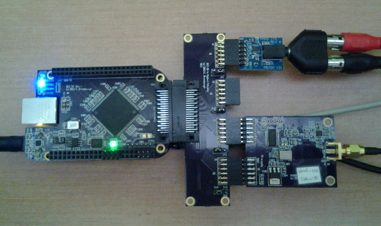
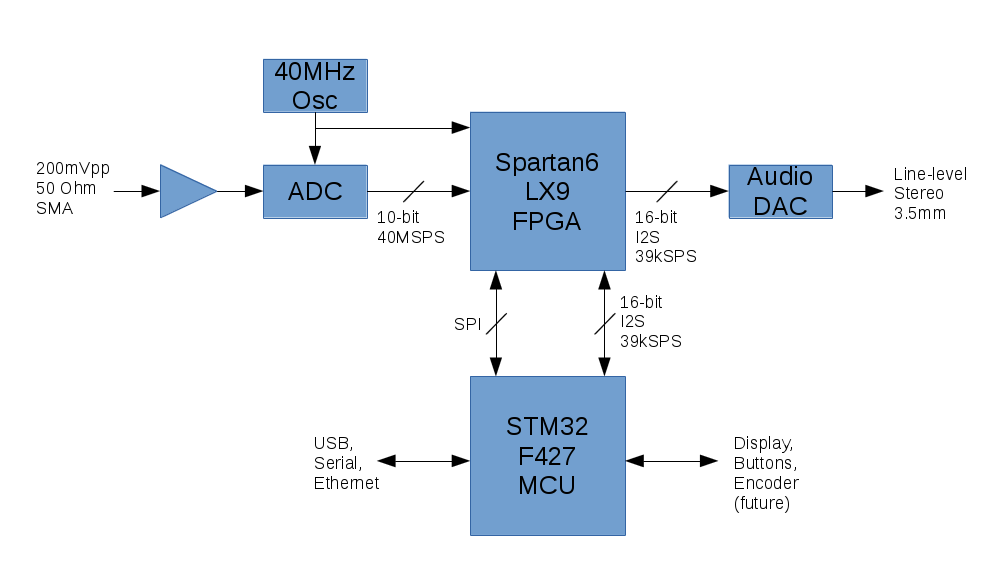
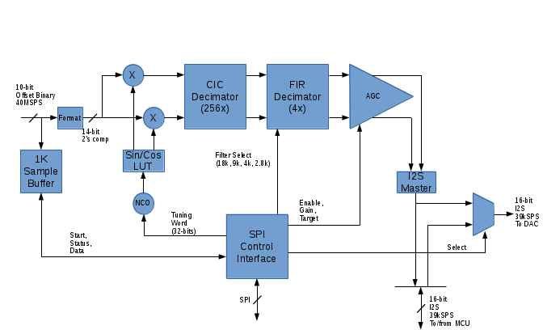
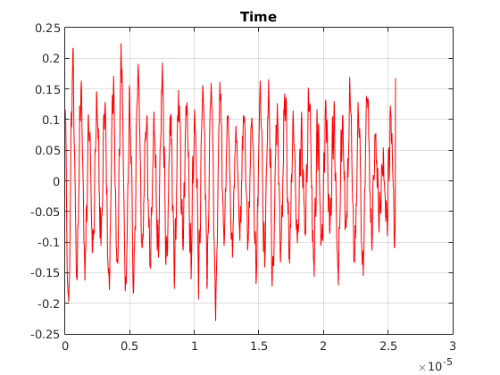
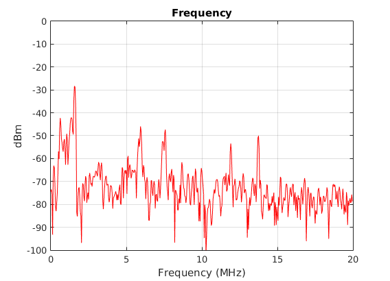

xml version="1.0" encoding="utf-8"?

HFSDR Prototype

# HFSDR Prototype

## Introduction

This is a test prototype for experimenting with Software Defined Radio (SDR).
It is composed of several boards that are described in detail elsewhere on this
site:

* [RXADC Board](../../radio/rxadc/index.html) - 
 40MSPS 10-bit ADC for capturing HF-band RF signals.
* [BCC S6 FPGA Board](../../embedded/bcc_s6/index.html) - 
 Contains high-speed digital logic for the Decimating Downconverter (DDC)
 as well as I2S master logic and DAC driver.
* [STBONE MCU Board](../../embedded/stbone/index.html) - 
 Provides software defined demodulation and overall control.
* [I2S DAC PMOD](../../synth/audiodac/index.html) - Used for
 stereo audio output of demodulated signals.

Combined with suitable firmware and FPGA design, these boards comprise a receiver
capable of capturing 20kHz of signal over 0-20MHz, demodulating it with a variety
of formats and driving high-quality audio.

## System Architecture

The HFSDR Prototype system diagram is shown in Figure 1 below.

**Figure 1: HFSDR System Diagram**

### ADC

RF input from the
antenna first passes thru a 20MHz low-pass anti-aliasing filter (not shown) before
entering the RXADC card where it is first amplified and then digitized in an ADC.
The maximum input signal allowed without exceeing the range of the ADC puts the
0dBfs point of this system at -10dBm in 50 ohms. The ADC runs at 40MSPS with a
resolution of 10 bits, providing approximately 60dB of dynamic range and 20MHz of
bandwidth which places the quantization noise floor at about -70dBm.

### FPGA

From the ADC, data passes into the FPGA where it is pre-processed for the MCU.
Figure 2 below shows the primary components of the FPGA design.

**Figure 2: HFSDR FPGA Diagram**

#### Sample Buffer

For diagnostic and analysis, a 1024x11-bit sample buffer is provided which can
snapshot the ADC input data as well as the overrange bit and store it in SRAM
for analysis by the MCU. This provides the capability to check for overflow and
also to generate wide-band signal analysis via DFT to find strong signals within
the input passband. Examples of signals processed thru the sample buffer are
shown in Figure 3 and 4.

**Figure 3: ADC Time Waveform (amplitude scaled to max=+/-1.0)**

**Figure 4: ADC PSD**

#### Input Data Formatting

10-bit 40MSPS offset-binary data from the ADC is reformatted to 14 bit two's
complement signed for further processing. This allows future updates to higher
dynamic range processing without significant redesign of the the FPGA functions.

#### Tuning and Real / Complex conversion

14-bit real data passes into a quadrature tuner. Here, a numerically controlled
oscillator (NCO) generates the local tuning reference to mix the incoming sampled
RF signal down to baseband. In the process the real input signal is converted into
complex I and Q. Data precision is maintained at 14-bits.

#### CIC Decimation

Baseband I and Q is decimated by a factor of 256 in a 4-stage CIC decimator. This
structure provides 4 bits of additional resolution due to the integration which
takes place. Since then next step in the processing will provide an additional bit,
the output of the CIC is rounded to input plus 5, or 19 bits total at a rate of
1.536MSPS.

#### FIR Decimator

19-bit decimated data at 1.536MSPS is futher decimated by 4 in a FIR decimator.
This subsystem provides up to 250 taps of 18-bit FIR coefficients which allows
substantial stop-band rejection and fairly narrow transition bands. Four separate
sets of coefficients are available, selectable in real-time. Corner frequencies
are currently set at 18kHz, 9kHz, 4kHz and 2.8kHz, but can be easily changed if
needed. This filter provides approximately 80dB of stop-band rejection for all
four bandwidths. The output signal is 19 bits at 39.0625kSPS, complex.

#### AGC

After tuning, filtering and decimation, the low-rate baseband signal has a wide
dynamic range. Strong input signals will be nearly at the maximum range of the
19-bit data word, while weak signals could occupy only the bottom few lsbs. A
Log AGC compresses the dynamic range to a nominal 16 bits by adjusting the gain
to ensure that the RMS signal amplitude matches a pre-set target value which
allows sufficient headroom for modualtion without clipping, yet maximizes the
overall signal amplitude within the 16-bit word. This AGC design has more than
80dB of gain range and settles in approximately 1s. The AGC may be disabled and
a fixed, externally set gain value may be applied if desired. The automatically
determined gain value can be read back by the MCU to estimate input signal
strength.

#### I2S Master

The 16-bit complex I/Q signal is reformatted as a 16-bit stereo I2S data stream
with I on the left channel and Q on the right channel. This signal is sent to
both the MCU and to a mux which can select either the raw I / Q signal for the
DAC output, or the processed audio returned from the MCU over the I2S data input.

#### SPI Control Interface

The SPI Control interface provides up to 128 32-bit wide read/write registers
which the MCU uses to control the FPGA design and check status. All tuning and
configuration of the RF processing takes place thru this interface, as well as
triggering the 1k sample buffer and reading back its contents.

#### Overall FPGA design

The current design which supports only receive operations is using about 37% of
the total resources available in the Spartan 6 LX9 FPGA. There is ample room
for the addition of transmit support processing as well as the possibility of
complex processing for modulation / demodulation of digital waveforms.

### MCU

The STM32F427 processor interfaces to the FPGA via SPI and I2S serial ports to
control the front end processing and exchange baseband and audio data. Firmware
running on the MCU configures the FPGA from a micro-SD card at power up, confirms
the presence of the proper design by reading an ID register in the SPI interface
and then configures the tuning, filter and AGC parameters. A background process
runs which accepts I2S data from the FPGA, applies user-selected demodulation
processing and then returns demodulated audio to the FPGA where it is forwarded
to the Audio DAC.

At present the MCU supports three different demodulation types:

* **AM:** For broadcast and Short-Wave listening, this algorithm uses
 a simple sqrt(I\*I+Q\*Q), followed by a DC blocker to remove
 the carrier component.
* **Upper Sideband:** This algorithm performs a phase shift of the I and
 Q signals by +/-45 degrees, followed by DC blocking and summation to
 cancel out the lower sideband. Phase shifting is performed with a pair of
 optimized 6th-order IIR allpass filters.
* **Lower Sideband:** This uses the same algorithm as the Upper Sideband
 described above, but uses a differencing network to cancel upper sideband.

These background audio processing algorithms currently require no more than 7% of
of the total available CPU cycles. Other demodulation formats are possible,
including narrowband FM, synchronous AM and various digital modes.

The foreground process on the MCU is a simple serial command-line interface
with simple functions for manipulating the FPGA configuration, tuning setup and
background demodulation parameters.

## Future Work

At present the HFSDR Prototype system demonstrates basic functionality and provides
a good base for improvement. Here's a list, in no particular order, of things to
explore in the future:

* Additional demodulation algorithms for both audio and digital modes.
* Enhanced front-end RF interfaces, including wider bitwidth converters,
 wider bandwidth sampling and improved analog processing with better gain
 control and filtering for signals that are of no interest.
* Better user interfaces. The current serial command line interface is
 fine for benchtop development work but falls short on usability. It would be
 nice to add a color graphic LCD display and some buttons / rotary encoder
 features for smoother tuning and feedback on signal conditions.
* Transmit capability. The audio DAC could be replaced with a true codec
 and the FPGA design can be extended to include an interpolating upconverter.
 The MCU background audio processing can be augmented to support the modulation
 of SSB, AM, NBFM and digital modes.
* More compact construction. The current prototype system is spread out
 over multiple boards for modular testing. A more compact form factor would
 significantly reduce signal length and thus interference / susceptibility,
 improving sensitivity and overall performance.

## Follow Up

I've had some time to pursue a few of the items from the Future Work list above
with some encouraging results

* Additional demodulation algorithms - Added a narrowband FM demod, as
 well as a special ISM mode with upper and lower sidebands on both
 stereo channels.
* Enhanced front-end RF interfaces - A 
 [VHF front-end](../r820t2_breakout/index.html) and
 [14-bit 80MSPS ADC](../rxadc14/index.html)
 combine to provide wider tuning range and enhanced dynamic range.
* Better user interfaces - Color LCD and encoder user interface has been
 incorporated in the [iceradio](../iceRadio/index.html) project
 and shows promise.
* Transmit capability - this is working in the
 [HF Bone](../hfbone/index.html) project.

[Return to Radio page.](../index.html)
##### 
**Last Updated**

:2017-03-04
##### 
**Comments to:**

[Eric Brombaugh](mailto:ebrombaugh1@cox.net)

