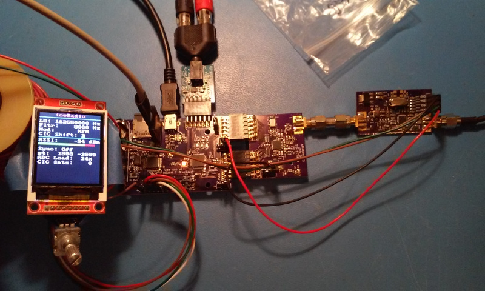
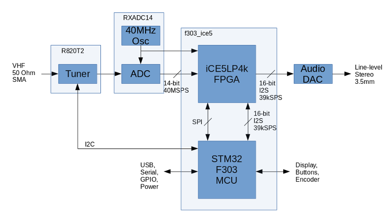
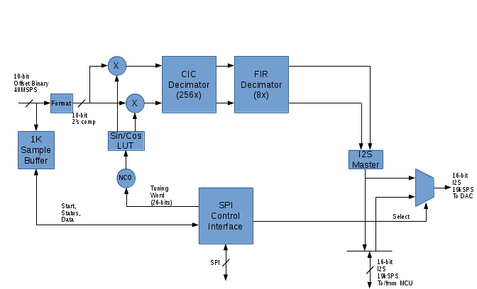

xml version="1.0" encoding="utf-8"?

iceRadio

# iceRadio

## Introduction

This is a test prototype for experimenting with Software Defined Radio (SDR).
It is composed of several boards that are described in detail elsewhere on this
site:

* [VHF Tuner](../../radio/r820t2_breakout/index.html) - 
 20MHz - 1200MHz VHF/UHF downconverter.
* [RXADC Board](../../radio/rxadc14/index.html) - 
 40MSPS 14-bit ADC for capturing HF-band RF signals.
* [STM32F303 and ice5 Board](../../embedded/f303_ice5/index.html) - 
 MCU and FPGA which implement the digital receiver.
* [I2S DAC PMOD](../../synth/audiodac/index.html) - Used for
 stereo audio output of demodulated signals.

Combined with suitable firmware and FPGA design, these boards comprise a receiver
capable of capturing 20kHz of signal from DC to over 1GHz, demodulating it with a variety
of formats and driving high-quality audio.

## System Architecture

The iceRadio system diagram is shown in Figure 1 below.

**Figure 1: iceRadio System Diagram**

### Tuner

RF input from the antenna can optionally be tuned down from VHF/UHF
frequncies to an IF frequency in the HF range before passing to the ADC.

### ADC

Raw HF or downconverted VHF at an IF of 5MHz is digitized to 14-bit resolution.
The maximum input signal allowed without exceeing the range of the ADC puts the
0dBfs point of this system at -10dBm in 50 ohms. The ADC runs at 40MSPS with a
resolution of 10 bits, providing approximately 60dB of dynamic range and 20MHz of
bandwidth which places the quantization noise floor at about -70dBm.

### FPGA

From the ADC, data passes into the FPGA. This is an iCE5LP4k part which
provides 20 4kb RAM blocks and 4 16x16 MAC blocks which are essential for the
DSP required for the downconversion. In the FPGA the ADC data is pre-processed
to a sample rate appropriate for the MCU. Figure 2 below shows the primary
components of the FPGA design.

**Figure 2: iceRadio FPGA Diagram**

#### Sample Buffer

For diagnostic and analysis, a 1024x11-bit sample buffer is provided which can
snapshot the ADC input data as well as the overrange bit and store it in SRAM
for analysis by the MCU. This provides the capability to check for overflow and
also to generate wide-band signal analysis via DFT to find strong signals within
the input passband.

#### Input Data Formatting

10-bit 40MSPS offset-binary data from the ADC is reformatted to 10 bit two's
complement signed for further processing.

#### Tuning and Real / Complex conversion

10-bit real data passes into a quadrature tuner. Here, a numerically controlled
oscillator (NCO) generates the local tuning reference to mix the incoming sampled
RF signal down to baseband. In the process the real input signal is converted into
complex I and Q. Data precision is maintained at 10-bits.

#### CIC Decimation

Baseband I and Q is decimated by a factor of 256 in a 4-stage CIC decimator. This
structure provides 4 bits of additional resolution due to the integration which
takes place. Output is truncated to 16 bits total at a rate of 156.25kSPS.

#### FIR Decimator

16-bit decimated data at 156.25kSPS is futher decimated by 8 in a FIR decimator.
This subsystem provides up to 246 taps of 16-bit FIR coefficients which allows
substantial stop-band rejection and fairly narrow transition bands. Corner
frequency of the filter is 9kHz but can be easily changed if needed. The output
signal is 16 bits at 19.531kSPS, complex.

#### I2S Master

The 16-bit complex I/Q signal is reformatted as a 16-bit stereo I2S data stream
with I on the left channel and Q on the right channel. This signal is sent to
both the MCU and to a mux which can select either the raw I / Q signal for the
DAC output, or the processed audio returned from the MCU over the I2S data input.

#### SPI Control Interface

The SPI Control interface provides up to 128 32-bit wide read/write registers
which the MCU uses to control the FPGA design and check status. All tuning and
configuration of the RF processing takes place thru this interface, as well as
triggering the 1k sample buffer and reading back its contents.

#### Overall FPGA design

The current design which supports only receive operations is using about 37% of
the total resources available in the iCE5LP4k. It may be possible to include
additional processing functions on the FPGA to reduce the burden on the MCU.

### MCU

The STM32F303 processor interfaces to the FPGA via SPI and I2S serial ports to
control the front end processing and exchange baseband and audio data. Firmware
running on the MCU configures the FPGA from a micro-SD card at power up, confirms
the presence of the proper design by reading an ID register in the SPI interface
and then configures the tuning and mux settings. A background process runs which
accepts I2S data from the FPGA, filters it, adjusts gain, applies user-selected
demodulation processing and then returns demodulated audio to the FPGA where it
is forwarded to the Audio DAC.

#### Filter
The first step in the processing is to further filter the input data. The full
9kHz bandwidth is rarely useful for broadcast and amateur radio signals so a
set of real-time selectable 6th-order IIR filters with bandwidths of 8kHz,
6kHz, 4kHz, 2kHz, 1kHz and 500Hz are available.

AGC
After decimation and filtering the total signal power can be significantly
reduced so an AGC automatically adjusts the signal power to a pre-determined
level. The attack and decay time constants of the AGC are separate, allowing
for fast attack and slow decay which reduces leading-edge distortion of
signals with wide dynamic range such as amateur SSB.

Demodulation
At present the MCU application supports these demodulation types:

* **AM:** For broadcast and Short-Wave listening, this algorithm uses
 a simple sqrt(I\*I+Q\*Q), followed by a DC blocker to remove
 the carrier component.
* **Synchronous AM:** For broadcast and Short-Wave listening, this
 algorithm regenerates the local carrier reference using an extremely
 narrowband PLL for reduced noise in weak signal conditions.
* **Upper Sideband:** This algorithm performs a phase shift of the I and
 Q signals by +/-45 degrees, followed by DC blocking and summation to
 cancel out the lower sideband. Phase shifting is performed with a pair of
 optimized 6th-order IIR allpass filters.
* **Lower Sideband:** This uses the same algorithm as the Upper Sideband
 described above, but uses a differencing network to cancel upper sideband.
* **Upper + Lower:** This mode outputs both upper and lower SSB sidebands
 simultaneously on the stereo output channels. This produces a unique tuning
 experience that may be useful for finding signals.
* **Narrowband FM:** This is mode differentiates the phase of the
 complex I and Q signal to demodulate FM. Standard de-emphasis is included.
* **Raw:** This is the filtered and AGCed I and Q data applied
 directly to the left / right stereo channels.

These background audio processing algorithms currently require no more than 30% of
of the total available CPU cycles. Other demodulation formats may be possible
such as various digital modes.

The foreground process on the MCU is either a simple serial command-line interface
with simple functions for manipulating the FPGA configuration, tuning setup and
background demodulation parameters or a GUI based on a color LCD and rotary
encoder.

Front-end Enhancements
The original design of iceRadio was based on a 10-bit 40MSPS ADC PMOD that
I designed many years ago. In early 2017 I came across a good deal on some much
higher performance ADC chips so I adapted iceRadio to use 14-bit input samples.
The additional resolution has helped to improve overall sensitivity and allows
me to extend to dynamic range of the CIC decimation filters by several bits.
While these chips can operate at over 100MSPS I'm only running this one at
40MSPS for now, mainly due to the speed limitations of the FPGA. It may be
possible to double the sampling rate with some careful redesign of the input
logic and that's going on the To-Do list.

Another enhancement is the addition of a VHF-downconverter based on the
Rafael R820T2 tuner. The iceRadio firmware has been extended to allow it to
control the tuner chip via I2C bus and configure its DDC to the IF output
center frequency of the tuner. This allows reception of narrowband FM signals
used in amateur radio, business and public service frequencies.

Ultra Plus FPGA
In late 2017, Lattice Semiconductor's new Ultra Plus subset of the ice40
FPGA became available through the normal distribution channels. These parts
are a nice extension of the Ultra FPGA originally used in iceRadio with
additional logic elements, more DSP cores and more RAM. At about the
same time the IceStorm FOSS FPGA toolchain added support for these parts. I
picked up a few and updated the STM32F303 + ice5 board with one since the
parts are pin-compatible with the earlier ones. The good news is that iceRadio's
FPGA design ported over with virtually no changes required. On top of that,
the additional resources in the Ultra Plus part will allow me to add some more
features that I've been mulling over, including a hardware AGC, support for
a panadapter to aid in tuning, wideband + stereo FM demodulation and possibly
even wider input bandwidth.

Status
* 07-08-16 - Started coding.
* 07-22-16 - Basic functions working.
* 08-09-16 - Webpage created.
* 03-21-17 - Added 14-bit ADC, VHF downconverter, fancier GUI.
* 02-25-18 - Updated with Ultra Plus FPGA.

Future Work
At present the iceRadio system demonstrates basic functionality and provides
a good base for improvement. Here's a list, in no particular order, of things to
explore in the future:

* Additional demodulation algorithms for both audio and digital modes.
* Hardware AGC
* Panadapter
* Higher input sampling rate
* Wideband + stereo FM demodulation

Design Resources
* [iceRadio source on github](https://github.com/emeb/iceRadio)

[Return to Radio page.](../index.html)

**Last Updated**
:2018-02-25

**Comments to:**
[Eric Brombaugh](mailto:ebrombaugh1@cox.net)

[Valid HTML 4.01 Transitional](http://validator.w3.org/check?uri=referer)

