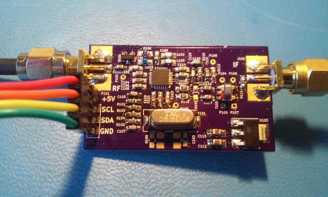

xml version="1.0" encoding="utf-8"?

R820T2 Breakout

# R820T2 Breakout

## Introduction

This is a breakout board for the Rafael Microelectronics R820T2 Advanced
Digital TV Silicon Tuner chip. This is the same chip used in most all of the
RTL-SDR dongles, as well as the Airspy and numerous other radios. The chip
is a versatile front-end with reasonable sensitivity and wide tuning range.
The design presented here is almost an exact implementation of the Mfg's
suggested demo design from the datasheet, implemented on the OSHpark 4-layer
PCB process and provides a simple 4-pin interface with power, ground and I2C
bus for controlling the tuner. A broad-band RF input and 10MHz IF output are
provided on SMA connectors.

### Features:

* R820T2 tuner chip
* Onboard 3.3V Regulator (5V input).
* Full Mfg's suggested support circuitry.
* Optional crystal or TCXO LO reference frequency.
* 50-ohm SMA input and output

## Firmware

I've provided a simplified driver based on work from Airspy and the Linux
media drivers which allows control of the R820T2 from an STM32F0xx processor.

## Design Resources
* Schematic: <r820t2_breakout_sch.pdf>
* Bill of Materials (PDF): <r820t2_breakout_bom.pdf>
* Bill of Materials (ODF): <r820t2_breakout_bom.ods>
* Gerbers: <r820t2_breakout_gerber.zip>
* Board at OSHpark: [R820t2 Breakout Board](https://oshpark.com/shared_projects/woujCstn)
* Github sources: [r820t2 github](https://github.com/emeb/r820t2)

[Return to Radio page.](../index.html)

**Last Updated**
:2017-02-17

**Comments to:**
[Eric Brombaugh](mailto:ebrombaugh1@cox.net)

[Valid HTML 4.01 Transitional](http://validator.w3.org/check?uri=referer)

