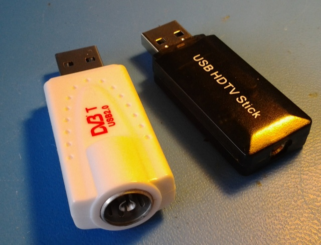

xml version="1.0" encoding="utf-8"?

RTL-SDR

# RTL-SDR

## Introduction

RTL-SDR is an open-source tool to enable use of Realtek RTL2832-based DVB-T
USB dongles in software defined radio applications. These inexpensive dongles,
originally intended to enable reception on European digital TV broadcasts on
PCs also include a raw digitizer mode which allows reception of up to ~3MHz of
RF bandwidth. The DVB-T chip is usually coupled with a broad-band analog
front-end (AFE) chip capable of tuning over ~60-1700MHz and so they are useful
for a wide range of radio applications. Because they are designed to support
a broadcast standard that isn't used in the US, these dongles are generally
only available via international orders through sites such as ebay, but with
a bit of patience they're not hard to get.

Although the manufacturers of both the digital and analog chips in these
dongles haven't openly published sufficient details to allow writing drivers
directly from documentation, a reverse-engineering effort has resulted in
a very capable set of open-source tools which enable basic functionality. This
is a short, incomplete list of resources I've found handy:

* [sdr.osmocom.org](http://sdr.osmocom.org/trac/wiki/rtl-sdr)
 - The original source for the driver effort
* [www.oz9aec.net](http://www.oz9aec.net/index.php/gnu-radio/gnu-radio-blog/464-rtl2832u-based-software-defined-radios)
 - OZ9AEC's blog entry on the guts.
* [sdrsharp.com](http://sdrsharp.com/)
 - an excellent free tool for Windows that has built-in support for RTL-SDR.
* More to come

[Return to Radio page.](../index.html)
##### 
**Last Updated**

:2012-06-03
##### 
**Comments to:**

[Eric Brombaugh](mailto:ebrombaugh1@cox.net)

