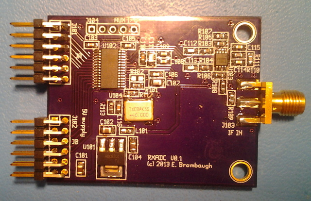

xml version="1.0" encoding="utf-8"?

RXADC Pmod

# RXADC Pmod

## Introduction

This is an ADC designed for use in digitizing RF signals with up to 20MHz
bandwidth. The form-factor is compatible with a dual-connector Digilent
Pmod so that it can be used with commonly available FPGA development boards to
build a variety Software-Defined radio functions.

### Features:

* [AD9203](http://www.analog.com/en/analog-to-digital-converters/ad-converters/ad9203/products/product.html)
 10-bit 40MSPS RXADC.
* [AD8138](http://www.analog.com/en/specialty-amplifiers/differential-amplifiers/ad8138/products/product.html)
 differential buffer/driver
* Onboard 3.3V Regulator (5V input)
* Filtered Analog 3.3V Supply
* Onboard 40MHz clock oscillator
* Digilent-compatible 2-connector Pmod interface
* Unused data bits brought to 5-pin header for misc interfacing.
* 50-ohm SMA input

### Design Resources

* Schematic: <rxadc.pdf>
* Bill of Materials: <bom.txt>
* Gerbers: <rxadc.zip>
* Board at OSHpark: [RXADC Board](https://oshpark.com/shared_projects/0RBiA4fM)

[Return to Radio page.](../index.html)
##### 
**Last Updated**

:2016-11-23
##### 
**Comments to:**

[Eric Brombaugh](mailto:ebrombaugh1@cox.net)

