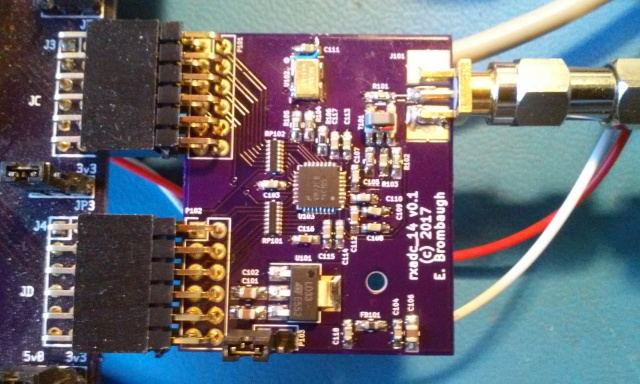

xml version="1.0" encoding="utf-8"?

RXADC\_14 Pmod

# RXADC\_14 Pmod

## Introduction

This is an ADC designed for use in digitizing RF signals with up to 40MHz
bandwidth and 80dB SNR. The form-factor is compatible with a dual-connector Digilent
Pmod so that it can be used with commonly available FPGA development boards to
build a variety Software-Defined radio functions.

### Features:

* [ADC14C105](http://www.ti.com/product/ADC14C105)
 14-bit 105MSPS RXADC.
* Onboard 3.3V Regulator (5V input)
* Filtered Analog 3.3V Supply
* Onboard 80MHz clock oscillator
* Digilent-compatible 2-connector Pmod interface
* 50-ohm SMA input - 2.5Vpp ~= 0dBfs

### Design Resources

* Schematic: <rxadc_14_sch.pdf>
* Bill of Materials (PDF): <rxadc_14_bom.pdf>
* Bill of Materials (ODS): <rxadc_14_bom.ods>
* Kicad design on Github: [rxadc\_14 github](https://github.com/emeb/rxadc_14)* Board at OSHpark: [RXADC\_14 Board](https://oshpark.com/shared_projects/miq3V6Fq)

## Status

* 01-19-17 - Schematic started.
* 01-20-17 - Layout started.
* 01-27-17 - V0.1 PCBs ordered.
* 03-01-17 - V0.1 Boards back, assembled, working. Bugs found:
	+ R104/R105 refdes swapped
	+ U102 OE pin tied wrong.
* 03-04-17 - V0.2 corrections added, Webpage created.

[Return to Radio page.](../index.html)
##### 
**Last Updated**

:2017-03-04
##### 
**Comments to:**

[Eric Brombaugh](mailto:ebrombaugh1@cox.net)

