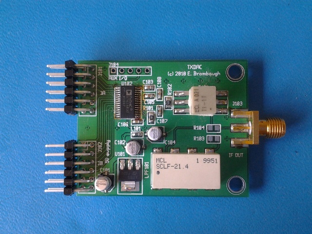
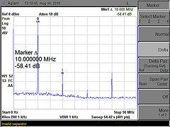

xml version="1.0" encoding="utf-8"?

TXDAC Pmod

# TXDAC Pmod

## Introduction

This is a DAC designed for use in generating RF signals in the HF Bands
(100kHz - 27 MHz). The form-factor is compatible with a dual-connector Digilent
Pmod so that it can be used with commonly available FPGA development boards to
build a variety of signal generators, transmitter exciters and
Software-Defined radio functions.

### Features:

* [AD9760](http://www.analog.com/en/digital-to-analog-converters/da-converters/ad9760/products/product.html)
 10-bit 100MSPS TXDAC. Footprint compatible with similar parts up to 12-bits.
 * Onboard 3.3V Regulator (5V input)
* Filtered Analog 3.3V Supply
* Digilent-compatible 2-connector Pmod interface
* Unused data bits brought to 5-pin header for misc interfacing.
* Optional footprint for Mini-Circuits RF Filters
* 50-ohm SMA output

### Performance

TXDAC output spectrum driven by a 10.00MHz DDS implemented in an FPGA and
clocked at 50MHz.

### Design Resources

* Schematic: <txdac_pg1.pdf>
* Gerbers (OSHpark naming conventions): <txdac_v1.0_oshpark.zip>
* Bill of Materials: <bom.txt>

### Getting One

Interested? PCB Gerbers and BOM are available above in the Design Resources section.
Cost for boards is about $16.15 for a set of three from OSHpark.com. Parts will run another
$50 or so depending on where you get them, what type of filter you use and which version of
the TXDAC you want.

[Return to Radio page.](../index.html)
##### 
**Last Updated**

:2013-12-01
##### 
**Comments to:**

[Eric Brombaugh](mailto:ebrombaugh1@cox.net)

