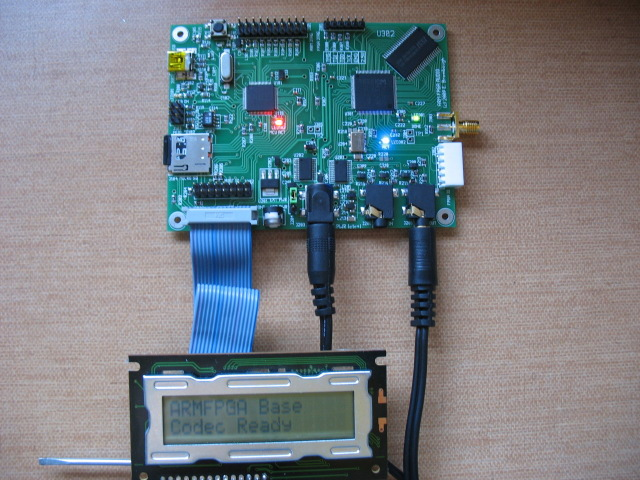

xml version="1.0" encoding="utf-8"?

ARM FPGA Audio

# ARM FPGA Audio board

ARM FPGA board
## Hardware

This is a development system for audio applications of FPGAs and Microcontrollers.
It provides the following features:

* NXP [LPC2148](http://www.nxp.com/#/pip/pip=[pip=LPC2141_42_44_46_48_4]|pp=[t=pip,i=LPC2141_42_44_46_48_4]) ARM Microcontroller with 512kB Flash, 32kB SRAM, USB, 2 ADCs, DAC, etc.
+ Pin-compatible with LPC2144/LPC2146 for reduced cost with less SRAM and Flash

* MicroSD Flash card socket for on-board program, FPGA bitstream and data table storage.
* Xilinx [XC3S250EVQ100-4](http://www.xilinx.com/support/mysupport.htm#Spartan-3E) FPGA with ~250kgate capacity, 12 multipliers, 216kb RAM and 66 I/O
+ Pin-compatible with XC3S500EVQ100-4 or -5 for more gates, BRAM, multipliers and speed

* ISSI [IS61WV25616](http://www.issi.com/pdf/61WV25616.pdf) SRAM with 4Mb (256k x 16) and 10ns access time.
+ Pin-compatible with IS61WV51216 8Mb (512k x 16) for 2x capacity.

* Cirrus Logic [CS4270](http://www.cirrus.com/en/products/pro/detail/P1091.html) stereo audio CODEC with up to 200kHz / 24-bit sampling.
* 24.576MHz Oscillator
+ Optional VCXO and simple PLL for sychronization to external sources.

* USB 2.2 full-speed port in Mini-B format.
* MIDI physical interface.
* Hitachi-standard character LCD drive signals.
* Off board analog/digital expansion port with 8 MCU I/O.
+ Up to 6x 10-bit ADC inputs.
+ 1x 10-bit DAC output.
+ Up to 8x GPIO (4 with pullups for switches / encoders)
+ 2nd UART
+ Up to 3 PWM

* One Digilent-compatible 6-pin [peripheral module](http://www.digilentinc.com/Products/Catalog.cfm?NavTop=2&NavSub=401&Cat=Peripheral) connector for direct FPGA interfacing.
* JTAG ports for MCU and FPGA development and debugging
* USB or external 5V power.
* SMA Clock In/Out
* Uncommitted FPGA testpoints

I envision this being used for development of unique digital synthesis systems based on
a hybrid of 32-bit ARM MCU acting as a powerful command interpreter and realtime scheduler,
along with the FPGA/SRAM/CODEC which combine to provide a powerful audio synthesis and
effects engine.

Potential applications include:

* MIDI-controlled digital synthesis
* Delay effects (more than 5 seconds of storage at 48kHz)
* Real-time spectral analysis with Xilinx FFT cores
* AES/EBU and SP/DIF interfacing (via Digilent port and VCXO)
* Vocoders* * Granular Synthesis
* etc

Here's the [schematic](armfpga_pg1-3.pdf).

Here're the [gerbers](armfpga_gerber.zip).

Here's the [BOM](armfpga_bom.csv).

Here's the [Bootloader source](bootloader.zip).

Here's the [Base firmware source](base.zip).

Here's the [Test FPGA source](fpga_test.zip).

Here's the [gEDA schematic](armfpga_sch.tgz).

Here's the [gEDA PCB design](armfpga_pcb.tgz).

## Firmware

ARM code for this will be based on the 
[SparkFun LPC2148 USB Bootloader](http://www.sparkfun.com/commerce/tutorial_info.php?tutorials_id=94).
This will allow downloading files from a PC to the MicroSD card, including ARM firmware
updates, FPGA bitstreams, wavetables and other run-time data. Future development
may include run-time access to the USB port for full-speed (12Mbps) communication
between the ARMFPGA board and a control PC.

Development will be based on the widely-available ARM-GCC compiler toolchain
([Win](http://www.yagarto.de/),
[Mac](http://arm-elf-gcc.darwinports.com/),
[Linux](http://www.codesourcery.com/gnu_toolchains/arm))
for MCU firmware development, coupled with Xilinx's freely available [ISE Webpack](http://www.xilinx.com/ise/logic_design_prod/webpack.htm)
(Win, Linux only) for FPGA synthesis.

## Status

12-25-08 - Initial paper design.

12-27-08 - start schematics.

01-20-09 - most parts have been received and the pcb design is in the fab.
First prototype testing should happen sometime in mid-February.

02-14-09 - PCB back from fab. Found a few fab problems due to minimum
trace width violations (see image). Resulting shorts easily scraped off.

02-21-09 - ARM processor, micro SD, bootloader and LCD work. 

02-23-09 - FPGA shows up on JTAG, serial config from SD works. 

02-27-09 - Assembly complete, all major sections of circuitry working.

02-28-09 - Simple sine & saw oscillator working.

03-21-09 - Added MIDI receive (note on/off, pitch bend, CCs).

03-22-09 - Added 2-operator FM waveshaping (mod/carr ratio on CC knob,
mod index on modulation wheel).

03-28-09 - Added Linear ADSR, external SRAM delay and feedback. Found
first hardware bug: SRAM data bits 6,7 hooked to input-only pins on FPGA.

04-05-09 - Improve MIDI responsivness with foreground/background partitioning. 
Widened delay data to 24 bits, add headroom in feedback calcs.

04-14-09 - Expo release for ADSR. Sample sounds on my site at [SDIY.org](http://www.sdiy.org/kbadc/armfpga/).

[Return to Synth page.](../index.html)
##### 
**Last Updated**

:2009-04-15
##### 
**Comments to:**

[Eric Brombaugh](mailto:ebrombaugh1@cox.net)

