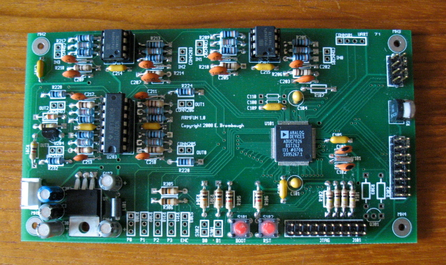
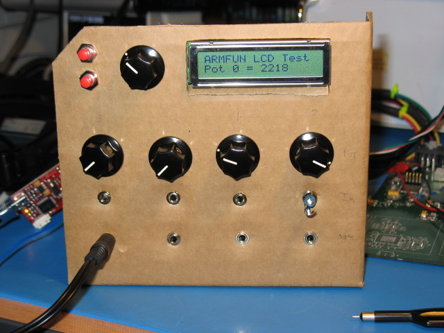

xml version="1.0" encoding="utf-8"?

ARM Functions

# ARM Functions

#### Assembled Board (minus backlight driver)

#### Prototype front panel (Yeah - it's cardboard. So?)

## Hardware

This is a test-bed for using the Analog Devices ADuC7026 in control voltage 
processing applications. It supports four channels of input/output with a +/-5V 
range, plus four ratiometric pots for real-time control. A 16x2 LCD, encoder 
and two buttons are used for setup and configuration. Power requirements are
+/-15V and +5V. Programming and debug are supported with both a 20-pin ARM JTAG 
connector, as well as a standard 3.3V UART connector compatible with the ADI 
bootloader. An 8-pin AUX connector provides for future expansion with GPIO and/or
hardware-backed SPI and I2C interfaces.

Here's the [schematic](armfun_pg1-3.pdf).

## Firmware

Firmware is under development, but preliminary code provides a sample rate 
of 22.1kHz on each I/O channel and 5.025ksps on each the pots with plenty of
unused bandwidth for additional processing to be added.
 
[Return to Synth page.](../index.html)
##### 
**Last Updated**

:2008-06-08
##### 
**Comments to:**

[Eric Brombaugh](mailto:ebrombaugh1@cox.net)

