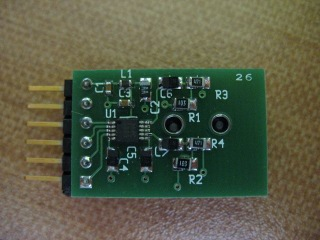

xml version="1.0" encoding="utf-8"?

Digilent-Compatible I2S Audio DAC

# Digilent-Compatible I2S Audio DAC

#### Audio DAC top side

#### Audio DAC component side

## Description

This is an I2S-based Audio DAC that can be connected to 6-pin Digilent peripheral
module sockets. It provides a 24-bit, 192kHz stereo audio DAC with line-level outputs.

Here's the [schematic](audiodac_pg1.pdf).

## Interface

[Test Code](i2s_tst_10.3.zip): (UPDATED) 
This is a complete ISE 10.3 SP3 project
targeting the Avnet Spartan 3A EVK which drives the DAC at a rate of 41.7kHz
for evaluation purposes. It provides a sawtooth on the left channel and a sine
on the right channel. The A and B capsense pads raise and lower the pitch and
the C pad serves as a gate.

~~## These are available for purchase

I've built up a small stock of these (less than 30) and they are available
for purchase while the supply lasts. As of 12-18-2008 I have 11 built and
parts on hand for an additional 18. If you're interested in buying one or
more, please contact me [Eric Brombaugh](mailto:ebrombaugh1@cox.net)
to check for availability.

Price is $25 (US) each and $5 shipping for any quantity up to 5. Payment
via Paypal is preferred. Please contact me prior to paying to ensure that I've
got sufficient stock to cover your order.~~
Update 03-17-10: uh-bdee..ub-bdee..That's all folks! I've sold
27 of these to customers across the world over the last 15 months and
I'm not making any more of them. You can buy bare boards from BatchPCB here:

~~AudioDAC PCB @ BatchPCB~~
Update 03-25-10: Several folks are interested in building these for
themselves, so here's the BOM with Digi-Key part numbers:

~~BOM~~
Update 01-13-11: Digilent is now selling their own version of the Audio DAC:
[Digilent I2S PMOD](http://www.digilentinc.com/Products/Detail.cfm?NavPath=2,719,859&Prod=PMOD-I2S)
I believe that it is pin-for-pin compatible with my old one, but I've ordered one 
to check for certain. More to come...

Update 04-10-11: I've gotten a couple of Digilent's I2S PMODs to try out and
they appear to work just fine. One major caution: Digilient's documentation 
appears to be wrong - their datasheet and schematic have the pinout shown
reversed. The correct pinout is:

* J2-1 -> IC1-4 (MCLK)
* J2-2 -> IC1-3 (LRCK)
* J2-3 -> IC1-2 (SCLK)
* J2-4 -> IC1-1 (SDIN)

Which is identical to my original.

Here's a copy of my test design targeted at the Nexsys2 board. A README.TXT
file is included to explain how to use it:

[Nexsys2 I2S PMOD design (ISE 10.3 and 11.5)](i2s_tst_nexsys2.zip)
[Return to Synth page.](../index.html)
##### 
**Last Updated**

:2011-04-10
##### 
**Comments to:**

[Eric Brombaugh](mailto:ebrombaugh1@cox.net)

