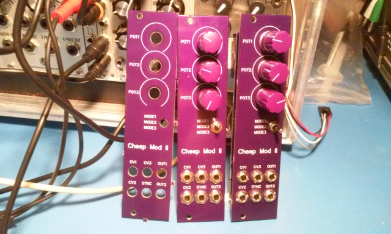

xml version="1.0" encoding="utf-8"?

Cheep Mod II

# Cheep Mod II - a low cost platform for Euro-Rack digital audio.

#### Cheep Mod II Front - fully assembled

### What is it?

This is a small 6HP Euro-Rack format module with 3 CV inputs, 3 pots, Digital
(Sync) input, 16-bit stereo audio outputs. It's a slight modification of the
[Cheep Mod](../cheep_mod/index.html) I did earlier, but with a
slightly more advanced MCU that provides I2S output and has more on-chip flash.
One of the goals here was to test out the audio characteristics of one of the
low-cost I2S DACs that are cropping up.

### Features:

* [STM32F031F6P6](http://www.st.com/content/st_com/en/products/microcontrollers/stm32-32-bit-arm-cortex-mcus/stm32f0-series/stm32f0x1/stm32f031f6.html)
 CPU with:
	+ 32-bit ARM Cortex-M0 CPU rated for 48MHz clock
	+ 6kB SRAM
	+ 32kB Flash
	+ 5 Timers
	+ 1 SPI / I2S
	+ 1 I2C
	+ 1 USART
	+ RTC
	+ 15 GPIO pins (4 are 5V tolerant)
	+ 1 12-bit SAR ADC with 11 input channels
* 3 front-panel pots
* 3-position toggle switch for mode selection
* 3 +/-5V CV inputs
* 1 digital (sync/trigger/gate) input
* 1 16-bit Stereo DAC +/-5V (audio/CV) output
* 1 6-pin ARM SWD connector (ST-Link V2 format) on back
* Standard 16-pin shrouded Euro-Rack power:
	+ +12V @ 28ma
	+ -12V @ 9ma
* 24mm deep

### Software Development

The STM32 family of parts are supported by a variety of commercial IDEs, all
of which are available in low-cost or limited free versions from the
[ST website](http://www.st.com/internet/mcu/class/1734.jsp).

I prefer to use open-source tools so I've set up a development environment
based on the GNU C compiler for ARM, available for free from the Launchpad
project. For downloading to the target I use OpenOCD and the ST-Link V2 SWD
interface that's available on most all of the inexpensive STM32 Discovery boards.
To accelerate development I also use the STM32 Standard Peripheral Library as
a starting point for my code and then optimize out the heavyweight functions
as required. Links to all of these are here:

* [Launchpad GCC](https://launchpad.net/gcc-arm-embedded): 
 ARM-supported GCC (somewhat newer than the CS version above).
* [OpenOCD](http://openocd.org/): JTAG/SWD interface for
 programming a debugging.
* [STM32F0 Discovery](http://www.st.com/web/catalog/tools/FM116/SC959/SS1532/PF253215?sc=internet/evalboard/product/253215.jsp): Development board with USB flash programming
 and debugging.
* [STM32 Standard Peripheral Library for STM32F0xx](http://www.st.com/web/catalog/tools/FM147/CL1794/SC961/SS1743/LN1939/PF257884): Manufacturer's low-level C driver code.

### Design Resources

* Schematic: <cheep2_sch.pdf>
* more to com...

### Project Status

* 2015-12-11: Started Schematic, order parts.
* 2016-04-06: Order PC boards.
* 2016-04-23: PC boards arrive, assembled, working.
* 2016-08-02: Created web page.

[Return to Synth page.](../index.html)
##### 
**Last Updated**

:2016-08-02
##### 
**Comments to:**

[Eric Brombaugh](mailto:ebrombaugh1@cox.net)

