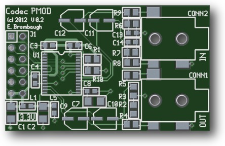
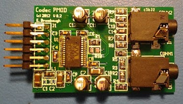

xml version="1.0" encoding="utf-8"?

Digilent-Compatible I2S Audio Codec

# Digilent-Compatible I2S Audio Codec

#### Codec PCB Render

#### Assembled Codec PCB

## Description

This is an I2S-based Audio Codec that can be connected to 12-pin Digilent
peripheral module sockets (PMOD). It provides up to 24-bit, 96kHz stereo
audio line-level I/O.

### Features:

* [WM8731](http://www.wolfsonmicro.com/products/codecs/WM8731/)
 Codec with:
	+ 8kHz-96kHz sample rate
	+ 24-bit I2S data
	+ Selectable SPI or I2C control port
	+ Internal analog mixing/routing/muting/volume control
* Filtered Analog 3.3V Supply
* 3.5mm stereo line-in and line-out jacks (AC-coupled)
* 12-pin Digilent-compatible PMOD connector

The signals on the PMOD interface connector are:

| Function | Pin | Pin | Function |
| --- | --- | --- | --- |
| I2S\_SCLK | 1 | 2 | MCLK |
| I2S\_SDO | 3 | 4 | SPI\_CLK |
| I2S\_LRCK | 5 | 6 | SPI\_DO |
| I2S\_SDI | 7 | 8 | SPI\_CSB |
| GND | 9 | 10 | GND |
| +3.3V | 11 | 12 | +3.3V |

| Function | Description |
| --- | --- |
| I2S\_SCLK | I2S Bit Clock |
| I2S\_SDO | I2S Data to the codec DAC |
| I2S\_LRCK | I2S Word Clock |
| I2S\_SDI | I2S Data from the codec ADC |
| MCLK | Codec Master Clock |
| SPI\_CLK | Control port clock (SPI or I2C) |
| SPI\_DO | Control port data (SPI or I2C) |
| SPI\_CSB | Control port select (SPI) or address (I2C) |

Caveats:
* Although the WM8731 Codec supports on-chip headphone amp and
 MIC input, these functions are not brought out to interfaces.
* WM8731 crystal oscillator functionality is not enabled - the
 MCLK must be supplied by the host FPGA.
* User must select SPI or I2C control port by installing either
 R1 (SPI) or R10 (I2C). Do not install both R1 and R10 simultaneously.

## Design Materials

* [Schematic](codec_pg1.pdf).
 * [Bill of Materials](bom.txt).
 * [DAC test project for ISE12.4 and Nexsys 2 board](dac_drive.zip).
 * [Loopback test project for ISE12.4 and Nexsys 2 board](loopback.zip).
 * [97kHz/24-bit/stereo/44-sec PSRAM delay for ISE12.4 and Nexsys 2 board](delay.zip).
 * More to come...

[PC Boards](https://www.batchpcb.com/pcbs/83930) are available directly from BatchPCB.

### Project Status

* 2012-04-30: Started Schematic and layout.
* 2012-05-01: Order PC boards.
* 2012-05-20: V0.2 PCB assembled.
* 2012-05-26: DAC driver project posted.
* 2012-05-27: Loopback driver project posted.
* 2012-05-28: Delay project posted.
* 2012-10-29: PCB link posted.

[Return to Synth page.](../index.html)
##### 
**Last Updated**

:2012-10-29
##### 
**Comments to:**

[Eric Brombaugh](mailto:ebrombaugh1@cox.net)

