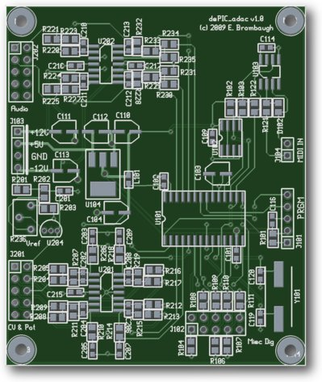
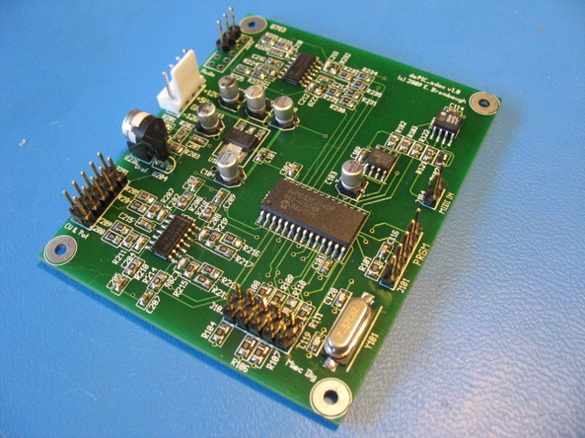

xml version="1.0" encoding="utf-8"?

dsPIC Audio DAC

# dsPIC Audio DAC board

#### PCB Plot

#### Assembled board

## Hardware

This is a small project focused on audio signal processing using the Microchip dsPIC.
It provides the following features:

* Microchip [dsPIC33FJ64GP802](http://www.microchip.com/wwwproducts/Devices.aspx?dDocName=en532310) Microcontroller with 64kB Flash, 16kB SRAM, ADC, Stereo DACs, I2C, SPI, etc.
* Microchip [24aa256](http://www.microchip.com/wwwproducts/Devices.aspx?dDocName=en010785) I2C 32kB EEPROM.
* Off board stereo audio outputs (+/-5Vpp, DC-coupled)
* Off board analog CV / Pot port with 4 x 10V CV + offset pot.
* Off board analog/digital expansion port with 7 MCU I/O.
	+ Up to 2x 12-bit ADC inputs.
	+ Up to 7x GPIO with pulldowns for switches / encoders
* Optional crystal clock source for improved frequency stability
* MIDI Input port
* ISP port for MCU development and debugging

The principle reason for this board is development and deployment of simple digital synthesis systems. I've already
breadboarded most of this circuitry for other projects and wanted something compact and inexpensive that could
be used to encapsulate their functions for permanent installations, as well as to serve as a prototyping
platoform for future development.

Potential applications include:

* Voltage-controlled digital oscillators
* LFOs
* Envelope / Transient generators
* MIDI-controlled digital synthesis
* etc

## Design Collateral

* [Schematic](dsPIC_adac_pg1-2.pdf)
* [Bill of Materials](bom_sorted.pdf)
* [C test code skeleton v0.0](dsPIC_adac_cskel_v0.0.zip)
* Email me [Eric Brombaugh](mailto:ebrombaugh1@cox.net) for a link to where you can purchase the PCB
* ...and more to come as development continues.

## Firmware

dsPIC code for this will be developed using the freely available Microchip MPLAB IDE, including an assembler
and GCC-based C compiler. A C skeleton/test project is provided as a starting
point which provides two sawtooth oscillators sampled at 48kHz with pitch
controlled by analog input CV 0 and 1. Additional driver code for SPI, I2C and
UART is included but not used in this project.

## Status

* 06-15-09 - Start schematics.
* 06-21-09 - Submit rev 1.0 board layout to fab.
* 07-13-09 - Received PCB from fab. Assembled board and tested some functions.
* 06-27-10 - Bill of Materials added.
* 08-11-10 - C Skeleton code added.
* 09-01-10 - Correct missing R232 in BOM and XTAL freq on schematic.

[Return to Synth page.](../index.html)
##### 
**Last Updated**

:2010-09-01
##### 
**Comments to:**

[Eric Brombaugh](mailto:ebrombaugh1@cox.net)

