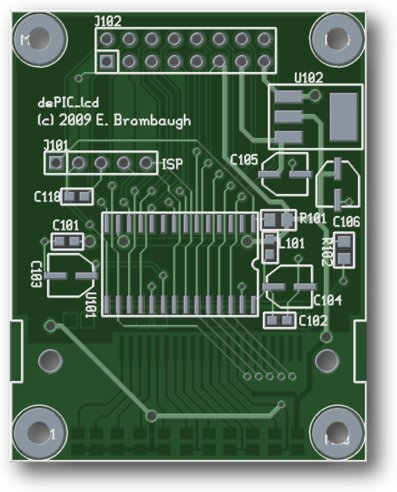

xml version="1.0" encoding="utf-8"?

Goldmine LCD with dsPIC

# Goldmine LCD with dsPIC board

#### PCB Plots (front / back)

#### Hardware (front / back)

#### Simple Oscilloscope, Spectrum Analyzer

#### Spectrum Analyzer Demo Video

## Hardware

This is a tiny board to make easy connection to the the [inexpensive graphic LCD from
Electronic Goldmine](http://www.goldmine-elec-products.com/prodinfo.asp?number=G15623). You can find more info about this LCD at [Tim's blog](http://tim.cexx.org/?page_id=342). The board provides the following features:

* Microchip [dsPIC33FJ12GP202](http://www.microchip.com/wwwproducts/Devices.aspx?dDocName=en520470) Microcontroller with 12kB Flash, 1kB SRAM, ADC, I2C, SPI, UART, etc.
* or Microchip [dsPIC33FJ32GP302](http://www.microchip.com/wwwproducts/Devices.aspx?dDocName=en532304) Microcontroller with 32kB Flash, 4kB SRAM, ADC, I2C, SPI, UART, etc.
* Off board analog/digital expansion port with 13 MCU I/O and/or LCD signals.
	+ Up to 2x 12-bit ADC inputs.
	+ Up to 8x GPIO
	+ 5 direct LCD control lines
* ISP port for MCU development and debugging
* Optional 3.3V regulator
* Optional 4-LED backlight (needs checkout)

Potential applications include:

* LCD only
	+ Provides support circuits (regulator, caps) for LCD operation
	+ simple 5-wire SPI-like interface
	+ more convenient mounting
* LCD and dsPIC
	+ Multi-format serial interfaces (SPI, I2C, UART)
	+ Stand-alone gizmos
	+ Analog displays (via dsPIC ADC)
* etc

## Firmware

dsPIC code for this will be developed using the freely available Microchip MPLAB IDE, including an assembler
and GCC-based C compiler. Several archives of different firmware are here:

* <dsPIC_lcd_fw_v0.2.zip>
 A low-level assembly code test program. Just loads up bug-eyed Earl.
* <dsPIC_lcd2_adc_bargraph.zip>
 A simple C-based 2-channel ADC bargraph for '12GP202 processors.
* <dsPIC_lcd2_oscope.zip>
 A simple C-based 1-channel ADC oscilloscope for '12GP202 processors.
* <dsPIC_lcd3_spect.zip>
 C-based 64-bin FFT spectrum analyzer with log-scale display for 32'GP302 processors.

## PC Board

This board is being fabbed at BatchPCB. It can be ordered directly from BatchPCB - cost is about $8/ea. You can find more here: [dsPIC\_lcd version 1.1 at BatchPCB](http://www.batchpcb.com/product_info.php?products_id=22030&check=bddc16a0b6d67b6278243b06e65529fa).

### Design files

* <dsPIC_lcd_pg1.pdf> schematic.
* <dsPIC_geda.zip> gEDA source (schematic & PCB layout).

## Display Reliability

I bought 10 of the display modules from Goldmine. While testing the boards I had a lot
of trouble getting them to work until I started cleaning the elastomer strips. I found
that it's critical to clean the entire elastomer strip - both the side that touches the
PCB and the side that touches the LCD glass.
I used isopropyl alcohol and a cotton swab to wipe and dry the strips, as well as the PCB
footprint. After learning this, all but one of the displays worked on the first try.

Incidentally, the one display that never worked was actually getting warm!
Flipping the elastomer strip over, I spotted a scorched portion - probably a short between several adjacent power pins.

## Status

06-22-09 - Start schematics.

06-30-09 - Layout complete - checking footprints.

07-01-09 - LCD footprint lines up with original. Added backlights.

07-02-09 - Tweaked some lines/rects that didn't line up right.

07-03-09 - Sent to fab. Should be back in ~3 weeks.

07-24-09 - Boards back. LCD fits footprint.

07-26-09 - Board assembled. Need wires for ISP on '12GP202 part.

07-29-09 - LCD won't initialize with Tim's config. On hold.

09-05-09 - Kenny Booth sends helpful startup hints out of the blue and I'm
now able to draw on the screen. Also need to figure out why only one of my displays works.

09-07-09 - Built a second board & tested the remaining displays. Only one dud!

09-18-09 - C code for ADC driven bargraph & Oscilloscope apps

09-22-09 - '32GP302 board built - no haywires! Format update, spectrum analyzer app

09-24-09 - Added a font, extended spectrum analyzer and posted video

[Return to Synth page.](../index.html)
##### 
**Last Updated**

:2009-09-24
##### 
**Comments to:**

[Eric Brombaugh](mailto:ebrombaugh1@cox.net)

