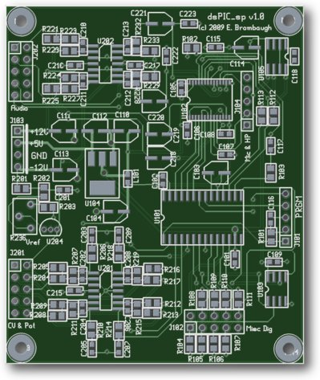
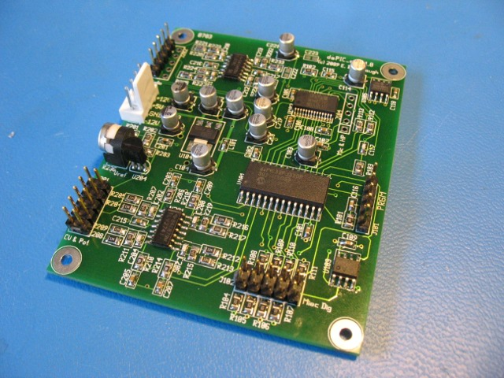

xml version="1.0" encoding="utf-8"?

dsPIC Signal Processing

# dsPIC Signal Processing board

#### PCB Plot

#### Assembled board

## Hardware

This is a small project focused on audio signal processing using the Microchip dsPIC.
It provides the following features:

* Microchip [dsPIC33FJ32GP302](http://www.microchip.com/wwwproducts/Devices.aspx?dDocName=en532304) Microcontroller with 32kB Flash, 4kB SRAM, ADC, Codec interface, I2C, SPI, etc.
	+ Pin-compatible with other dsPIC parts for expanded Flash, SRAM, peripherals.
* Wolfson [WM8731](http://www.wolfsonmicro.com/products/WM8731) stereo audio CODEC with up to 96kHz / 24-bit sampling.
* Microchip [23k256](http://www.microchip.com/wwwproducts/Devices.aspx?dDocName=en539039) SPI 32kB SRAM.
* Microchip [24aa256](http://www.microchip.com/wwwproducts/Devices.aspx?dDocName=en010785) I2C 32kB EEPROM.
* Off board stereo audio I/O (+/-5Vpp, AC-coupled)
* Off board analog CV / Pot port with 4 x 10V CV + offset pot.
* Off board analog/digital expansion port with 8 MCU I/O.
	+ Up to 2x 12-bit ADC inputs.
	+ Up to 8x GPIO with pulldowns for switches / encoders
* Codec expansion port with headphone driver output and microphone input
* ISP port for MCU development and debugging

The principle reason for this board is development and deployment of simple audio DSP applications. I've already
breadboarded most of this circuitry for other projects and wanted something compact and inexpensive that could
be used to encapsulate their functions for permanent installations, as well as to serve as a prototyping
platoform for future development. Thi

Potential applications include:

* Filters
* Distortion/Modulation
* Chorus
* Phase/Flange
* Short Delay (approx 1/3 second of storage at 48kHz)
* Vocoder
* Granular Synthesis
* etc

## Firmware

dsPIC code for this will be developed using the freely available Microchip MPLAB IDE, including an assembler
and GCC-based C compiler.

## Design Collateral

* [Schematic](dsPIC_sp_pg1-2.pdf)
* [gEDA/PCB Source for schematic & PCB](dsPIC_sp_gEDA_PCB_source.zip)
* [PCB Artwork](dsPIC_sp_gerbers.zip)
* [C Source for test application](dsPIC_sp_v0.9.zip)
* [Bill of Materials](bom.csv)
* More to come as developement continues...

## Status

* 06-15-09 - Start schematics.
* 06-21-09 - Submit rev 1.0 board layout to fab.
* 07-13-09 - Received boards from fab.
* 07-18-09 - Assembled board, codec working.
* 09-01-10 - Posted C code for Test application.
* 01-19-11 - Posted schematic & PCB source files & artwork.
* 01-28-14 - Posted Bill of Materials.

[Return to Synth page.](../index.html)
##### 
**Last Updated**

:2014-01-28
##### 
**Comments to:**

[Eric Brombaugh](mailto:ebrombaugh1@cox.net)

