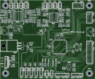
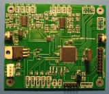
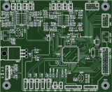

xml version="1.0" encoding="utf-8"?

dsPIC Functions

# dsPIC Functions

#### PCB Plot and Assembled Board

## Hardware

This is a test-bed for using the Microchip dsPIC33FJ128GP708 in control voltage 
processing applications. It supports four channels of input/output with a +/-5V 
range, plus four ratiometric pots for real-time control. A 16x2 LCD, encoder 
and two buttons are used for setup and configuration. Power requirements are
+/-15V and +5V. Programming and debug are supported with a 5-pin ISP 
connector. A 4-pin 3.3V UART connector is provided for access to serial I/O,
including MIDI. An 8-pin DCI connector allows future expansion with an
off-board audio codec, and an 8-pin AUX connector provides access to GPIO
and/or hardware-backed SPI and I2C interfaces.

Here's the [schematic (updated 1-17-2009)](dsPICfun2_pg1-3.pdf).
Here are the [gerbers](dsPICfun2_gerber.zip).
Here's the [BOM (updated 1-17-2009)](dsPICfun2_bom.csv).

## Firmware

Preliminary firmware is running on the board and most functions have
been verified. As of 1/5/09 I've tested out the dsPIC, the SPI DAC,
CV inputs, CV outputs, Pot inputs, LCD, and buttons. The rotary encoder,
UART, DCI and aux digital I/O ports remain to be tested.

Here's [Rev 0.3](dsPICfun_v0.3.zip).

## Others

Csaba Zvekan built one of these and documented his work on
[his own website](http://www.csaba.ch/index.php?option=com_content&task=view&id=42&Itemid=30).

### Errata

Several of these boards have been built and there are a few bugs in the layout
which have emerged:
* Clearance between crystal & load caps is too narrow. I had to stand the
 crystal up on some sleeving to keep the case from shorting to the caps. You
 could also mount it on the back. FWIW, the crystal probably isn't even
 needed - you can get by with just the FRC oscillator.
* The silkscreen for the LM4041 reference is reversed. When installing
 the part, put the flat side of the TO92 package on the opposite side as
 indicated by the silkscreen.

## Rev 2.1

#### PCB Plot of Rev 2.1

Schematic & layout have been updated to correct the above errata. Also, the
spare I2C port on the dsPIC is now connected to an optional 32k x 8 EEPROM.

Here's the new [schematic](dsPICfun2.1_pg1-3.pdf).
Here are the new [gerbers](dsPICfun2.1_gerber.zip).
Here's the new [BOM](dsPICfun2.1_bom.csv).

[Return to Synth page.](../index.html)
##### 
**Last Updated**

:2009-01-17
##### 
**Comments to:**

[Eric Brombaugh](mailto:ebrombaugh1@cox.net)

