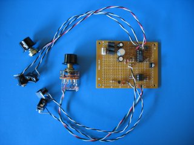

xml version="1.0" encoding="utf-8"?

Digital VCO

# Digital VCO

This is a voltage controlled DDS, implemented with a Cypress PSoC (Programmable System-on-Chip). It uses standard 1V/Octave control voltages over a 0-10V range and generates 8 different waveforms with a +/-5V swing as output. Output frequencies from 20Hz-20kHz are possible, and falling-edge sensitive hard-sync is also provided.

The waveforms are:

|  |  |
| --- | --- |
| Select Value | Waveform |
| 0 | Sine |
| 1 | Triangle |
| 2 | Square |
| 3 | Sawtooth |
| 4 | Pulse |
| 5 | Random Pulse |
| 6 | Random Level |
| 7 | Double Pulse |

## Samples

Here are a few examples of what it sounds like:
* [Sine Sweep](http://www.sdiy.org/kbadc/sine_sweep.wav) This is the sine waveform
 swept across the full range. Listen for aliases - there aren't too many in
 the lower frequency range.
* [Triangle Sweep](http://www.sdiy.org/kbadc/triangle_sweep.wav) The triangle waveform
 swept across the full range. There are a few more aliases audible than in
 the sine.
* [Square Sweep](http://www.sdiy.org/kbadc/square_sweep.wav) The square waveform
 swept across the full range. There are lots of aliases due to phase jitter
 on the fast edges.
* [Saw Sweep](http://www.sdiy.org/kbadc/saw_sweep.wav) The sawtooth waveform
 swept across the full range.
* [Pulse Sweep](http://www.sdiy.org/kbadc/pulse_sweep.wav) The pulse waveform
 swept across the full range.
* [Random Pulse Sweep](http://www.sdiy.org/kbadc/random_pulse_sweep.wav) The random pulse
 waveform swept across the full range. Notice how it fades from a thin
 tone to pure noise.
* [Noise Sweep](http://www.sdiy.org/kbadc/noise_sweep.wav) The noise generator
 swept across the full range. Kinda reminds me of Atari Star Raiders.
* [Double Pulse Sweep](http://www.sdiy.org/kbadc/double_pulse_sweep.wav) Ian Fritz's
 double-pulse waveform swept across the full range.
* [Sine Sync](http://www.sdiy.org/kbadc/sine_sync.wav) The sine waveform
 swept up and down while hard-syncing to the sawtooth in my PAiA9700.
* [Double Pulse Sync](http://www.sdiy.org/kbadc/double_pulse_sync.wav) The double pulse
 waveform swept up and down while hard-syncing to the sawtooth in my
 PAiA9700.

These were all recorded through a mixer and a USB A/D on a Mac with Felt-tip Sound Studio. Note that these are plain .WAV files and thus rather large. I tried using lame to encode them as .MP3, but the results weren't very much like the original.

## Design Files

[PSoC Designer project files](dvco_0.zip)
[Schematic](dvco_schem.jpg)
[Matlab scripts for lookup tables](dvco_tables.zip)
## Theory of Operation

The circuit can be divided into 4 distinct sections:
* ### Control Voltage Summer and Scaler.

 Two 0-10V 1V/Octave control voltages are summed with a pitch offset control
 voltage using an ordinary inverting summation. The pitch offset is just a
 10k pot with a 2k resistor on the top end to keep the output voltage in the
 0-10V range with a 12V supply voltage. The two external CV connections are
 summed with 1% resistors to keep them scaled identically. The feedback
 resistor need not be 1% since the overall gain is set with an adjustment
 in the next stage.
 
 Since the summation stage is inverting, we need to invert again to 
 restore the sense of direction. Also, there's a gain of ~1/2 to get the
 0-10V range down to 0-5V required by the PSoC ADC input. The gain of this
 stage is set with a trimmer pot to allow calibration after assembly. To
 reduce the sensitivity of the calibration, the feedback resistance is a
 combination of fixed and variable resistors.
 
 Note that the control voltage sum may exceed 5V even after scaling, which
 could exceed the input voltage range of the PSoC. A 10k resistor is in-line
 between the op-amp and PSoC to limit the input current and allow the PSoC
 ESD diodes to clamp the input voltage.
* ### Sync edge detector.

 Hard synchronization is accomplished by detecting the falling edge of the
 sync input and generating a 20 microsecond positive pulse. A 0.003uF
 capacitor coupled with 12k resistance and the base impedance of a 2N3906
 PNP transistor meets this requirement. An additional 0.001uF capacitor
 prevents oscillation of the 2N3906. The resulting 5V pulse feeds to the
 Port0\_3 input of the PSoC where it is detected during the DAC update ISR.
* ### PSoC

 The CY8C24123A-PXI is the lowest-end member of the Cypress PSoC product
 line and contains the following resources:
	+ 8-bit MCU
	+ 4k bytes flash memory
	+ 256 bytes RAM
	+ System clock generator
	+ 6 Analog blocks
	+ 4 Digital blocks
	+ 8x8=>32 MAC
	+ I2C logic
	+ Decimator
	+ SAR logic
	+ 6 GPIO pins (2 Analog outputs possible)The Digital VCO uses 95% of the flash memory, all of the digital blocks,
 4 of the 6 analog blocks, the MAC, the decimator and all of the GPIO. The
 digital and analog blocks are divided among four user modules (Cypress'
 terminology for their hardware macro functions):
 
	+ #### PGA
	
	
	 This is a programmable gain amplifier which is used as an input
	 buffer on the ADC input. There are a wide variety of gains
	 possible for this module, but it is set to 1.0 for this design.
	 This function uses one continuous-time analog block.
	+ #### DELSIG11
	
	
	 This is an 11-bit Delta-Sigma ADC. It is run at a clock rate of 250kHz
	 which gives an output data rate of about 244Hz. It uses one digital
	 block and one discrete-time analog block, as well as the decimator.
	+ #### DAC9
	
	
	 This is a 9-bit charge-transfer DAC. It is run at a clock rate of 250kHz
	 which gives an output sample rate of 62.5kHz. It uses two discrete-time
	 analog blocks, as well as the analog column interrupt. Note that
	 although it is specified for 9-bit resolution, this design actually
	 feeds it 11 bits of data. The differential non-linearity is not
	 guaranteed by Cypress for this mode of operation, but it seems to help.
	+ #### PRS24
	
	
	 This is a 24-bit pseudo-random sequence generator. It is run at a clock
	 rate of 250kHz, which means the sequence will repeat approximately
	 every 67 seconds. The random and random-pulse waveforms use this
	 function as a source of uncertainty.
Running on the MCU is a fairly simple program which consists of a main
 routine that initializes the hardware blocks and then enters a loop waiting
 for the ADC results. When a new ADC sample is available, it is converted
 to an exponential frequency and saved in the DDS frequency register. After
 updating the frequency value, the waveform select pins are sampled and the
 waveform jump address is updated.
 
 The exponential conversion calculation converts the 11-bit ADC samples
 into 24-bit frequency words for the NCO (numerically controlled oscillator).
 It does this by first scaling the 11-bit value so that there are 256 lsbs
 per volt, then using the bottom byte of the result as an index into a
 fractional exponent table. The output of this lookup operation is then
 scaled by integer powers of two using the value in the top byte of the
 scaled ADC value. The PSoC's 8x8 MAC is very useful in these calculations,
 which provide an exponential response that is within 0.5% of ideal. 
 
 There are two ISRs running in the background: The first is the DELSIG11
 ISR which handles housekeeping functions for the ADC and is automatically
 generated by the PSoC Designer application. The second ISR is in sync with
 the DAC update rate and ensures that new samples of digital data are always
 available for the DAC. Part of this routine's task is to update the NCO
 which provides the address into the waveform tables.
 
 The DAC update ISR contains 8 distinct waveform computation routines,
 one for each unique waveform. The sine, triangle and sawtooth waveforms
 all use 256-entry 16-bit lookup tables which contain the 11-bit DAC data
 as well as control bits for the DAC so they don't have to be computed in
 the ISR. The square, pulse and double-pulse waveforms are computed based
 on the msbs of the NCO phase. The random waveforms are triggered by the
 overflow of the NCO and read random data directly from the top two bytes
 of the PRS24 module.
 
 The PSoC is clocked by its on-chip master clock which is factory-trimmed
 to run within 2.5% of 24MHz. Using an external 32768kHz crystal it would
 be possible to ensure 3ppm frequency accuracy, but that would use up two
 of the GPIO pins, and the sync and waveform select functions were felt to
 be more important.
* ### Output Signal Conditioning

 The DAC output is filtered with a 2nd-order active filter that has a corner
 frequency of about 16kHz, well below the 31.25kHz Nyquist frequency of this
 system. The filter has a gain of 2, as well as a DC offset which provides
 an output signal that swings over a range of -5V/+5V. A 1kohm output
 resistor provides some isolation from external short-circuits or ESD events.

## Design Notes

### Aliasing

Working on this design has really highlighted the problems of aliasing for me. I've been doing DSP work for more than a decade, so you'd think that this wouldn't have been such a surprise, but the fact is that nothing brings home a system effect like actually hearing it. The sine waveform, with its naturally limited bandwidth doesn't suffer too badly from this (although there are some audible 'birdies' in the full-range sweep), and the triangle wave is tolerable, although somewhat worse than the sine. The waves with the sharp transitions though (square, pulse, sawtooth, and double pulse) are very sensitive to the natural jitter of the edges caused by quantization in time of the sample rate. When these are swept, you can hear this constant high-level fuzz that gradually resolves into individual aliases sweeping up and down the spectrum.

The main thing to remember is that when you're generating signals with sharp transitions at low sampling rates, the aliases are going to hit you hard. There are a number of techniques for reducing or controlling this effect, but they unfortunately require either lots of computation or lots of memory, neither of which are available on this particular PSoC. Using a higher-end chip with more flash memory it might be possible to do multiple wave-tables with band-limited waveforms. In this technique, the frequency computation routine would also generate a pointer to the wavetable which is dependent not only on the waveform selection, but also on the current frequency. I'll probably play around with this for a future version of the firmware.

For more details on this, see Dr. Aaron Lanterman's [series of lectures on Synthesis](http://users.ece.gatech.edu/~lanterma/ece4803/). He has an excellent discussion of digital oscillators here: [Alias-free synthesis of classic analog waveforms; digital state variable filters](http://www.stream.gatech.edu/DCRS/tools/download.php?media=dcrs&id=10921) (Warning: this is a ~200MB RealMedia file).

### PSoC Architecture

Learning to use the PSoC has been an interesting experience. Although these parts provide a wealth of possibilities, they are also fairly limited. This application in particular pushes the envelope of their capabilities, primarily because of the CPU loading caused by the DAC update ISR. The PSoC's MCU, while flexible and easy to understand is also rather slow when compared to some of the other offerings. With a maximum clock rate of 24MHz and an average time of 6 cycles per instruction, it sometimes struggles to meet hard realtime deadlines in a fast system. On the other hand, it was quite a deja-vu feeling
to program this beast in assembly language. The architecture reminded me of nothing so much as the 6502 processor that I first learned on years ago.

The hardware capabilities are truly stunning though, especially the analog modules. Using just three unique blocks they've cooked up a broad range of functions that, while primarily targeted at low-speed signal conditioning and data acquisition, can be pushed into audio-speed DSP. The digital blocks are useful as well, although I would have loved to see one additional function: an accumulator for quick computation of NCOs would have been a really nice additional feature.

### Additional Possibilities

Cypress provides a wide range of user modules, including various amplifiers, data conversion functions, filters, serial I/O functions and timers. Moving away from the speed requirements of the audio-frequency oscillator presented here suggests a number of Synth-DIY applications that are well within the capabilities of this architecture. Among these are:
* Low Frequency Oscillators
* Envelope Generators
* Quantizers
* Arpeggiators
* Midi-CV converters
* Etc

I'll probably be exploring some of these in the future.

### Power Supplies

This system is designed for my rack which has +/-12V and +5V available. +/-15V supplies can be used with only one change - the 2k resistor at the top of the Pitch control (labeled 'Tune' in the schematic) should be increased to 5k so that the summed CV normally stays in a 10V range.

If no +5V is available, a standard LM7805 type regulator may be used on the
+12V line to provide power for the PSoC. Since the PSoC and it's associated circuitry draw very little current (I measured 19mA), an LM78L05 might be used to reduce size.

### Tools and Resources

Cypress provides [PSoC Designer](http://www.cypress.com/portal/server.pt?space=CommunityPage&control=SetCommunity&CommunityID=209&PageID=418&r_folder=Software%20and%20Drivers&r_title=PSoC%20Designer(TM)%20v.%204.2) free of charge. It's a decent integrated development environment (IDE) which allows you to pick and place the hardware functions you want, configure them and link them into the firmware. After you've specified the hardware, you can write the firmware and debug it. The free version provides only assembly language support with no real debugging, but it can be augmented with a C compiler and In-Circuit Emulation (ICE). For this project, I found that assembly language was more than adequate, and I didn't need the ICE. Instead of spending $700+, I just routed debugging signals out to GPIO pins to monitor internal conditions. 

There are over two hundred [PSoC application notes](http://www.cypress.com/portal/server.pt?space=CommunityPage&control=SetCommunity&CommunityID=205&PageID=209&&pfilter=24:PSoC%20Mixed-Signal%20Array&grpid=13&resource=Application%20Notes&next=0) available at Cypress' website. These cover both hardware and firmware topics and a wide variety of target applications.

Programming the PSoc requires special hardware. I used the [CY3210-Miniprog1](http://www.cypress.com/portal/server.pt?space=CommunityPage&control=SetCommunity&CommunityID=209&PageID=418&r_folder=Developer%20Kits&r_title=CY3210-MiniProg1) which is available for a reasonable price from [Digi-Key](http://www.digikey.com/). It's a pretty good deal, and includes several of the high-pincount PSoC devices which are useful for developing complex applications.

### Acknowledgements

Thanks to the members of the [Synth-DIY mailing list](http://dropmix.xs4all.nl/synth-diy/) for providing me with lots of great ideas and encouragement for this project.

[Return to Synth page.](index.html)
##### 
**Last Updated**

:2008-05-25
##### 
**Comments to:**

[Eric Brombaugh](mailto:ebrombaugh1@cox.net)

