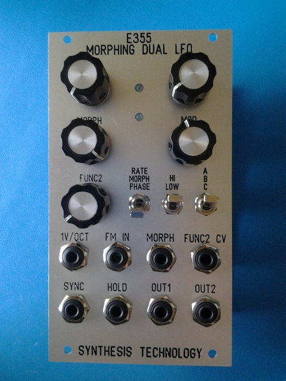

xml version="1.0" encoding="utf-8"?

Synthtec E355 Morphing Dual LFO

# E355

## Introduction

The E355 Morphing Dual LFO is a Euro-rack synthesis module for generation of
periodically varying control voltages. Based on the 64 Bank C waveforms of the
respected E350 Morphing Terrarium, this module provides a reduced-cost way to
use the same waveforms for LFO tasks while providing a few additional ways
to control the outputs.

## Features

* Two quasi-independent LFO outputs
	+ Independent Rates, Common Morph and Phase
	+ Independent Morph, Common Rate and Phase
	+ Independent Phase, Common Rate and Morph
* 3 Banks
	+ 8 Basic Waveforms
	+ 8 Basic Waveforms x 8 Harmonics
	+ 64 E350 Bank C Waveforms
* High (0.25 Hz - 120Hz) and Low (15min - 4Hz) rate ranges
* 1V/Oct with offset + FM input with attenuator
* Sync/Reset and Hold/Freeze inputs
* LED indicators for each LFO output

## Availability

Find more about the E355 at these sites:
* [E355 info from Analogue Haven](http://www.analoguehaven.com/synthesistechnology/e355/)
* [E355 info from Schneidersladen](http://www.schneidersladen.de/en/synthesis-technology-e355-morphing-dual-lfo.html)

[Return to Synth page.](../index.html)
##### 
**Last Updated**

:2013-09-25
##### 
**Comments to:**

[Eric Brombaugh](mailto:ebrombaugh1@cox.net)

