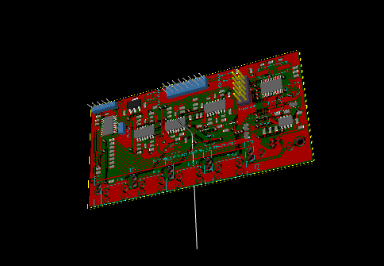

xml version="1.0" encoding="utf-8"?

Synthtec E610 USB Audio I/O

# E610

## Introduction

The E610 USB Audio I/O is a Euro-rack digital audio interface module that
provides a USB 1.1 Audio class-compliant stereo input / output. Various sample
rates from 8kHz to 48kHz are supported and USB current draw is less than 100ma
so the device will work with iOS devices such as the iPad, as well as with MacOS X,
Windows XP, Windows 7/8 and Linux.

The principle feature of the E610 is DC coupling on the audio outputs and
a voltage range of +/-5V which allows its use as a Control Voltage source in
modular synthesis. Coupled with existing software such as Silent Way or Volta,
this allows a simple interface between an analog modular synthesizer and
powerful DAW software. The interface is full-duplex, so the audio inputs may
be used for simultaneous recording, or for feedback in generating CV calibration
curves.

In addition to stereo audio I/O, the E610 provides visual level indicators
for each input and output channel consistingn of bi-color LEDs with different
colors representing different signal amplitudes. There is also a USB status
indicator which reflects the operational state of the interface.

## Availability

The E610 is now available as the [Audio Damage ADM09](http://www.audiodamage.com/hardware/product.php?pid=ADM09) ODIO.

[Return to Synth page.](../index.html)
##### 
**Last Updated**

:2015-05-26
##### 
**Comments to:**

[Eric Brombaugh](mailto:ebrombaugh1@cox.net)

