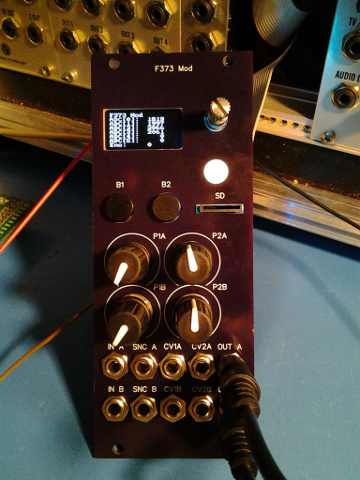
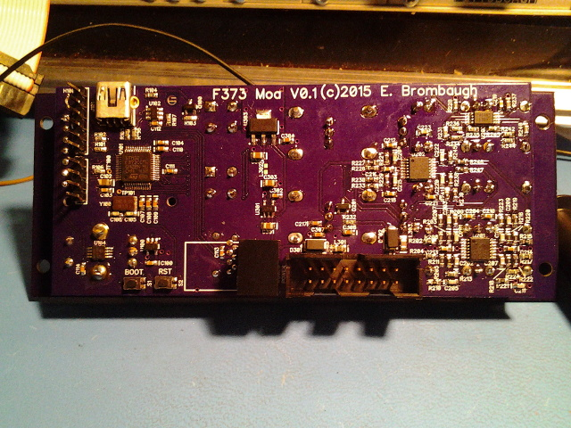

xml version="1.0" encoding="utf-8"?

F373 Mod

# F373 Mod - a Euro-Rack DSP technology demonstration.

#### f373 Mod - fully assembled

### What is it?

This is a 10HP Euro-Rack format module with 2 Audio/CV inputs, 4 CV inputs, 4 pots, 2 Digital
(Sync) inputs and 2 Audio outputs. It features a 128x64 monochrome OLED display, two buttons,
a rotary encoder with pushbutton, a micro SD card slot, a hidden USB mini-B jack, RGB LED and I2C EEPROM.

### Why?

The STM32F373 MCU is a fascinating hybrid Analog/Digital processor with a unique combination of
features that I've wanted to try out as a platform for audio DSP. Included are a set of 16-bit Sigma/Delta
ADCs, as well as 12-bit DACs that are almost ideal for audio synthesis in a single package. I've been able
to port a number of my audio effects algorithms over and they run nicely.

### Features:

* [STM32F373CCT6](http://www.st.com/web/catalog/mmc/FM141/SC1169/SS1576/LN10/PF253090)
 CPU with:
	+ 32-bit ARM Cortex-M4F CPU rated for 72MHz clock
	+ 32kB SRAM
	+ 256kB Flash
	+ 14 Timers
	+ 3 SPI
	+ 2 I2C
	+ 3 USART
	+ 1 CAN
	+ 1 USB Device
	+ 36 GPIO pins (20 5V tolerant)
	+ 1 12-bit SAR ADC
	+ 3 16-bit Sigma/Delta ADCs
	+ 3 12-bit DACs
	+ 2 Analog Comparators
* 4 front-panel pots
* Rotary Encoder with push switch
* 2 pushbuttons
* Micro SD slot
* USB Mini-B device jack (behind panel)
* I2C EEPROM
* RGB LED
* 2 +/-7V Audio/CV inputs with 16-bit resolution
* 4 +/-5V CV inputs with 12-bit resolution
* 2 digital (sync/trigger/gate) inputs
* 2 12-bit +/-7V DAC outputs (audio/CV) outputs
* 6-pin ARM SWD connector (ST-Link V2 format) on back
* 4-pin GPIO / Test Jack
* Standard 16-pin shrouded Euro-Rack power:
	+ +12V @ 40ma
	+ -12V @ 9ma
* 24mm deep

### Software Development

The STM32 family of parts are supported by a variety of commercial IDEs, all
of which are available in low-cost or limited free versions from the
[ST website](http://www.st.com/internet/mcu/class/1734.jsp).

I prefer to use open-source tools so I've set up a development environment
based on the GNU C compiler for ARM, available for free from the Launchpad
project. For downloading to the target I use OpenOCD and the ST-Link V2 SWD
interface that's available on most all of the inexpensive STM32 Discovery boards.
To accelerate development I also use the STM32 Standard Peripheral Library as
a starting point for my code and then optimize out the heavyweight functions
as required. Links to all of these are here:

* [Launchpad GCC](https://launchpad.net/gcc-arm-embedded): 
 ARM-supported GCC (somewhat newer than the CS version above).
* [OpenOCD](http://openocd.org/): JTAG/SWD interface for
 programming a debugging.
* [STM32F0 Discovery](http://www.st.com/web/catalog/tools/FM116/SC959/SS1532/PF253215?sc=internet/evalboard/product/253215.jsp): Development board with USB flash programming
 and debugging.
* [STM32 Standard Peripheral Library for STM32F0xx](http://www.st.com/web/catalog/tools/FM147/CL1794/SC961/SS1743/LN1939/PF257884): Manufacturer's low-level C driver code.

### Design Resources

* Schematic: <f373_mod_schematic.pdf>
* more to com...

### Project Status

* 2015-05-30: Started Schematic, order parts.
* 2015-06-10: Order PC boards.
* 2015-06-29: PC boards arrive, assembled.
* 2015-07-02: Tested, working.
* 2015-07-26: Created web page.

### Design Notes

I threw a lot of extra goodies into this design just to check out practicality. Some of them worked, some
of them didn't. Here's a rundown:
* DC-coupled 16-bit Sigma-Delta ADC inputs: This is a success - I'm particularly impressed with the
 quality of the analog peripherals on the STM32F373 MCU - the 16-bit SDADCs and 12-bit
 SAR ADCs perform well with very little lsb noise. Much less lsb jitter than I've seen on other STM32
 families (don't get me started on the F4 series...)
* 12-bit DAC output for audio. I still need to do some testing to see how well this works, but in general
 it's not a disappointment. I did hear some quantization effects at very low signal levels as expected, but
 for strong signals things seem reasonably good - no excessive noise.
* Monochrome OLED: This is working well. Update rates are reasonable for the amount of content that
 I'm using and the display is very readable. I'm considering adding some graphical elements like waveform
 and FFT plots. More on this as the experiments progress.
* Rotary Encoder: I need to do more fine-tuning on this - debounce is critical on these mechanical
 switch encoders. As is, I'm seeing a lot of uncommanded movements.
* Buttons: These are a success from a usability standpoint, but they take up a lot of PCB real-estate.
* SD card: Not tested yet.
* RGB LED: This was added as a joke suggested by a colleague. The WS2812 RGB LED shines through
 a window in the FR4 front panel which imparts a bit of a yellow tinge to the light. The major issue is that
 the PWM LED brightness control cycles in the audio range, so when the LED is on there is some noticeable
 whine audible in the output. Not a success.
* USB: The main use for USB in this case would be software updates - I've provided a button to allow
 powering up with USB DFU bootloader and this works. It may be possible to bring the USB to a Euro panel
 via some sort of bulkhead/pigtail but I haven't looked into this yet.

[Return to Synth page.](../index.html)
##### 
**Last Updated**

:2015-07-26
##### 
**Comments to:**

[Eric Brombaugh](mailto:ebrombaugh1@cox.net)

