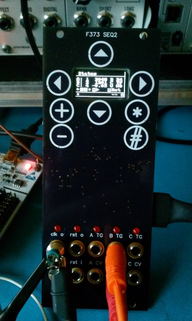

xml version="1.0" encoding="utf-8"?

F373 SEQ2

# F373 SEQ2 - a Euro-Rack 3-channel CV + Gate step sequencer.

#### F373 SEQ2 - fully assembled

### What is it?

This is a 3-channel CV + Gate step sequencer in a 10HP Euro-Rack format module.
It features a 128x64 monochrome OLED display, 8 touch-sense buttons, Clock and
Reset inputs and Clock and Reset outputs, along with 3 +/-7V CV outputs and 3 5V
Trigger / Gate outputs. Firmware provides a unique 2D grid-based UI for editing
parameters and sequence data and numerous options for sequencing.

### Why?

The STM32F373 MCU is a fascinating hybrid Analog/Digital processor with a unique
combination of features that includes excellent analog I/O as well as a powerful
ARM Cortex M4F CPU. One of the options it supports is capacitive touch-sense for
human input and I've been curious to try this out for a while. A simple step
sequencer seemed like a good excuse for this.

### Features:

* [STM32F373CCT6](http://www.st.com/web/catalog/mmc/FM141/SC1169/SS1576/LN10/PF253090)
 CPU with:
	+ 32-bit ARM Cortex-M4F CPU rated for 72MHz clock
	+ 32kB SRAM
	+ 256kB Flash
	+ 14 Timers
	+ 3 SPI
	+ 2 I2C
	+ 3 USART
	+ 1 CAN
	+ 1 USB Device
	+ 36 GPIO pins (20 5V tolerant)
	+ 1 12-bit SAR ADC
	+ 3 16-bit Sigma/Delta ADCs
	+ 3 12-bit DACs
	+ 2 Analog Comparators
* 8 front-panel capacitive touch sensors
* I2C EEPROM
* 3 +/-7V CV outputs with 12-bit resolution
* 5 0V/5V Clock / Reset / Trigger / Gate outputs.
* 2 digital inputs for clock and reset
* 6-pin ARM SWD connector (ST-Link V2 format) on back
* 3-pin GPIO / Test Jack
* Standard 16-pin shrouded Euro-Rack power:
	+ +12V @ 80ma
	+ -12V @ 11ma
* 24mm deep

### Software Development

The STM32 family of parts are supported by a variety of commercial IDEs, all
of which are available in low-cost or limited free versions from the
[ST website](http://www.st.com/internet/mcu/class/1734.jsp).

I prefer to use open-source tools so I've set up a development environment
based on the GNU C compiler for ARM, available for free from the Launchpad
project. For downloading to the target I use OpenOCD and the ST-Link V2.1 SWD
interface that's available on most all of the inexpensive STM32 Nucleo boards.
To accelerate development I also use the STM32 HAL Library as a starting point
for my code and then optimize out the heavyweight functions as required. Links
to all of these are here:

* [Gnu ARM GCC](https://developer.arm.com/open-source/gnu-toolchain/gnu-rm/downloads): 
 Full embedded ARM toolchain.
* [OpenOCD](http://openocd.org/): JTAG/SWD interface for
 programming a debugging.
* [STM32F303RE Nucleo](https://www.st.com/content/st_com/en/products/evaluation-tools/product-evaluation-tools/mcu-eval-tools/stm32-mcu-eval-tools/stm32-mcu-nucleo/nucleo-f303re.html): Development board with USB flash programming
 and debugging.
* [STM32 Cube F3](https://www.st.com/en/embedded-software/stm32cubef3.html): Manufacturer's C HAL code.

### Design Resources

* Schematic: <f373_seq2_panel_sch.pdf> Front panel schematic.
* <f373_seq2_back_sch.pdf> Back panel schematic.
* BOM: <f373_seq2_panel_bom.pdf> Front panel bill of materials.
* <f373_seq2_back_bom.pdf> Back panel bill of materials.
* Github: [emeb/f373\_seq2](https://github.com/emeb/f373_seq2) Full hardware and software source repository.
* OSHPark Front PCB: [Front Panel PCB @ OSHPark.](https://oshpark.com/shared_projects/gtSpkoFa)
* OSHPark Back PCB: [Back PCB @ OSHPark.](https://oshpark.com/shared_projects/g8AxTFyM)
* more to com...

### Project Status

* 2018-09-16: Started Schematic.
* 2018-10-29: Order PC boards.
* 2018-11-17: PC boards assembled.
* 2018-12-03: Created web page.

### Design Notes

Inspiration for the 2D grid-based UI came from a number of sources. I was particularly
impressed with the sliding 2D notion when I saw it used in the
[vpme.de Spooky Action](https://vpme.de/spooky-action/) prototype. Then I saw
an integrated touchsense + OLED board in one of Mikes Electric Stuff videos and the idea
started to come together.

Touch sense auto-calibrates for a few milliseconds during power-on, so don't touch
the sensors during this period or they will not function correctly.

The step sequencer itself is a fairly simple 3-channel system using the 3 on-chip 12-bit
DACs of the STM32F373CCT6 processor. External op-amp buffers increase the signal swing to
approximately +/-7V range which yeilds about 3.4mV resolution, or 4.1 cents when used with a
1V/Oct tuning system. While that's somewhat coarse, it is in the range of normal human
sensitivity to relative pitch steps. The clock output operates over a range of 0 - 999 beats
per minute (bpm) and the trigger / gate outputs have a variety of timing options, including
duration that tracks clock rate, as well has non-pulsed off / on and ratchets. The clock input
can be used to override the internally generated clock and the reset output can be assigned
to assert on any channel step. Each channel has a separate clock divider option between 1 and
16.

[Return to Synth page.](../index.html)
##### 
**Last Updated**

:2018-12-04
##### 
**Comments to:**

[Eric Brombaugh](mailto:ebrombaugh1@cox.net)

