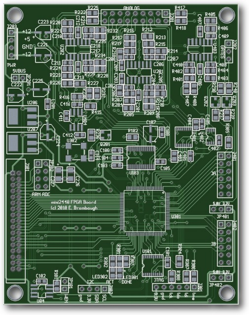

xml version="1.0" encoding="utf-8"?

mini2440 FPGA

# mini2440 FPGA Expansion Board

#### PCB Rendering

#### Partially Assembled

## What is it?

This is a small (3.1" x 3.9" - same size as mini2440 LCD) board with a
Xilinx Spartan 3A FPGA connected directly to the [mini2440](../../embedded/mini2440/index.html)
expansion connector. Designed to mount back-to-back with the mini2440 or
nearby, it provides the following features:

* Xilinx [XC3S200AVQ100](http://www.xilinx.com/products/spartan3a/) Spartan 3A FPGA with 200kgates, 16 Multipliers and 288kb RAM.
* Wolfson [WM8731](http://www.wolfsonmicro.com/products/WM8731) stereo audio CODEC with up to 96kHz / 24-bit sampling.
* Linear Tech [LTC1867L](http://www.linear.com/pc/productDetail.jsp?navId=H0,C1,C1155,C1001,C1158,P9358) 8-channel 16-bit SPI ADC
* Linear Tech [LTC2602](http://www.linear.com/pc/productDetail.jsp?navId=LTC2602) 2-channel 16-bit SPI DAC
* 24.576 MHz crystal oscillator
* I2C EEPROM with write-enable jumper
* 2x Digilent-compatible I/O ports with 8 FPGA I/O, VDD (selectable 5V or 3.3V) and GND.
* 3.3V I2C port for off-board serial expansion.
* JTAG port for FPGA development and debugging.
* Analog / Synth I/O port with
	+ 4x 10V CV / Pot input summing buffers connected to 16-bit ADC channels
	+ 2x 10V CV output drivers connected to 16-bit DAC channels
	+ Stereo 5V input buffers connected to Codec
	+ Stereo 5V output drivers connected to Codec
	+ Buffered Sync input
* 2x 5V Gate outputs
* 4x ADC inputs direct to ARM SoC on mini2440
* Power jack with +/-12V, +5V and option to power mini2440.

## Motivation

The main goals for this board are to experiment with FPGA-based audio synthesis
algorithms and miscellaneous interfacing.

## Design Details

### Expansion Connector

All GPIO/Muxed signals on the mini2440 Expansion connector are routed to the
FPGA, with the exception of the I2C signals which are used for ID and control
on-board. Configuration of the FPGA uses SPI port 0, so your kernel will have
to support this and alternate functions for these pins are probably not
practical without some serious kernel code changes. That shouldn't be a big
issue though, because the FPGA bitstream can use SPI port 0 for control, or
route it through to the I/O connectors after configuration. All other GPIO
pins connect without restriction.

### Configuration

This board has no on-board flash for the configuration of the FPGA - the
configuration is written to the FPGA by the mini2440 via SPI port 0.
This allows the board to be re-configured at any time merely by restarting
the configuration and downloading a new bitstream from the mini2440.
An PCF8754 I2C port expander controls the configuration process and
also provides additional I/O to the FPGA. The port expander is at
I2C address 0x38.

A bitstream download application which uses kernel I2C and SPIDEV drivers
to manage the process will be provided for userland setup. After configuration
these interfaces can also be used to control the FPGA.

### JTAG

A 6-pin JTAG header is provided for external configuration and debug. It
conforms to the Digilent JTAG pinout, but can also be used with Xilinx
download cables if flywires are used. This is handy for testing the FPGA
without the mini2440 attached, or for debugging designs using Xilinx's
Chipscope application.

### ID

A 128-byte I2C EEPROM is available for ID and key storage. While normally
write-protected, a Write-Enable jumper is provided to set the ID and any
other data stored in the EEPROM. This device uses address 0x51h so as not
to conflict with the EEPROM on the mini2440.

### I2C

The I2C2 bus is available, along with 3.3V supply and GND on a 4-pin header.
This can be used to add I2C peripherals off-board. Bear in mind that there
alread 2 devices (ID EEPROM and Port Expander) on the bus, so check that any
additional devices don't collide with those already present.

### Digilent Ports

These are 12-pin right-angle 0.1" receptacles which conform to the Digilent
PMOD standard. Each connector provides 8 bits of direct connection to the FPGA,
along with two power and two ground connections. Power is jumper selectable as
either 3.3V or 5V on a per-connector basis.
Digilent (and others) sell a variety of I/O boards for this
standard that are inexpensive, small and provide a wide range of interfacing
opportunities, including Ethernet, RF/Wireless, motor control, audio, etc.
Find out more at
[Digilent's site](http://www.digilentinc.com).

There are two of these connectors on one side of the board, spaced at the
same interval as is found on Digilent FPGA boards, so standard two-connector
boards with up to 16 I/O signals are possible.

### FPGA

The Xilinx XC3S200A Spartan 3A FPGA on this board is inexpensive (about
$10 in single quantity) and provides sufficient I/O and logic resources to 
perform a wide range of interfacing and processing tasks. Simple signal
processing, sequencing and control are certainly possible, as well as some
buffering and reformatting using on-chip RAM.

### Clocks

The mini2440 expansion connector provides two clocks directly from the ARM
SoC which can be configured at kernel initializtion. In addition to these, a
stable crystal oscillator generates a clean 24.576MHz clock suitable for
high-accuracy timing.

### Power

On-board 3.3V and 1.2V LDO regulators derive all the supplies required
from the mini2440 5V supply provided on the expansion connector. While the
3.3V and 1.2V regulators which supply the FPGA I/O and Core voltages are rated
for close to 1A, it is recommended that FPGA designs which require high power
are not considered for this board. Although the Spartan 3A chip used here can
operate at fairly high internal frequencies approaching 200MHz, the practical
limitations of power supply and heat management will constrain the designs
that can safely be realized on this board.

## Software

A user-space application and access library is provided which supports
command-line bitstream loading and control of the features on the board. The
application can be used to download FPGA configuration files and control the
I2C port expander that manages configuration. The access library
provides a low-level API for control of the I2C and SPI ports, as well as
higher level functions for bitstream download and may be used to construct
complex user-space applications for interaction with the FPGA design. Full
source for this will be provided once it's working.

## Design Documentation

* [Schematic Diagram](mini_fpga_pg1-4.pdf)
* more to come...

## Status

* 03-23-10 - mini2440 SPI Loopback works.
* 04-18-10 - Start Schematic.
* 04-22-10 - Start Layout.
* 04-24-10 - Preliminary Layout Complete.
* 04-26-10 - Add 2x 5V Gate outputs and Codec clock filter, Cleanup Layout.
* 05-14-10 - Ordered boards - wait ~3 weeks...
* 06-01-10 - Boards back
* 06-19-10 - Power supplies and I2C works
* 06-20-10 - FPGA works, codec installed.
* 07-10-10 - Codec I2C works, analog waveforms coming out.

[Return to Synth page.](../index.html)
##### 
**Last Updated**

:2010-07-10
##### 
**Comments to:**

[Eric Brombaugh](mailto:ebrombaugh1@cox.net)

