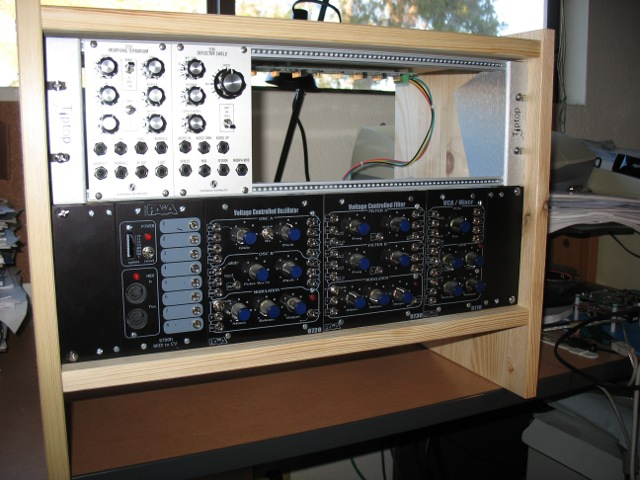
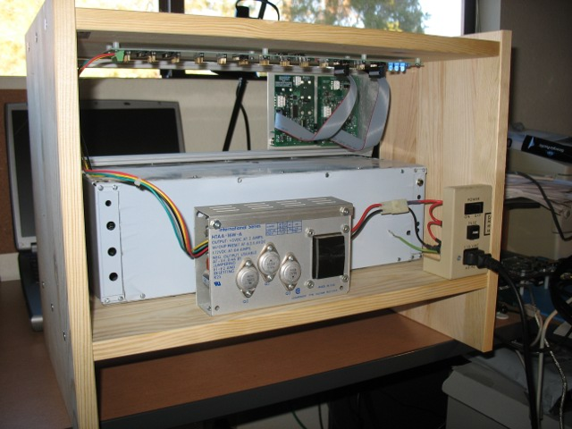

xml version="1.0" encoding="utf-8"?

Euro / Frac Rack

# Euro / Frac Rack

## Introduction

As a synth module designer, the aphorism about the shoemaker's children applies to me as well. I've
got lots of modules laying around but none were racked up and ready to use, and when it came time to
test I usually had to improvise something with alligator clips and lab supplies. That's pretty lame,
so I finally decided to get organized and build a rack.

I started looking through the various websites for information on 19" racks and Euro mounting
hardware. Since I didn't want to spend a large amount on this, the prices were pretty daunting - a truly
pro setup could easily exceed $1000 for a modest system without any modules. Not quite what I had in mind.
I did a bit more research and came across the poor-mans approach: The Ikea Rast nightstand. Surprisingly,
this inexpensive and simple piece of furniture is sized almost exactly right for a 6U 19" rack (one wonders
if this is intentional?). Add in a bit of mounting hardware and a power supply and you've got a fairly good
looking rack - a bit on the heavy side and unfinished, so it's probably not good for mobile use, but for
holding things securely in a home studio/lab situation it's fine. All told, I spent about $120 on this.

## Bill of Materials

* Cabinet: [Ikea 'Rast'](http://www.ikea.com/us/en/catalog/products/44361109) - $14.99
* 19" rack mount brackets: [Raxxess Rack Rails, 6 space](http://www.guitarcenter.com/Raxxess-Rack-Rails--Pair--100996099-i1427163.gc) - $12.49
* Euro Ears: [Tiptop Z-Ears Tabletop](http://www.analoguehaven.com/tiptopaudio/zearstabletop/) - $15.00
* Euro Rails: [Tiptop Z-Rails](http://www.analoguehaven.com/tiptopaudio/zrails/) - $35.00
* Euro Power Bus: [Tiptop Zeus Passive Bus Board](http://www.analoguehaven.com/tiptopaudio/zeuspassive/) - $35.00
* Power Supply: surplus +/-12V, +5V - Free
* Misc Hardware: - less than $10 total
	+ Euro Rails -> Ears: 4x M4-0.7x12mm pan-head screws
	+ Ears -> 19" Rack: 8x 10-32x3/4 pan-head screws
	+ 19" Rack Rails -> Cabinet: 8x #12x3/4 self-tapping screws
	+ Power Bus -> Cabinet: 8x #6x3/4 self-tapping screws
	+ Power Bus standoffs: 8x #6x1/8 Nylon Standoffs
	+ 18ga wire

## Notes

* Misc Hardware: I got most of the screws at my local Home Depot and Ace Hardware
 stores. Unfortunately they don't have this stuff well catalogued online, so I can't
 provide links to exact items. It's best to just go in person with a list in-hand.
* The vertical clearance inside the Rast is about 1/8" more than a perfect 6U. I
 referenced everything against the bottom shelf, so the small gap is on the top.
 Vent hole?
* When fastening the Raxxess rails to the Rast I pushed them back from the front
 surface by about 7/8" to provide some protection for the module knobs.
* Power Supply: I got mine from a surplus telecomm demux that I bought at an auction
 many years ago. It's a Power-One with +/-12V @ 400mA, +5V @ 2A, all linear regulated
 (what would we do without the venerable LM723?) and with a fairly big chunk of iron in
 the transformer. The current ratings aren't ideal for a modular synth application, but
 then I don't expect to be adding a whole lot more modules. The mains interface consists
 of a filtered 3-prong IEC power jack, a fuse holder and switch, all mounted in the
 original sheet-metal of the cabinet they came in which I cut out and screwed to the
 bottom shelf of the Rast.
* 5V supplies for Euro are becoming a big issue these days as more and more modules
 consist of mainly digital processing. This is certainly true for the modules I'm working
 on, and while none of them presently use the Euro +5V bus, they could be modified to do
 so and relieve some of the drain on the +12V bus. The Tiptop passive power bus I bought
 provides a regulated +5V from a separate external supply, but it is limited to a few
 hundred mA since it's sourced from a TO-220 LM7805 without any heatsink. Since my supply
 already has 2A of +5V, I removed the LM7805 on the Zeus bus and bypassed it with a solid
 copper conductor. This allows me to wire my external +5V @ 2A supply directly to the Vr
 terminal on the Zeus.
 * Yeah - I know. PAiA. It was the first modular stuff I built, and I still use it from
 time to time for testing. It works, but it's not the most fantastic stuff out there. If
 you're a Euro purist then you'll have to spend another $40 or so to get a second 3U of
 space to fill up the 6U total.

[Return to Synth page.](../index.html)
##### 
**Last Updated**

:2011-01-02
##### 
**Comments to:**

[Eric Brombaugh](mailto:ebrombaugh1@cox.net)

